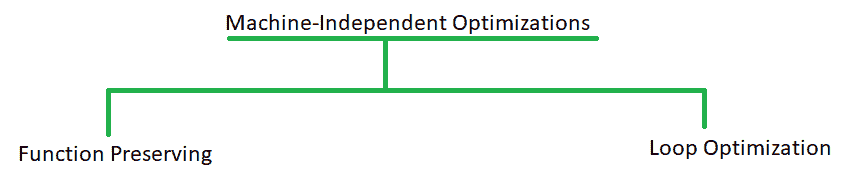
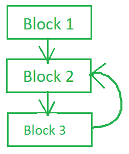

# 编译器设计中的机器无关代码优化

> 原文:[https://www . geesforgeks . org/机器无关-代码优化-在编译器中-设计/](https://www.geeksforgeeks.org/machine-independent-code-optimization-in-compiler-design/)

**机器无关代码优化**试图通过转换一段不涉及 CPU 寄存器或任何绝对内存位置等硬件组件的代码来提高中间代码的效率。通常，它通过消除冗余、减少代码行数、消除无用代码或减少重复代码的频率来优化代码。因此可以在任何处理器上使用，而与机器规格无关。

机器无关的代码优化可以通过以下方法实现:



**功能保持优化:**

函数保留优化处理给定函数中的代码，试图减少计算时间。可以通过以下方法实现:

1.  公共子表达式消除
2.  可折叠的
3.  死代码消除
4.  复制传播

**1。常见子表达式消除:**

一个常见的子表达式是被计算出来的，并且在最后一次计算后不会改变，但是经常在程序中重复。即使值不变，编译器也会计算它的值。这种评估导致资源和时间的浪费。因此，最好将其消除。考虑一个例子:

```
//Code snippet in three address code format
t1=x*z;
t2=a+b;
t3=p%t2;
t4=x*z;     //t4 and t1 is same expression 
            //but evaluated twice by compiler.
t5=a-z;

// after Optimization
t1=x*z;
t2=a+b;
t3=p%t2;
t5=a-z;
```

如果一个公共子表达式经常在程序中重复，那就麻烦了。因此，它需要被消除。

**2。恒定折叠:**

常数折叠是一种在编译时计算的表达式被其值替换的技术。一般来说，这样的表达式是在运行时计算的，但是如果我们用它们的值替换它们，它们就不需要在运行时计算，这样可以节省时间。

```
//Code segment
int x= 5+7+c;

//Folding applied
int x=12+c;
```

折叠可以应用于布尔、整数以及浮点数，但是要小心浮点数。恒定折叠通常与恒定传播交错。

**恒定传播:**

如果任何变量被赋予一个常数值并用于进一步的计算，常数传播建议直接使用该常数值进行进一步的计算。考虑下面的例子

```
// Code segment
int a = 5;
int c = b * 2;
int z = a;

//Applying constant propagation once
int c = 5 * 2;
int z = a;

//Applying constant propagation second time
int c = 10;  
int z = a;

//Applying constant propagation last time
int z = a[10];
```

**3。死码消除:**

死代码是程序中从未执行或从未到达的程序片段。它是一种代码，可以有效地从程序中删除，而不会影响程序的任何其他部分。万一获得了一个值，以后再也不用了，那也算是死代码。考虑下面的死代码:

```
//Code
int x= a+23;  //the variable x is never used 
              //in the program. Thus it is a dead code.
z=a+y;
printf("%d,%d".z,y);

//After Optimization
z=a+y;
printf("%d,%d".z,y);
```

死代码的另一个例子是给变量赋值，并在使用它之前更改该值。前面的赋值语句是死代码。这种死代码需要删除，以实现优化。

**4。复制传播:**

复制传播建议在使用 x=y 形式赋值的情况下，使用一个变量而不是其他变量。这些作业是抄写语句。我们可以在所有需要的地方有效地使用 y，而不是将其分配给 x。简而言之，消除代码中的副本就是复制传播。

```
//Code segment
----;
a=b;
z=a+x;
x=z-b;
----;

//After Optimization
----;
z=b+x;
x=z-b;
----;
```

另一种优化，循环优化处理减少程序在循环中花费的时间。

**循环优化:**

程序大部分时间都在循环中度过。因此，循环决定了程序的时间复杂度。因此，为了得到一个最优和有效的代码，需要进行循环优化。为了应用循环优化，我们首先需要借助程序流图使用控制流分析来检测循环。程序流程图中的循环将指示循环的存在。注意，来自中间代码生成阶段的三地址格式的代码被作为优化阶段的输入给出。很难识别这种格式的循环，因此需要一个程序流程图。

程序流程图由基本块组成，这些基本块只不过是将代码分成部分或块，并显示代码的执行流程，



示例程序流程图

上图中的循环显示存在从块 2 到块 3 的循环。

一旦检测到循环，可以应用以下循环优化技术:

1.  频率降低
2.  代数表达式简化
3.  强度降低
4.  冗余消除

**1。频率降低:**

它适用于循环运行最少可能的代码行的概念。可以通过以下方法实现:

**a .代码动作:**

很多时候，在循环中，每次迭代保持不变的语句都包含在循环中。这样的语句是循环不变量，只会导致程序在循环中花费更多的时间。代码移动只是将循环不变的代码移出循环，减少了在循环内花费的时间。为了理解这一点，考虑下面的例子。

```
//Before code motion

p=100
for(i=0;i<p;i++)
{
    a=b+40;         //loop invariant code
    if(p/a==0)
        printf("%d",p);
}

// After code motion

p=100
a=b+40;
for(i=0;i<p;i++)
{
    if(p/a==0)
        printf("%d",p);
}
```

在该示例中，在优化之前，循环不变代码是针对循环的每次迭代进行评估的。一旦应用了代码运动，评估循环不变代码的频率也会降低。因此，它也被称为频率降低。下面也是代码运动的一个例子。

```
//Before code motion
----;
while((x+y)>n)
{
    ----;
}
----;

// After code motion
----;
int t=x+y;
while(t>n)
{
    ----;
}
----;
```

**b .循环展开:**

如果一个循环每次迭代都运行相同的操作，那么我们可以在循环中多次执行相同的操作。这被称为循环展开。这种展开的循环将在单个循环迭代中不止一次地执行评估。

```
//Before Loop unrolling

while(i<50)       //while loop initialize all array elements to 0; 
                 //one element each iteration. Thus the loop runs 50 times.
{
    x[i]=0;
    i++;
}

//After loop unrolling

while(i<50)       //After unrolling, each iteration 
                  //initializes 5 elements to 0; 
                  //Thus this loop runs only 5 times.
{
    x[i]=0;
    i++;
    x[i]=0;
    i++;
    x[i]=0;
    i++;
    x[i]=0;
    i++;
    x[i]=0;
    i++;
}
```

如上例所示，展开的循环比前一个循环更有效。

**c .环路干扰:**

合并执行相同操作的循环称为循环阻塞。

```
//Before loop jamming
----;
    for(i=0;i<5;i++)      //Setting all elements of 2D array to 0.
    {
        for(j=0;j<5;j++)
        {
            x[i][j]=0;

        }
    }
    for(i=0;i<5;i++)     //Setting diagonal elements to 1.
    {
        x[i][i]=0;

    }
----;

//After loop jamming
----;
    for(i=0;i<5;i++)      //Setting all elements of 2D array to 0 
                          //and diagonal elements to 1.
    {
        for(j=0;j<5;j++)
        {
            x[i][j]=0;
            x[i][i]=1;
        }
    }
----;
```

因此，该操作可以通过只执行一次循环来完成，而不是执行两次相同的循环。

**2。代数表达式简化:**

一个程序可能包含一些琐碎的代数表达式，这些表达式不会导致任何有用的计算或值的改变。这样的代码行可以被删除，这样编译器就不会浪费时间去评估它。例如，

```
A=A+0;
x=x*1;
```

这些陈述不会导致任何有用的计算。这样的代码看似无害，但当在任何循环中使用时，它们会继续被编译器评估。因此，最好消除它们。

**3。强度降低:**

它建议用更便宜的运算代替像乘法这样昂贵的运算。

```
Example:
a*4 

after reduction
a<<2
```

对于在循环中进行数组访问的程序来说，这是一个重要的优化，应该只用于整数操作数。

**4。冗余消除:**

一个特定的表达式可能会在一个代码中重复多次。这个表达式对于代码来说是多余的，因为我们可以对它求值一次，并用它的求值值替换它的下一次出现。这种替代不过是冗余消除。下面给出了一个简单的例子

```
//Code:
----;
int x=a+b;
----;
int z=a+b+40;
----;
return (a+b)*5;

//After optimization
----;
int x=a+b;
----;
int z=x+40;
----;
return x*5
```

冗余消除避免了多次计算相同的表达式，从而加快了执行速度。