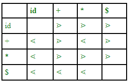
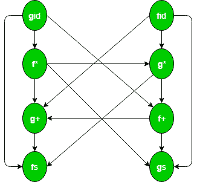

# TOC 中的运算符语法和优先解析器

> 原文:[https://www . geesforgeks . org/operator-grammar-and-preference-parser-in-TOC/](https://www.geeksforgeeks.org/operator-grammar-and-precedence-parser-in-toc/)

用于定义数学运算符的语法称为**运算符语法**或**运算符优先语法**。这种语法有一个限制，即任何产品都没有空的右侧(空产品)或在其右侧有两个相邻的非终端。

**示例–**
这是运算符语法的示例:

```
E->E+E/E*E/id 
```

但是，下面给出的语法不是运算符语法，因为两个非终结符彼此相邻:

```
S->SAS/a
A->bSb/b 
```

不过，我们可以将其转换为运算符语法:

```
S->SbSbS/SbS/a
A->bSb/b  
```

**运算符优先解析器–**
运算符优先解析器是一种自下而上的解析器，用于解释运算符语法。这个解析器只用于运算符语法。*除了运算符优先解析器之外，任何解析器中都不允许有不明确的语法*。
有两种方法可以确定一对终端之间应该保持什么样的优先关系:

1.  使用运算符的传统结合律和优先级。
2.  选择运算符优先关系的第二种方法是首先为语言构建一个明确的语法，这个语法反映了语法树中正确的结合性和优先级。

该解析器依赖于以下三种优先关系: **⋖、≐、⋗**
**a ⋖ b** 这意味着 a“让位于”b.
**a ⋗ b** 这意味着 a“优先于”b.
**a ≐ b** 这意味着 a“与”b“具有相同的优先级”。


**图–**语法 E- > E+E/E*E/id 运算符优先关系表

id 和 id 之间没有任何关系，因为 id 不会被比较，两个变量也不会同时出现。这个表还有一个缺点——如果我们有 n 个操作符，那么表的大小将是 n*n，复杂度将是 0(n <sup>2</sup> )。为了减小表格的尺寸，我们使用了**操作员功能表**。

运算符优先级分析器通常不存储带有关系的优先级表；相反，它们是以一种特殊的方式实现的。运算符优先解析器使用**优先函数**，将终端符号映射为整数，符号之间的优先关系通过数值比较实现。解析表可以由两个优先函数 **f** 和 **g** 编码，这两个优先函数将终端符号映射为整数。我们选择 f 和 g，以便:

1.  只要 a 优先于 b，f(a) < g(b)
2.  只要 a 和 b 具有相同的优先级，f(a) = g(b)
3.  只要 a 优先于 b，f(a) > g(b)

**示例–**考虑以下语法:

```
 E -> E + E/E * E/( E )/id   
```

这是表示优先函数的有向图:



由于图中没有循环，我们可以制作这个函数表:


```
fid -> g* -> f+ ->g+ -> f$
gid -> f* -> g* ->f+ -> g+ ->f$ 
```

桌子的尺寸是 **2n** 。

函数表的一个缺点是，即使我们在关系表中有空白条目，我们在函数表中也有非空白条目。空白条目也称为错误。因此关系表的检错能力大于函数表。

```
#include<stdlib.h>
#include<stdio.h>
#include<string.h>

// function f to exit from the loop
// if given condition is not true
void f()
{
    printf("Not operator grammar");
    exit(0);
}

void main()
{
    char grm[20][20], c;

    // Here using flag variable,
    // considering grammar is not operator grammar
    int i, n, j = 2, flag = 0;

    // taking number of productions from user
    scanf("%d", &n);
    for (i = 0; i < n; i++)
        scanf("%s", grm[i]);

    for (i = 0; i < n; i++) {
        c = grm[i][2];

        while (c != '\0') {

            if (grm[i][3] == '+' || grm[i][3] == '-'
                || grm[i][3] == '*' || grm[i][3] == '/')

                flag = 1;

            else {

                flag = 0;
                f();
            }

            if (c == '{content}apos;) {
                flag = 0;
                f();
            }

            c = grm[i][++j];
        }
    }

    if (flag == 1)
        printf("Operator grammar");
}
```

```
Input :3
A=A*A
B=AA
A=$

Output : Not operator grammar

Input :2
A=A/A
B=A+A

Output : Operator grammar

```

$在这里是一个空生产，这在运算符语法中也是不允许的。

**优势–**

1.  它可以很容易地用手建造。
2.  实现这种类型的解析很简单。

**缺点–**

1.  很难处理像减号(-)这样的标记，它有两种不同的优先级(取决于它是一元还是二元)。
2.  它只适用于一小部分语法。