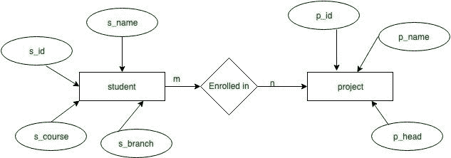
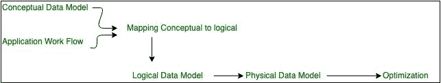
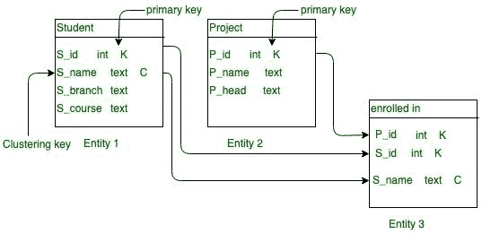

# Apache Cassandra 中的数据建模概述

> 原文:[https://www . geesforgeks . org/数据建模概述-in-apache-cassandra/](https://www.geeksforgeeks.org/overview-of-data-modeling-in-apache-cassandra/)

在本文中，我们将在 Cassandra 中了解这三种数据模型:概念模型、逻辑模型和物理模型。

**学习目标:**

*   用卡珊德拉的快速设计技术建立数据库。
*   使用 Cassandra 中的查询驱动方法改进现有模型。
*   通过卡珊德拉的分析和验证技术优化现有模型。

**Apache Cassandra 中的数据建模 :**
在 Apache Cassandra 中，数据建模对于用正确的方法管理海量数据起着至关重要的作用。方法论是阿帕奇卡桑德拉的一个重要方面。数据建模描述了 Apache Cassandra 中的策略。

**1。概念数据模型:**
概念模型是你的领域的抽象视图。它独立于技术。概念模型并不特定于任何数据库系统。

**目的:**

*   理解适用于数据建模的数据。
*   定义基本对象。
*   定义适用于数据建模的约束。

Cassandra 中概念数据建模的优势是协作。

**实体-关系(ER)模型:**
ER 图将表示数据模型的抽象视图，并给出图形视图。ER 图简化了数据模型。例如，让我们举一个例子，其中 m:n 基数，学生和课程之间的多对多关系意味着许多学生可以注册许多课程，许多课程被许多学生注册。



<center>**Figure –** ER diagram for conceptual model in Cassandra with M:N cardinality</center>

在本例中，s_id、s_name、s_course、s_branch 是学生实体的属性，p_id、p_name、p_head 是项目实体的属性，“注册”是学生记录中的关系。这就是我们如何将 ER 图转换成概念数据模型。

```
Student(S_id, S_name, S_branch, S_course)
Project(P_id, P_name, P_head)
enrolled in(S_id, P_id, S_name)
```

**应用程序工作流:**
在每个应用程序中都有工作流，其中的任务和依赖关系使得在应用程序中有许多学生想要注册许多项目。



<center>**Figure –** Data Model Flow diagram</center>

这是来自数据税的实际数据模型流程图。

**2。逻辑数据模型:**
在逻辑数据模型中，我们将定义每个属性或字段或列的功能，使得 S_id 是学生实体中的关键分区，P_id 是项目实体中的分区键。分区键在 Cassandra 中起着至关重要的作用，我们可以据此执行查询。在 Cassandra 中，当我们执行 CQL 查询和索引时，分区键很有帮助。例如，在关系数据库中，这个查询可以工作，但是在 Cassandra 中，它不能这样工作。

```
Select * 
From student_data 
Where S_branch = 'CSE'; 
```

因为，在卡珊德拉中 S_branch 不是表的分区键的一部分，所以首先在卡珊德拉中为这种类型的查询定义了分区键。

```
Select * 
From student_data 
Where S_id = '123'; 
```

这个查询在卡珊德拉中可以很好地工作。



<center>**Figure –**</center>

**3。物理数据模型:**
在这个数据模型中，我们将描述表查询，我们将编写查询来构建表，这是一个实际的数据模型，我们需要编写专门需要的查询，并实现我们实际想要的数据库功能。例如，让我们使用 CQL 查询为 student_record 数据库逐个定义表。

**表:**学生

```
CREATE TABLE student_record.student
 ( 
  S_id int,
  S_name text,
  S_branch,
  S_course,
  PRIMARY KEY((S_id), S_name),
 );
```

**表:**项目

```
CREATE TABLE student_record.Project
 ( 
  P_id int,
  P_name text,
  P_head,
  PRIMARY KEY(P_id),
 ); 
```

**表:**注册人数

```
CREATE TABLE student_record.Enrolled_in
 ( 
  S_id int,
  P_id int,
  S_name text,
  PRIMARY KEY((S_id, P_id), S_name)),
 ); 
```