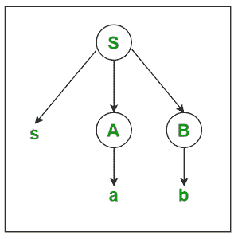
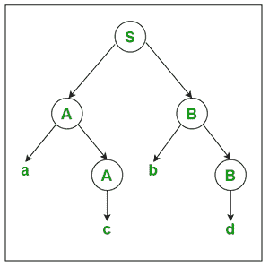

# 编译器设计中的解析树

> 原文:[https://www . geesforgeks . org/parse-tree-in-compiler-design/](https://www.geeksforgeeks.org/parse-tree-in-compiler-design/)

在本文中，我们将研究编译设计中解析树的概念和用途。首先，让我们看看两个术语:

*   **Parse :** 它的意思是把(一个句子)分解成它的组成部分，并描述它们的句法角色，或者简单地说，它是一个解析字符串或文本的行为。
*   **树:**树可以是广泛使用的抽象数据类型，它模拟分层树结构，具有根值和具有父节点的子树，表示为一组链接节点。

**解析树:**

*   解析树是终端或非终端的分层表示。
*   这些符号(终端或非终端)代表产生输入字符串的语法派生。
*   在解析中，字符串使用开始符号弹出。
*   语法的起始符号必须用作解析树的根。
*   解析树的叶子代表终端。
*   每个内部节点代表语法的产物。

**绘制解析树的规则:**

1.  所有叶节点都需要是终端。
2.  所有内部节点都需要是非终端。
3.  有序遍历给出原始输入字符串。

**例-1:**
我们举一个语法(产生式规则)的例子。

```
S -> sAB
A -> a
B -> b
```

输入字符串是“sab”，那么解析树是:

[](https://media.geeksforgeeks.org/wp-content/uploads/20200913131917/cd2-299x300.PNG) 

**例-2:**
我们再举一个语法(产生式规则)的例子。

```
S -> AB
A -> c/aA
B -> d/bB
```

输入字符串是“acbd”，那么解析树是:

[](https://media.geeksforgeeks.org/wp-content/uploads/20200913131918/cd1-300x298.PNG) 

**解析树的用法:**

*   它通过反映输入语言的语法来帮助进行语法分析。
*   它使用内存中的输入表示，其结构符合语法。
*   使用解析树而不是语义动作的好处是:您可以多次传递信息，而不必重新解析输入。