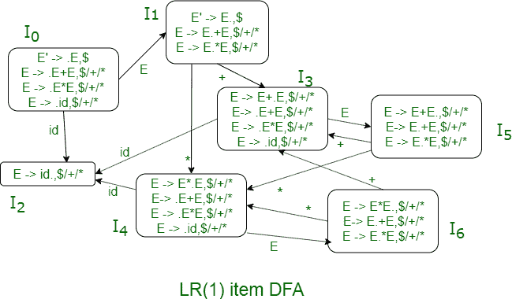
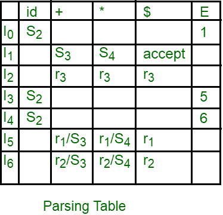
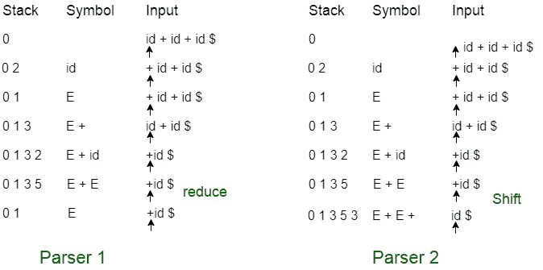

# 使用 LR 解析器解析不明确的语法

> 原文:[https://www . geesforgeks . org/parsing-ambiguos-grammars-using-lr-parser/](https://www.geeksforgeeks.org/parsing-ambiguos-grammars-using-lr-parser/)

[LR 解析器](https://www.geeksforgeeks.org/parsing-set-3-slr-clr-and-lalr-parsers/)可以用来解析歧义语法。LR 解析器基于语法的某些规则(操作符的优先级和/或结合性)来解决歧义语法的解析表中的冲突(移位/减少或减少/减少)。

**例:**
我们来看看下面这个模棱两可的语法:

```
E -> E+E
E -> E*E
E -> id 
```

假设语法的运算符(+和*)的优先级和结合性如下:

*   “+”和“*”都是左关联的，
*   “*”的优先级高于“+”的优先级。

如果我们使用 LALR(1)解析器，LR(1)项 DFA 将是:



从 LR(1)项 DFA 我们可以看到状态 I <sub>5</sub> 和状态 I <sub>6</sub> 存在换挡/减挡冲突。所以解析表如下:



“+和“*”上的 I <sub>5</sub> 和 I <sub>6</sub> 都有移减动作。为了解决这个冲突，也就是确定从表中保留哪个移动和丢弃哪个移动，我们将使用运算符的优先级和关联性。
考虑输入字符串:

```
id + id + id 
```

让我们根据上面的解析表来看解析器移动到冲突状态。



*   如果我们像解析器 1 一样对符号“+”进行 I <sub>5</sub> 状态的缩减移动，那么输入字符串的左边“+”在右边“+”之前被缩减，这使得“+”向左关联。

*   如果我们像解析器 2 中那样对符号“+”进行 I <sub>5</sub> 状态的移位，那么输入字符串的右“+”在左“+”之前减少，这使得“+”向右关联。

类似地，将符号“*”上的 I <sub>5</sub> 状态移位将使“*”优先于“+”，因为“*”将在“+”之前减少。将符号“*”上的 I <sub>5</sub> 状态的减少移动将使“+”优先于“*”，因为“+”将在“*”之前减少。类似于 I <sub>5</sub> ，来自 I <sub>6</sub> 的冲突也可以解决。

根据我们示例的优先级和结合性，冲突解决如下:

*   在“+”上的 I <sub>5</sub> 处的移位/减少冲突通过保持减少移动和丢弃移位移动来解决，这使得“+”向左关联。
*   “*”上 I <sub>5</sub> 处的移位/减少冲突通过保持移位并丢弃减少移动来解决，这将使“*”比“+”具有更高的优先级。
*   在“+”上的 I <sub>6</sub> 处的移位/减少冲突通过保持减少移动和丢弃移位移动来解决，这将给予“*”比“+”更高的优先级。
*   “*”上 I <sub>6</sub> 处的移位/减少冲突通过保持减少移动并丢弃移位移动来解决，这使得“*”向左关联。

一般来说，解析器生成器工具 **YAAC** 解决由于语法不明确引起的冲突，如下所示:

*   解析表中的 Shift/reduce 冲突通过优先考虑 shift move 而不是 reduce move 来解决。如果字符串被接受用于移位，则减少移动被移除，否则移位移动被移除。
*   解析表中的减少/减少冲突通过优先考虑第一个减少移动而不是第二个减少移动来解决。如果字符串被接受进行第一次减少移动，则第二次减少移动被移除，否则第一次减少移动被移除。

**相关 GATE 问题:**

*   [GATE-CS-2005 |问题 85](https://www.geeksforgeeks.org/gate-gate-cs-2005-question-85/)
*   [GATE-CS-2005 |问题 86](https://www.geeksforgeeks.org/gate-gate-cs-2005-question-86/)