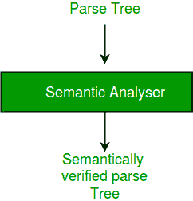

# 编译器的阶段

> 原文:[https://www.geeksforgeeks.org/phases-of-a-compiler/](https://www.geeksforgeeks.org/phases-of-a-compiler/)

**先决条件–**[编译器设计简介](https://www.geeksforgeeks.org/introduction-compiler-design/)

我们基本上有两个编译器阶段，即分析阶段和合成阶段。分析阶段从给定的源代码创建一个中间表示。合成阶段从中间表示创建等效的目标程序。

**符号表–**它是由编译器使用和维护的数据结构，由所有标识符的名称及其类型组成。它通过快速查找标识符来帮助编译器平稳运行。

源程序的分析主要分为三个阶段。它们是:

1.  **线性分析-**
    这包括从左到右读取字符流的扫描阶段。然后，它被分组为具有集体意义的各种标记。
2.  **层次分析-**
    在这个分析阶段，基于一个集合意义，令牌被层次分类到嵌套组中。
3.  **语义分析-**
    这个阶段用来检查源程序的组成部分是否有意义。

编译器有两个模块，即前端和后端。前端包括词法分析器、语义分析器、语法分析器和中间代码生成器。其余的组装起来形成后端。

1.  [**【词法分析器】**](https://www.geeksforgeeks.org/compiler-lexical-analysis/)**—**
    也叫扫描仪。它将预处理器(执行文件包含和宏扩展)的输出作为纯高级语言的输入。它从源程序中读取字符，并把它们组合成 lexemes(一起出现的字符序列)。每个词位对应一个标记。标记由词法分析器理解的正则表达式定义。它还删除了词法错误(例如，错误的字符)、注释和空白。
2.  [**Syntax Analyzer**](https://www.geeksforgeeks.org/compiler-design-introduction-to-syntax-analysis/) **–** It is sometimes called a parser. It constructs the parse tree. It takes all the tokens one by one and uses Context-Free Grammar to construct the parse tree. 

    *为什么是语法？*
    编程的规则完全可以在几部作品中表现出来。使用这些产品，我们可以代表程序实际上是什么。必须检查输入是否为所需格式。
    解析树也称为派生树。解析树通常被构造来检查给定语法中的歧义。有某些规则与派生树相关联。

    *   任何标识符都是一个表达式
    *   任何数字都可以称为表达式
    *   在给定的表达式中执行任何操作都会得到一个表达式。例如，两个表达式的和也是一个表达式。
    *   解析树可以被压缩以形成语法树

如果输入不符合语法，可以在这个级别检测到语法错误。

*   **语义分析器–**它验证解析树，不管它是否有意义。它还会生成一个经过验证的解析树。它还进行类型检查、标签检查和流量控制检查。
*   [**Intermediate Code Generator**](https://www.geeksforgeeks.org/intermediate-code-generation-in-compiler-design/) **–** It generates intermediate code, which is a form that can be readily executed by a machine We have many popular intermediate codes. Example – Three address codes etc. Intermediate code is converted to machine language using the last two phases which are platform dependent. 

    直到中间代码，对于每个编译器都是一样的，但是在那之后，它取决于平台。要构建一个新的编译器，我们不需要从头开始构建。我们可以从已经存在的编译器中获取中间代码，并构建最后两部分。

*   [**【代码优化器】**](https://www.geeksforgeeks.org/compiler-design-code-optimization/)**–**它对代码进行转换，从而消耗更少的资源，提高速度。正在转换的代码的含义不会改变。优化可以分为两种类型:机器相关的和机器无关的。
*   **目标代码生成器–**目标代码生成器的主要目的是编写一个机器可以理解的代码，还可以进行寄存器分配、指令选择等。输出取决于汇编程序的类型。这是编译的最后阶段。优化的代码被转换成可重定位的机器代码，然后形成链接器和加载器的输入。

所有这六个阶段都与符号表管理器和错误处理程序相关联，如上面的框图所示。