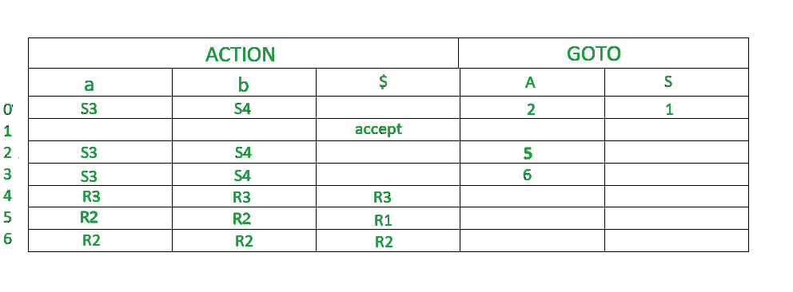

# LR(0)解析器出现问题

> 原文:[https://www.geeksforgeeks.org/problem-on-lr0-parser/](https://www.geeksforgeeks.org/problem-on-lr0-parser/)

**先决条件:** [LR 解析器](https://www.geeksforgeeks.org/lr-parser/)。

LR 解析器是一种有效的自下而上的语法分析技术，可用于大类上下文无关语法。这种技术也被称为 LR(0)解析。
L 代表从左到右扫描
R 代表反向中最右边的导数
0 代表前视的输入符号数。

**增广语法:**
如果 P 是一个带有起始符号 S 的语法，那么 G’(G 的增广语法)就是一个带有新的起始符号 S 的语法’和出品 S- >。S ' 。这个新的开始生产的目的是指示解析器何时应该停止解析。'的。在 S 之前表示'的左侧。已被编译器读取，并且的右侧。尚未被编译器读取。

**构建 LR 解析表的步骤:**

1.  写作扩充语法
2.  待查找项目的 LR(0)集合
3.  在解析表中定义 2 个函数:goto(终端列表)和 action(非终端列表)。

**问:为给定的上下文无关语法构建一个 LR 解析表–**

**S–>AA**T2**A–>AA | b**

**解决方案:**
**步骤 1-** 查找扩充语法–

给定语法的扩充语法是:-

s '–>。S [第 0 次生产]
S–>。AA【第一次生产】
A–>。aA【第二次生产】
A–>。b [第三次生产]

**步骤 2–**查找 LR(0)物品集合
下图为 LR(0)物品集合。我们会一件一件了解一切。

这个语法的终端是{a，b}
这个语法的非终端是{S，A}

**规则–**如果任何非终端有“.”在它之前，我们必须写下它所有的作品并加上“.”在每次生产之前。
**RULE**——从一个州到下一个州，这个“.”向右移动一个位置。

*   在图中，I 0 由增广语法组成。
*   ‘我 o 去我 1 当.’第 0 次生产的位置移向 S(S’->S)的右侧。这个状态就是接受状态。
    S 被编译器看到了
*   ‘我 o 去我 2 当.’第一部作品的重心向右移。编译器会看到
*   ‘我 0 去我 3 当.’第二部作品的主题向右移。编译器会看到。
*   ‘我 0 去我 4 当.’第三部作品的主题向右移(甲- >乙)。编译器会看到 b。
*   ‘我 2 去我 5 当.’第一次生产的重心向右移动(T4)。) .编译器会看到
*   ‘我 2 去我 4 当.’第三部的作品向右移了(甲- >乙)。编译器会看到 b。
*   ‘我 2 去我 3 当.’第二部作品的主题向右移。编译器会看到。
*   ‘我 3 去我 4 当.’第三部作品的主题向右移(甲- >乙)。编译器会看到 b。
*   ‘我 3 去我 6 当.’生产的第二部分向右移动(A- > aA)。) .编译器会看到
*   ‘我 3 去我 3 当.’第二部作品的重心向右移。编译器会看到。

**step 3–**定义 2 个函数:转到解析表中的【终端列表】和动作【非终端列表】

*   默认情况下，$是非终端，处于接受状态。
*   0，1，2，3，4，5，6 表示 I 0 ，I 1 ，I 2 ，I 3 ，I 4 ，I 5 ，I 6
*   I 0 给出 I 2 中的 A，所以 2 加到 A 列 0 行。
*   I 0 给出 I1 的 S，所以 S 列加 1，1 行加 1。
*   类似地，5 写在 A 列和第 2 行，6 写在 A 列和第 3 行。
*   I 0 给出一个在 I 3 到。所以 S3(移位 3)被添加到一列和 0 行。
*   I 0 在 I4 中给出 b，所以 S4(移位 4)被加到 b 列和 0 行。
*   类似地，S3(移位 3)被添加到列 a 和 2，3 行，S4(移位 4)被添加到列 b 和 2，3 行。
*   一 4 还原状态为“.”就在尽头。我 4 是 **3** 语法的第三个产物。所以在端子中写 r **3** (减少 3)。
*   一 5 还原状态为“.”就在尽头。我 5 是 **1** 语法的第一次产生。所以在端子中写 r **1** (减少 1)。
*   一 6 还原状态为“.”就在尽头。我 6 是 **2** 语法的第二个产物。所以在端子中写 r **2** (减 2) 。

由于每个单元格中只有 1 个值，因此，给定的语法是 LR(0)。