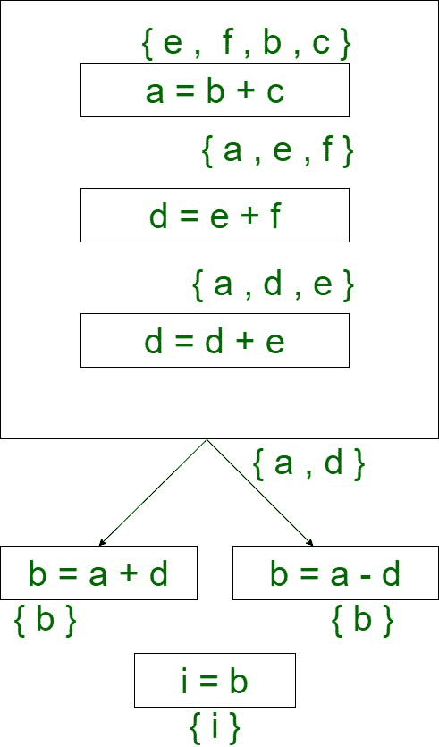
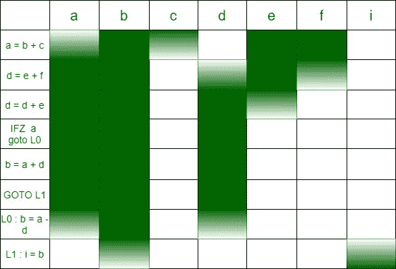
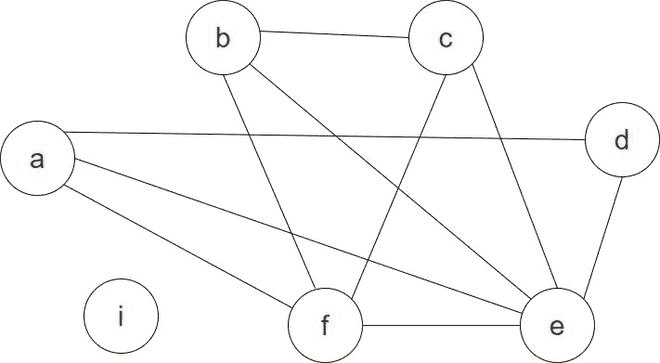
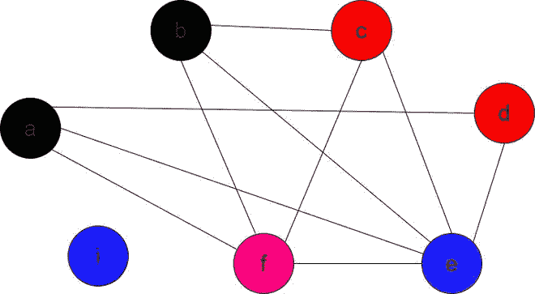

# 编译器设计中的寄存器分配算法

> 原文:[https://www . geesforgeks . org/register-allocation-algorithms-in-compiler-design/](https://www.geeksforgeeks.org/register-allocation-algorithms-in-compiler-design/)

**寄存器分配**是编译器最后阶段的重要方法。寄存器的存取速度比高速缓冲存储器快。寄存器的尺寸很小，可达几百 Kb。因此，有必要使用最小数量的寄存器进行变量分配。有三种流行的寄存器分配算法。

1.  初始寄存器分配
2.  线性扫描算法
3.  主席算法

这些解释如下。

**1。天真的寄存器分配:**

*   简单(无)寄存器分配基于变量存储在主存储器中的假设。
*   我们不能直接对存储在主存中的变量进行操作。
*   变量被移到寄存器中，寄存器允许使用算术逻辑单元执行各种操作。
*   算术逻辑单元包含一个临时寄存器，在执行算术和逻辑运算之前，变量会在其中移动。
*   在这个方法中，一旦操作完成，我们需要将结果存储回主存储器。
*   从主存来回转移变量会降低整体执行速度。

```
a = b + c
d = a
c = a + d
```

存储在主存储器中的变量:

<figure class="table">

| a | b | c | d |
| 2 fp | 4 英尺 | 6 英尺 | 8 英尺 |

</figure>

机器级说明:

```
LOAD  R1, _4fp
LOAD  R2, _6fp
ADD   R1, R2 
STORE R1, _2fp
LOAD  R1, _2fp
STORE R1, _8fp
LOAD  R1, _2fp
LOAD  R2, _8fp
ADD   R1, R2
STORE R1, _6fp
```

**优势:**

*   易于理解的操作和变量从主存储器到寄存器的流动，反之亦然。
*   只有 2 个寄存器足以执行任何操作。
*   设计复杂度更低。

**缺点:**

*   随着变量从主存转移到寄存器，时间复杂度增加。
*   加载和存储指令太多。
*   为了第二次访问一个变量，我们需要将它存储到主存储器中，以记录所做的任何更改，并再次加载它。
*   这种方法不适合现代编译器。

**2。线性扫描算法:**

*   线性扫描算法是一种全局寄存器分配机制。
*   这是一种自下而上的方法。
*   如果 n 个变量在任何时间点都是活动的，那么我们需要“n”个寄存器。
*   在该算法中，变量被线性扫描以确定变量的有效范围，基于该范围分配寄存器。
*   该算法背后的主要思想是分配最小数量的寄存器，以便这些寄存器可以再次使用，这完全取决于变量的活动范围。
*   对于这个算法，我们需要实现代码优化的动态变量分析。

```
a = b + c
d = e + f
d = d + e
IFZ a goto L0
b = a + d
goto L1
L0 : b = a - d 
L1 : i = b
```

**控制流程图:**



*   在本例中，在任何时间点，活动变量的最大数量为 4。因此，我们最多需要 4 个寄存器来分配寄存器。



如果我们在上图的任何一点画一条水平线，我们可以看到我们需要 4 个寄存器来执行程序中的操作。

**分裂:**

*   有时所需数量的寄存器可能不可用。在这种情况下，我们可能需要将一些变量移入和移出内存。这就是所谓的溢出。
*   溢出可以通过移动程序中使用次数较少的变量来有效地完成。

**缺点:**

*   线性扫描算法没有考虑变量的“寿命漏洞”。
*   变量在整个程序中不是实时的，并且该算法无法记录变量实时范围内的漏洞。

**3。图着色(柴丁算法):**

*   寄存器分配被解释为图着色问题。
*   节点代表变量的活动范围。
*   边缘表示两个活动范围之间的连接。
*   为节点分配颜色，使得没有两个相邻的节点具有相同的颜色。
*   颜色数量代表所需的最小寄存器数量。

图的 k-着色被映射到 k 个寄存器。

**步骤:**

1.  选择一个小于 k 度的任意节点。
2.  将该节点推到堆栈上，并移除它的所有输出边。
3.  检查剩余边的度数是否小于 k，如果是，转到 5，否则转到#
4.  如果任何剩余顶点的度数小于 k，则将它推到堆栈上。
5.  如果没有可推送的边，并且堆栈中存在所有边，则弹出每个节点，并对其进行着色，使得没有两个相邻的节点具有相同的颜色。
6.  分配给节点的颜色数量是所需寄存器的最小数量。

#根据节点的活动范围溢出一些节点，然后使用相同的 k 值重试。如果问题仍然存在，这意味着假设的 k 值不可能是最小的寄存器数量。尝试将 k 值增加 1，然后再次尝试整个过程。

对于上述相同的说明，图形着色如下:

假设 k=4



着色前

在执行图着色之后，如下获得最终图



k(4)色的最终图形

**注意:**任何颜色(寄存器)都可以被分配给‘I’，因为它对任何其他节点都没有边。