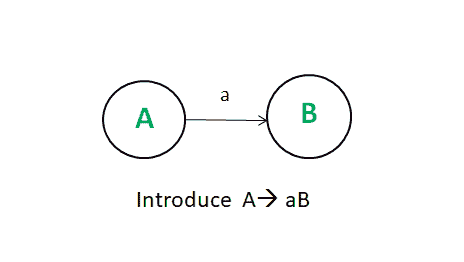
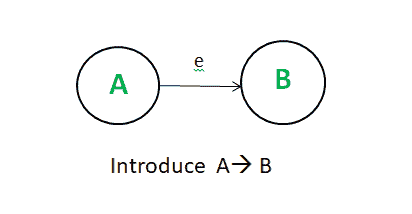
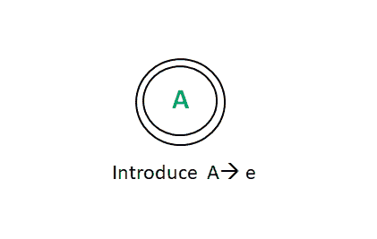

# 正则表达式 Vs 上下文无关语法

> 原文:[https://www . geesforgeks . org/正则表达式-vs-上下文无关-语法/](https://www.geeksforgeeks.org/regular-expression-vs-context-free-grammar/)

[正则表达式](https://www.geeksforgeeks.org/regular-expressions-regular-grammar-and-regular-languages/)能够描述标记的语法。任何可以用正则表达式描述的语法结构也可以用上下文无关语法来描述。

**正则表达式:**

```
(a|b)(a|b|01) 
```

**上下文无关语法:**

```
S --> aA|bA
A --> aA|bA|0A|1A|e 
```

*e 表示ε。

正则表达式的上下文无关语法形式 NFA 使用以下构造规则:

1.  每个状态都有一个非终端符号。
2.  如果符号 A 上的状态 A 转变为状态 B
    
3.  如果状态 A 变为状态 B，输入符号为 e
    
4.  如果 A 是接受状态。
    
5.  用语法的起始符号做 NFA 的起始符号。

每个正则集都可以用上下文无关的语法来描述，这就是我们使用正则表达式的原因。有几个原因，它们是:

<center>

| 正则表达式 | 上下文无关语法 |
| --- | --- |
| 就正则表达式而言，词法规则非常简单。 | 在上下文无关语法的情况下，词汇规则是困难的。 |
| 正则表达式中的符号很容易理解。 | 上下文无关语法中的符号相当复杂。 |
| 在正则表达式的情况下定义一组字符串。 | 在上下文无关语法中，语言是由产品集合定义的。 |
| 从正则表达式中构造高效的识别器很容易。 | 通过使用上下文无关语法，很难构造识别器。 |
| 对于正则表达式，有适当的词汇和句法分析程序。 | 在上下文无关语法的情况下，没有具体的词汇和句法分析指南。 |
| 正则表达式对于描述词汇结构如标识符、常量等非常有用。 | 上下文无关文法在描述嵌套链结构或句法结构(如平衡括号、if else 等)时最有用。
而这些不能用正则表达式来定义。 |

</center>