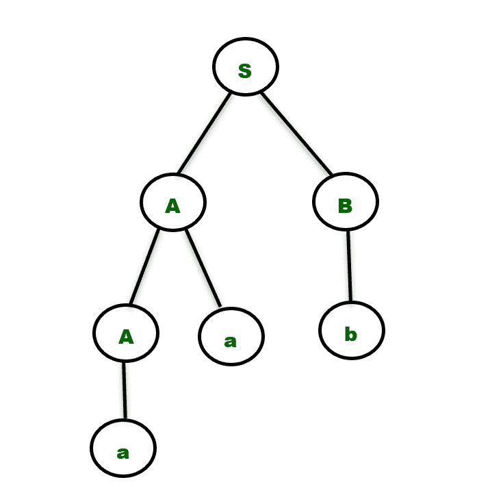
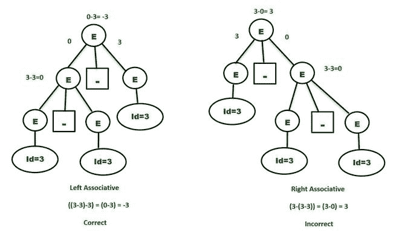
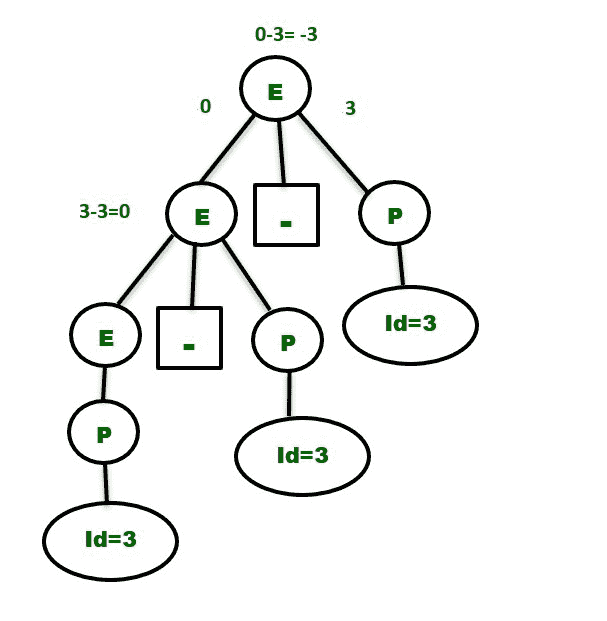
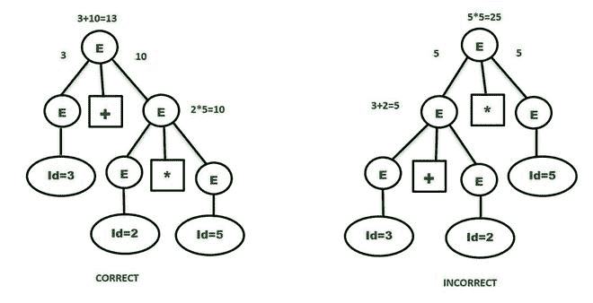
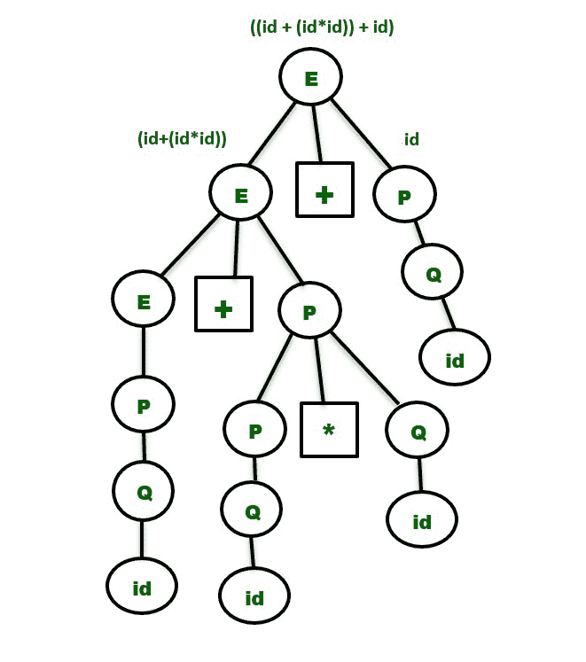

# 歧义消除(将歧义语法转换为明确语法)

> 原文:[https://www . geesforgeks . org/remove-of-歧义-转换-an-ambiguos-grammar-in-unambiguos-grammar/](https://www.geeksforgeeks.org/removal-of-ambiguity-converting-an-ambiguos-grammar-into-unambiguos-grammar/)

**先决条件:** [上下文无关语法](https://www.geeksforgeeks.org/classification-of-context-free-grammars/)、[歧义语法](https://www.geeksforgeeks.org/ambiguous-grammar/)、[歧义语法和非歧义语法的区别、](https://www.geeksforgeeks.org/difference-between-ambiguous-and-unambiguous-grammar/) [运算符的优先性和结合性](https://www.geeksforgeeks.org/operator-precedence-and-associativity-in-c/#:~:text=Operator%20precedence%20determines%20which%20operator,one%20operators%20with%20different%20precedence.&text=Operators%20Associativity%20is%20used%20when,Right%20or%20Right%20to%20Left.)、[递归语法](https://www.geeksforgeeks.org/classification-of-context-free-grammars/)
在本文中，我们将使用合适的示例来了解如何消除语法中的歧义。

**歧义语法 vs 无歧义语法:**
有多个派生树或 [**解析树**](https://www.geeksforgeeks.org/parse-tree-in-compiler-design/) 的语法是歧义语法。这些语法不被任何 [**解析器**](https://www.geeksforgeeks.org/types-of-parsers-in-compiler-design/) 解析。

**例-**T2**1。**考虑如下所示的生产–

> **S->aSbS | bSaS |∑**

比方说，我们想从上面的语法生成字符串**“abab”**。我们可以观察到，给定的字符串可以使用两个解析树导出。所以，上面的语法是歧义的。

只有一个派生树或解析树的语法称为明确语法。

**2。**考虑如下所示的产品–

> **S->AB**
> T3】A->Aa | AT5**B->B**

对于字符串“aab”，我们只有一个语法解析树，如下所示。

需要注意的是**没有直接的算法**来发现语法是否有歧义。我们需要为属于由语法产生的语言的给定输入字符串构建解析树，然后根据如上所述获得的解析树的数量来决定语法是模糊的还是明确的。

**注意–**必须仔细选择字符串，因为在只有一个解析树的明确语法所产生的语言中，可能有一些字符串可用。

**消除歧义:**
我们可以仅基于以下两个属性来消除歧义–

**1。** **优先级–**
如果使用不同的运算符，我们会考虑运算符的优先级。这三个重要特征是:

1.  生产存在的级别表示所用操作员的优先级。
2.  在**更高等级**的生产将会有**操作员，优先级较低**。在解析树中，位于顶层或接近根节点的节点将包含优先级较低的运算符。
3.  在**较低级别**的生产将有具有**较高优先级**的操作员。在解析树中，位于较低级别或靠近叶节点的节点将包含较高优先级的运算符。

**2。** **结合性–**
如果生产中有相同的优先操作符，那么我们必须考虑结合性。

*   如果关联性是从左到右，那么我们必须在生产中提示左递归。解析树也将保持递归，并在左侧增长。
    +、-、*、/是左关联运算符。
*   如果关联性是从右到左，那么我们必须在产品中提示右递归。解析树也将是右递归的，并在右侧生长。
    ^是右联想算子。

**示例 1–**考虑不明确的语法

> **E - > E-E | id**
> 语法中的语言将包含{ id，id-id，id-id，…。}

比方说，我们要导出字符串 **id-id-id。**让我们考虑 id=3 的单个值，以获得更多见解。结果应该是:

> 3-3-3 =-3
> 由于优先级相同的运算符，我们需要考虑从左到右的关联性。

**解析树–**生长在根的左侧的解析树将是正确的解析树，以便使语法明确。

所以，为了使上面的语法不含糊，只需通过用另一个随机变量替换产品右侧最左边的非终结符 E 来使语法**左递归**，比如说 **P.** 语法就变成了:

> **E->E–P | P**
> T3】P->id

上面的语法现在是明确的，对于上面的表达式将只包含一个解析树，如下所示

类似地，表达式: **2^3^2** 的明确语法是–

> **E - > P ^ E | P //右递归，因为^是右联想的。**T2**P->id**

**示例 2–**考虑下面显示的语法，它有两个不同的运算符:

> **E - > E + E | E * E | id**

显然，上面的语法是不明确的，因为我们可以为字符串**“id+id * id”**绘制两个解析树，如下所示。考虑以下表达式:

> **3+2 * 5//*”比“+”**
> **优先级更高正确答案是:(3+(2*5))=13**

优先级最低的“+”必须位于较高的级别，并且必须等待位于较低级别的“*”运算符产生的结果。因此，第一个解析树是正确的，并给出了与预期相同的结果。

明确的语法将包含在较低级别具有最高优先级运算符**(示例中为“*”)**的产品，反之亦然。两个操作符的关联性是**从左到右**。所以，明确的语法必须是**左递归的。**语法将是:

> **E - > E + P** // +处于较高级别，左关联
> T3】E->PT5**P->P * Q**/*处于较低级别，左关联
> T9】P->Q
> T12】Q->id
> 
> **(或)**
> 
> **E->E+P | P**T2**P->P * Q | Q**
> T6】Q->id

**E** 做加法运算， **P** 做乘法运算。它们是独立的，将保持解析树中的优先顺序。
字符串**“id+id * id+id”**的解析树将是–

**注意:**非常重要的一点是，在把一个有歧义的语法转换成无歧义的语法时，我们不应该改变有歧义的语法所提供的原始语言。因此，模糊语法中的非终结符必须用其他变量替换，这样我们就可以得到与之前派生的语言相同的语言，同时还能保持优先和结合规则。

这就是我们在上面的例子中替换掉生产 **E - > P** 和 **P - > Q** 和 **Q - > id** 之后编写生产**E->P**的原因，因为语言中也包含了字符串 **{ id，id+id }** 。
类似地，具有运算符 **-,*,^** 的表达式的明确语法是:

> **E->E–P | P**//由于优先级最低且左关联，减运算符处于较高的级别。
> **P - > P * Q | Q** //乘法运算符的优先级比–高，比^低，左**关联。**
> **Q - > R ^ Q | R** //由于最高优先级和右关联，指数运算符处于较低级别。
> T11】R->id

此外，还有一些不明确的语法不能转换成明确的语法。