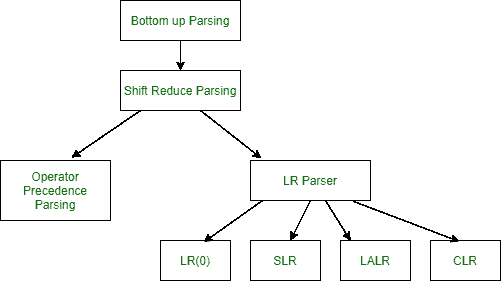
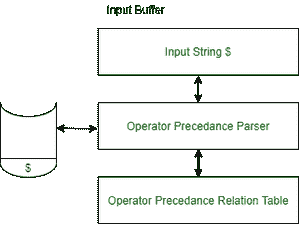
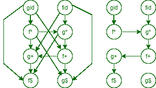
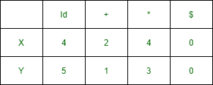

# 运算符优先级解析器的作用

> 原文:[https://www . geesforgeks . org/operator-preference-parser/](https://www.geeksforgeeks.org/role-of-operator-precedence-parser/)

在本文中，我们将介绍运算符优先级解析器的概述，并主要关注运算符优先级解析器的作用。还将介绍构造优先函数的算法，最后将讨论运算符优先解析中的错误恢复。我们一个一个来讨论。

**简介:**
[操作符优先解析器](https://www.geeksforgeeks.org/operator-grammar-and-precedence-parser-in-toc/)为操作符优先语法构建。运算符优先语法是一种不包含ε乘积的语法，也不包含任何乘积的 R.H.S .上的两个相邻非终结符。运算符优先语法带有优先规则。运算符优先语法可以是不明确的，也可以是明确的。



**运算符优先解析器算法:**

```
1\. If the front of input $ and top of stack both have $, it's done
  else
2\. compare front of input b with ⋗
      if b! = '⋗'
         then push b
      scan the next input symbol
3\. if b == '⋗'
       then pop till ⋖ and store it in a string S
       pop ⋖ also
       reduce the poped string
       if (top of stack) ⋖ (front of input)
            then push ⋖ S
       if (top of stack) ⋗ (front of input)
            then push S and goto 3 
```

**组件操作员图:**



组件操作符

**示例–**
我们举个例子来理解运算符优先级的作用，如下所示。

```
E-> E+T/T
T-> T*V/V
V->a/b/c/d
string= "a+b*c*d"
```

字符串“a+b*c*d”的上述算法实现如下。

<figure class="table">

| 堆 | 投入 | 栈顶 | 电流输入 | 行动 |
| --- | --- | --- | --- | --- |
| $ | a+b*c*d$ | $ | a | 移位 a |
| 一美元 | +b*c*d$ | A | + | 减少使用 A->a |
| 五美元 | +b*c*d$ | V | + | 使用 T->V 减少 |
| $T | +b*c*d$ | T | + | 使用 E->T 减少 |
| $E | +b*c*d$ | E | + | shift + |
| $E+ | b*c*d$ | b | * | 减少使用 V->b |
| $E+V | b*c*d$ | V | * | 使用 T->V 减少 |
| $E+T | *c*d$ | T | * | 轮班* |
| $E+T* | c*d$ | * | c | c 档 |
| $E+T*c | *d$ | c | * | 使用 V->c 减少 |
| $E+T*V | *d$ | V | * | 使用 T->T*V 减少 |
| $E+T | *d$ | T | * | 轮班* |
| $E+T* | d$ | * | d | d 档 |
| $E+T*d | $ | d | $ | 使用 V->d 减少 |
| $E+T*V | $ | V | $ | 使用 T->T*v 减少 |
| $E+T | $ | T | $ | 减少使用 E->E+T |
| $T | $ | E | $ | 接受 |

**优先函数构造算法:**

1.  为每个语法终端 a 和字符串符号的结尾生成一个函数 Xa。
2.  将符号分成组，这样如果 a 是≐ b，Xa 和 Yb 就是同一个组。
3.  对于每个符号 a 和 b，生成一个节点在组中的有向图，如果 a 是⋖ b，则放置一条从 Yb 组到 Xa 组的边，否则如果 a 是⋗ b，则放置一条从 Xa 组到 Yb 组的边。
4.  如果构造的图有一个循环，那么就不存在过程函数。当没有循环时，分别从 Xa 和 yb 组中收集最长路径的长度。

**示例–**
我们举个例子来理解优先函数的构造如下。

```
E -> E + E/E * E/( E )/id
```

在这里，您将看到运算符优先关系表和优先关系图。让我们看看。


操作员优先关系表



优先关系图

因为我们可以看到图中没有循环，所以我们可以将这个函数表如下所示。



功能表

**列表示功能:**

**列代表函数 Ya，行代表函数 Xa–**
通过取 Xid 到 X$和 Yid 到 Y$的最长路径计算。

```
fid -> g* -> f+ ->g+ -> f$
gid -> f* -> g* ->f+ -> g+ ->f$ 
```

*   运算符优先关系表的缺点是，如果有 n 个符号，那么我们需要一个 n*n 的表来存储它们。另一方面，通过使用运算符函数表，为了容纳 n 个符号，我们需要一个 2*n 的表。运算符优先语法不能决定一元减(词法分析器应该处理一元减)。
*   使用运算符优先语法的优点是简单，并且对于编程语言中的表达式足够强大。

**运算符优先解析中的错误恢复:**

*   **错误案例–**
    **1。**堆栈顶部的终端和下一个输入符号之间没有关系。
    **2。**找到一个手柄(还原步骤)，但没有以此手柄为右侧的产品。

*   **错误恢复–**
    **1。**每个空条目都用一个指向错误例程的指针填充。
    **2。**决定弹出的手柄“看起来像”哪个右手边。并试图从这种情况中恢复过来。

*   **处理轮班/减少错误–**
    为了处理此类错误，我们必须修改以下内容。
    **1。**堆叠
    **2** 。输入
    **3。**或两者都有

</figure>