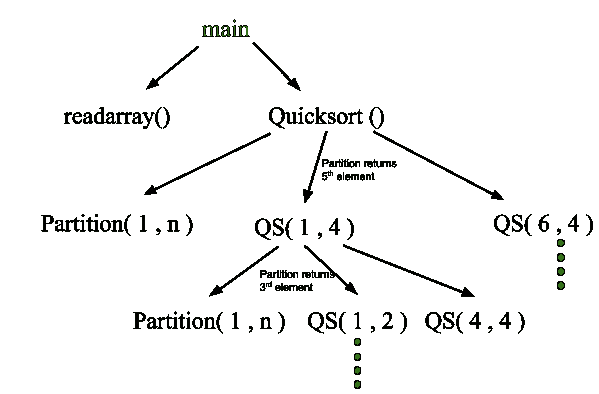
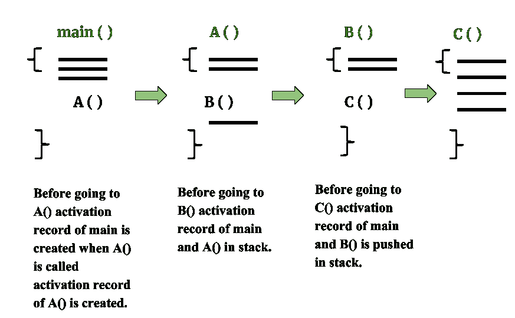
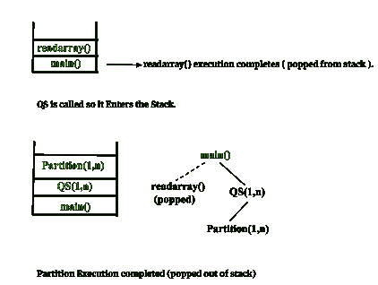
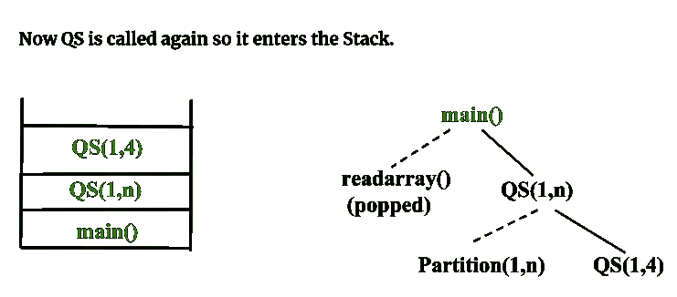
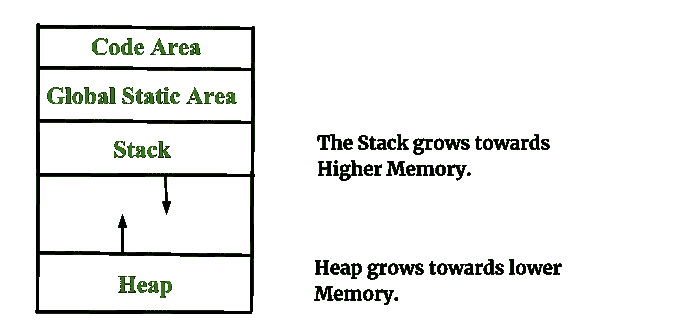
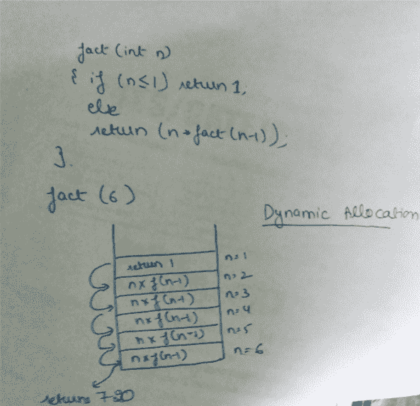
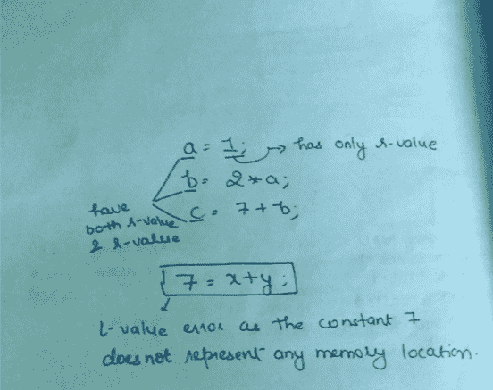
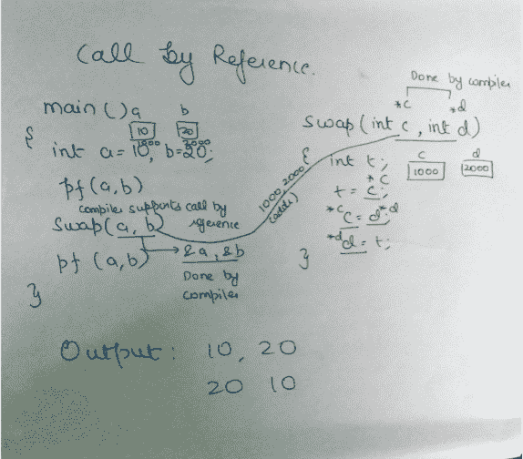
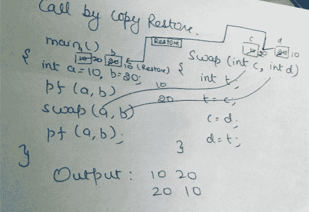
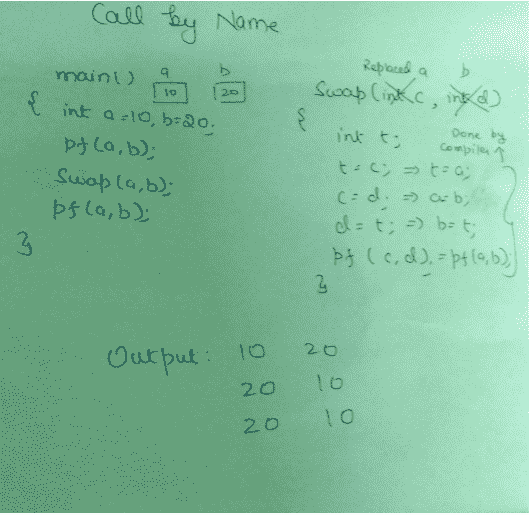

# 编译器设计中的运行时环境

> 原文:[https://www . geesforgeks . org/runtime-environments-in-compiler-design/](https://www.geeksforgeeks.org/runtime-environments-in-compiler-design/)

翻译需要将程序的静态源文本与执行程序时必须发生的动态动作联系起来。该程序由过程名、标识符等组成。，需要在运行时映射到实际的内存位置。

运行时环境是目标机器的状态，可能包括软件库、环境变量等。，为系统中运行的进程提供服务。

**源语言问题**

**激活树**

程序由过程组成，过程定义是一个声明，它以最简单的形式将标识符(过程名)与语句(过程体)相关联。过程的每次执行都被称为过程的激活。激活的生存期是程序执行过程中出现的一系列步骤。如果“a”和“b”是两个过程，那么它们的激活将是非重叠的(当一个接一个地被调用时)或嵌套的(嵌套过程)。如果在同一过程的早期激活结束之前开始新的激活，则该过程是递归的。激活树显示控件进入和离开激活的方式。
激活树的属性为:-

*   每个节点代表一个过程的激活。
*   根表示主要功能的激活。
*   当且仅当控制从过程 x 流向过程 y 时，过程“x”的节点是过程“y”的节点的父节点。

**示例–**考虑快速排序的以下程序

```
main() {

      Int n;
      readarray();
      quicksort(1,n);
}

quicksort(int m, int n) {

     Int i= partition(m,n);
     quicksort(m,i-1);
     quicksort(i+1,n);
}
```

该程序的激活树将是:



首先主函数作为根函数，然后主函数调用 readarray 和 quicksort。快速排序又调用分区和快速排序。程序中的控制流对应于从根开始的激活树的深度优先遍历。

**控制堆栈和激活记录**

控制堆栈或运行时堆栈用于跟踪实时过程激活，即执行尚未完成的过程。过程名在被调用(激活开始)时被推送到堆栈上，在返回(激活结束)时被弹出。使用激活记录或帧来管理单次执行过程所需的信息。当一个过程被调用时，一个激活记录被推入堆栈，一旦控件返回到调用者函数，激活记录就被弹出。



一般激活记录包括以下内容:

*   **局部变量:**保存程序执行的局部数据。
*   **临时值**:存储表达式求值中出现的值。
*   **机器状态:**保存函数调用前机器的状态信息。
*   **访问链接(可选):**指其他激活记录中保存的非本地数据。
*   **控制链接(可选):**指向来电者的激活记录。
*   **返回值:**被调用过程用来向调用过程返回值
*   实际参数

上述快速排序示例的控件堆栈:





**运行时存储器的细分**

运行时存储可以细分为:

*   目标代码——程序代码，它是静态的，因为它的大小可以在编译时确定
*   静态数据对象
*   动态数据对象-堆
*   自动数据对象-堆栈



**存储分配技术**

**一、静态存储分配**

*   对于任何程序，如果我们在编译时创建内存，内存将在静态区域创建。
*   对于任何程序，如果我们只在编译时创建内存，那么内存只创建一次。
*   它不支持动态数据结构，即内存在编译时创建，在程序完成后释放。
*   静态存储分配的缺点是不支持递归。
*   另一个缺点是数据的大小应该在编译时知道

FORTRAN 被设计成允许静态存储分配。

**二。堆栈存储分配**

*   存储被组织为堆栈，激活记录分别在激活开始和结束时被推送和弹出。本地变量包含在激活记录中，因此它们在每次激活时都绑定到新存储。
*   堆栈分配支持递归

**三。堆存储分配**

*   根据用户的要求，内存分配和释放可以在任何时间和任何地点进行。
*   堆分配用于动态分配内存给变量，并在不再需要变量时收回内存。
*   支持递归。



**参数通过**

过程之间的通信媒介称为参数传递。调用过程的变量值通过某种机制传递给被调用过程。

**基本术语:**

*   **R 值:**表达式的值称为其 R 值。如果包含在单个变量中的值出现在赋值运算符的右侧，则该值也会变成 r 值。r 值总是可以赋给其他变量。
*   **L-value: **The location of the memory(address) where the expression is stored is known as the l-value of that expression. It always appears on the left side if the assignment operator.
    

    **i .形式参数:**接受调用者过程传递的信息的变量称为形式参数。这些变量在被调用函数的定义中声明。

    **二。实际参数:**其值和函数被传递给被调用函数的变量称为实际参数。这些变量在函数调用中被指定为参数。

**将参数传递给程序的不同方式**

*   **按值调用**
    在按值调用中，调用过程传递实际参数的 r 值，编译器将其放入被调用过程的激活记录中。形式参数保存调用过程传递的值，因此形式参数中的任何更改都不会影响实际参数。
*   **Call by Reference**In call by reference the formal and actual parameters refers to same memory location. The l-value of actual parameters is copied to the activation record of the called function. Thus the called function has the address of the actual parameters. If the actual parameters does not have a l-value (eg- i+3) then it is evaluated in a new temporary location and the address of the location is passed. Any changes made in the formal parameter is reflected in the actual parameters (because changes are made at the address).

    

*   **通过复制还原调用**
    在通过复制还原调用中，编译器在调用过程时复制形式参数中的值，并在控制返回到被调用函数时将它们复制回实际参数中。r 值被传递，返回时形式的 r 值被复制成实际的 l 值。
    
*   **按名称调用**
    在按名称调用中，在过程中出现形式的所有地方，实际参数都被形式所替代。它也被称为惰性评估，因为只有在需要时才会对参数进行评估。

本文由**帕鲁尔·夏尔马**供稿。如果你喜欢 GeeksforGeeks 并想投稿，你也可以使用[contribute.geeksforgeeks.org](http://www.contribute.geeksforgeeks.org)写一篇文章或者把你的文章邮寄到 contribute@geeksforgeeks.org。看到你的文章出现在极客博客主页上，帮助其他极客。

如果你发现任何不正确的地方，或者你想分享更多关于上面讨论的话题的信息，请写评论。