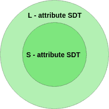

# 句法指导翻译中的 S 属性和 L 属性语义词典

> 原文:[https://www . geesforgeks . org/s-attributed-and-l-attributed-sdts-in-syntax-directed-translation/](https://www.geeksforgeeks.org/s-attributed-and-l-attributed-sdts-in-syntax-directed-translation/)

在讨论 S 属性和 L 属性 SDT 之前，这里简单介绍一下合成属性或继承属性

**属性类型–**
属性可能有两种类型–合成或继承。

1.  **Synthesized attributes –**
    A Synthesized attribute is an attribute of the non-terminal on the left-hand side of a production. Synthesized attributes represent information that is being passed up the parse tree. The attribute can take value only from its children (Variables in the RHS of the production).

    比方说，假设 A -> BC 是一个语法的产物，A 的属性依赖于 B 的属性或 C 的属性，那么它将是合成属性。

2.  **继承属性–**
    产品右侧非终端的属性称为继承属性。该属性可以从其父级或同级(生产的 LHS 或 RHS 中的变量)获取值。

例如，假设 A -> BC 是一个语法的产物，B 的属性依赖于 A 的属性或 C 的属性，那么它将是继承属性。

现在，我们来讨论一下 S 属性和 L 属性的 SDT。

1.  **S 属性 SDT :**
    *   如果一个软件开发工具包只使用合成属性，它被称为 S 属性软件开发工具包。
    *   由于父节点的值依赖于子节点的值，因此 s 属性的 SDT 在自下而上的解析中进行评估。
    *   语义动作放在 RHS 最右边的位置。
2.  **L 属性 SDT:**
    *   如果一个 SDT 同时使用合成属性和继承属性，并限制继承属性只能从左兄弟继承值，它被称为 L 属性 SDT。
    *   L 属性 SDT 中的属性通过深度优先和从左到右的解析方式进行评估。
    *   Semantic actions are placed anywhere in RHS.

        例如，

        ```
        A -> XYZ {Y.S = A.S, Y.S = X.S, Y.S = Z.S} 
        ```

        不是 L 属性化语法，因为 Y.S = A.S 和 Y.S = X.S 是允许的，但是 Y.S = Z.S 违反了 L 属性化 SDT 定义，因为属性化是从其右兄弟继承值。

        **注意–**如果一个定义是 S 属性的，那么它也是 L 属性的，但是**不是**，反之亦然。

        

        **示例–**考虑下面给出的 SDT。

        ```
        P1: S -> MN  {S.val= M.val + N.val}
        P2: M -> PQ  {M.val = P.val * Q.val  and P.val =Q.val} 
        ```

        选择正确的选项。P1 和 P2 都是南方人。
        B. P1 为 S 属性，P2 为 L 属性。
        P1 是左属性，但 P2 不是左属性。
        D .以上都不是

        **解释–**
        正确答案是选项 **C** 因为，在 P1，S 是合成属性，在 L 属性定义中允许合成。所以 P1 遵循 L 属性定义。但是 P2 没有遵循 L 属性的定义，因为 P 依赖于 Q，Q 是它的 RHS。