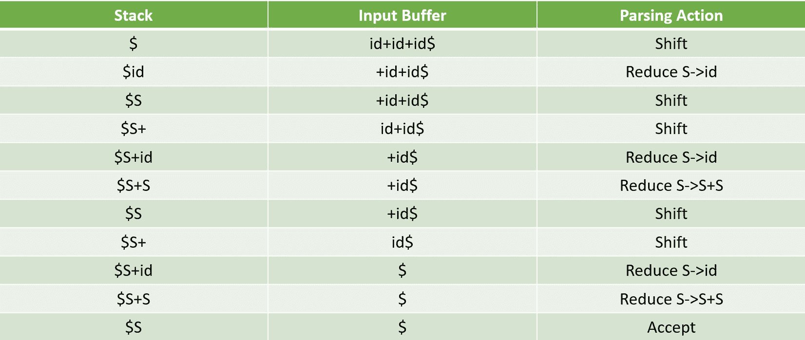

# 编译器中的移位缩减解析器

> 原文:[https://www.geeksforgeeks.org/shift-reduce-parser-compiler/](https://www.geeksforgeeks.org/shift-reduce-parser-compiler/)

先决条件–[解析|集合 2(自下而上或移位缩减解析器)](https://www.geeksforgeeks.org/parsing-set-2-bottom-up-or-shift-reduce-parsers/)

**Shift Reduce 解析器**尝试以与自下而上解析类似的方式构建解析，即解析树从叶子(底部)到根(向上)构建。移位-缩减解析器的一种更通用的形式是 LR 解析器。

这个解析器需要一些数据结构

*   用于存储输入字符串的输入缓冲器。
*   用于存储和访问生产规则的堆栈。

**基本操作–**

*   **Shift:** 这包括将符号从输入缓冲区移动到堆栈上。
*   **减少:**如果句柄出现在堆栈顶部，则使用适当的生产规则减少句柄，即生产规则的 RHS 从堆栈中弹出，生产规则的 LHS 被推送到堆栈上。
*   **接受:**如果堆栈中只有开始符号，并且输入缓冲区为空，则解析操作称为接受。当获得接受的动作时，这意味着成功的解析完成。
*   **错误:**这是解析器既不能执行移位动作，也不能执行缩减动作，甚至不能接受动作的情况。

**例 1–**考虑语法
S–>S+S
S–>S * S
S–>id

对输入字符串“id + id + id”执行 Shift Reduce 解析。



**示例 2–**考虑语法
E–>2e 2
E–>3e 3
E–>4
对输入字符串“32423”执行 Shift Reduce 解析。


**示例 3**–考虑语法
S–>(L)| a
L–>L，S | S
对输入字符串“(a，(a，a))执行 Shift Reduce 解析。

<figure class="table">

| 堆 | 输入缓冲器 | 解析动作 |
| --- | --- | --- |
| { content } # xA0 | (a)、(a、a)美元 | 变化 |
| $ ( | (a，a)美元 | 变化 |
| $ ( a | (a，a)美元 | 减少 S → a |
| $(新元 | (a，a)美元 | 减少 L → S |
| $(升 | (a，a)美元 | 变化 |
| $(升， | (a，a)美元 | 变化 |
| $(升，( | a，a)美元 | 变化 |
| $(升，(一) | )美元 | 减少 S → a |
| $(升，(秒 | )美元 | 减少 L → S |
| $(升，(升 | )美元 | 变化 |
| $(升，(升， | 美元) | 变化 |
| $(升，(升，一 | ) ) $ | 减少 S → a |
| $(升，(升，降) | ) ) $ | 减少 L →L，S |
| $(升，(升 | ) ) $ | 变化 |
| $(升，(升) | ) $ | 减少 S → (L) |
| $(升，秒 | ) $ | 减少 L → L，S |
| $(升 | ) $ | 变化 |
| $(升) | $ | 减少 S → (L) |
| $ S | $ | 接受 |

以下是实施情况-

## C++

```
// Including Libraries
#include <bits/stdc++.h>
using namespace std;

// Global Variables
int z = 0, i = 0, j = 0, c = 0;

// Modify array size to increase 
// length of string to be parsed
char a[16], ac[20], stk[15], act[10]; 

// This Function will check whether
// the stack contain a production rule 
// which is to be Reduce.
// Rules can be E->2E2 , E->3E3 , E->4
void check()
{
    // Copying string to be printed as action
    strcpy(ac,"REDUCE TO E -> ");  

    // c=length of input string
    for(z = 0; z < c; z++) 
    {
        // checking for producing rule E->4
        if(stk[z] == '4') 
        {
            printf("%s4", ac);
            stk[z] = 'E';
            stk[z + 1] = '\0';

            //printing action
            printf("\n$%s\t%s$\t", stk, a); 
        }
    }

    for(z = 0; z < c - 2; z++)
    {
        // checking for another production
        if(stk[z] == '2' && stk[z + 1] == 'E' && 
                                stk[z + 2] == '2') 
        {
            printf("%s2E2", ac);
            stk[z] = 'E';
            stk[z + 1] = '\0';
            stk[z + 2] = '\0';
            printf("\n$%s\t%s$\t", stk, a);
            i = i - 2;
        }

    }

    for(z = 0; z < c - 2; z++)
    {
        //checking for E->3E3
        if(stk[z] == '3' && stk[z + 1] == 'E' && 
                                stk[z + 2] == '3') 
        {
            printf("%s3E3", ac);
            stk[z]='E';
            stk[z + 1]='\0';
            stk[z + 1]='\0';
            printf("\n$%s\t%s$\t", stk, a);
            i = i - 2;
        }
    }
    return ; // return to main
}

// Driver Function
int main()
{
    printf("GRAMMAR is -\nE->2E2 \nE->3E3 \nE->4\n");    

    // a is input string
    strcpy(a,"32423"); 

    // strlen(a) will return the length of a to c
    c=strlen(a); 

    // "SHIFT" is copied to act to be printed
    strcpy(act,"SHIFT"); 

    // This will print Labels (column name)
    printf("\nstack \t input \t action"); 

    // This will print the initial 
    // values of stack and input
    printf("\n$\t%s$\t", a); 

    // This will Run upto length of input string
    for(i = 0; j < c; i++, j++) 
    {
        // Printing action
        printf("%s", act); 

        // Pushing into stack
        stk[i] = a[j];     
        stk[i + 1] = '\0';

        // Moving the pointer
        a[j]=' ';

        // Printing action
        printf("\n$%s\t%s$\t", stk, a); 

        // Call check function ..which will 
        // check the stack whether its contain
        // any production or not
        check(); 
    }

    // Rechecking last time if contain
    // any valid production then it will
    // replace otherwise invalid
    check(); 

    // if top of the stack is E(starting symbol)
    // then it will accept the input
    if(stk[0] == 'E' && stk[1] == '\0') 
        printf("Accept\n");
    else //else reject
        printf("Reject\n");
}
// This code is contributed by Shubhamsingh10
```

## C

```
//Including Libraries
#include<stdio.h>
#include<stdlib.h>
#include<string.h>

//Global Variables
int z = 0, i = 0, j = 0, c = 0;

// Modify array size to increase
// length of string to be parsed
char a[16], ac[20], stk[15], act[10];

// This Function will check whether
// the stack contain a production rule
// which is to be Reduce.
// Rules can be E->2E2 , E->3E3 , E->4
void check()
{
    // Copying string to be printed as action
    strcpy(ac,"REDUCE TO E -> "); 

    // c=length of input string
    for(z = 0; z < c; z++)
    {
        //checking for producing rule E->4
        if(stk[z] == '4')
        {
            printf("%s4", ac);
            stk[z] = 'E';
            stk[z + 1] = '\0';

            //printing action
            printf("\n$%s\t%s$\t", stk, a);
        }
    }

    for(z = 0; z < c - 2; z++)
    {
        //checking for another production
        if(stk[z] == '2' && stk[z + 1] == 'E' &&
                                stk[z + 2] == '2')
        {
            printf("%s2E2", ac);
            stk[z] = 'E';
            stk[z + 1] = '\0';
            stk[z + 2] = '\0';
            printf("\n$%s\t%s$\t", stk, a);
            i = i - 2;
        }

    }

    for(z=0; z<c-2; z++)
    {
        //checking for E->3E3
        if(stk[z] == '3' && stk[z + 1] == 'E' &&
                                stk[z + 2] == '3')
        {
            printf("%s3E3", ac);
            stk[z]='E';
            stk[z + 1]='\0';
            stk[z + 1]='\0';
            printf("\n$%s\t%s$\t", stk, a);
            i = i - 2;
        }
    }
    return ; //return to main
}

//Driver Function
int main()
{
    printf("GRAMMAR is -\nE->2E2 \nE->3E3 \nE->4\n");   

    // a is input string
    strcpy(a,"32423");

    // strlen(a) will return the length of a to c
    c=strlen(a);

    // "SHIFT" is copied to act to be printed
    strcpy(act,"SHIFT");

    // This will print Labels (column name)
    printf("\nstack \t input \t action");

    // This will print the initial
    // values of stack and input
    printf("\n$\t%s$\t", a);

    // This will Run upto length of input string
    for(i = 0; j < c; i++, j++)
    {
        // Printing action
        printf("%s", act);

        // Pushing into stack
        stk[i] = a[j];    
        stk[i + 1] = '\0';

        // Moving the pointer
        a[j]=' ';

        // Printing action
        printf("\n$%s\t%s$\t", stk, a);

        // Call check function ..which will
        // check the stack whether its contain
        // any production or not
        check();
    }

    // Rechecking last time if contain
    // any valid production then it will
    // replace otherwise invalid
    check();

    // if top of the stack is E(starting symbol)
    // then it will accept the input
    if(stk[0] == 'E' && stk[1] == '\0')
        printf("Accept\n");
    else //else reject
        printf("Reject\n");
}
// This code is contributed by Ritesh Aggarwal
```

**输出–**

```
GRAMMAR is -
E->2E2 
E->3E3 
E->4

stack      input      action
$    32423$    SHIFT
$3     2423$    SHIFT
$32      423$    SHIFT
$324       23$    REDUCE TO E -> 4
$32E       23$    SHIFT
$32E2        3$    REDUCE TO E -> 2E2
$3E        3$    SHIFT
$3E3         $    REDUCE TO E -> 3E3
$E         $    Accept
```

</figure>