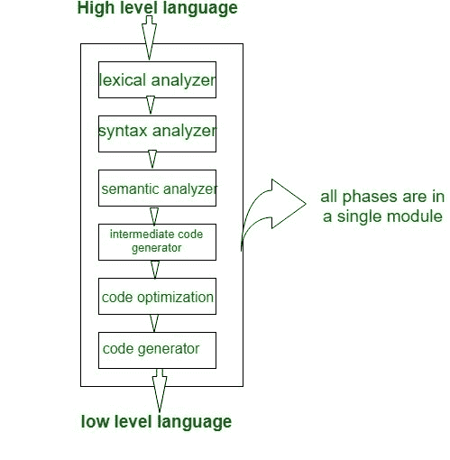
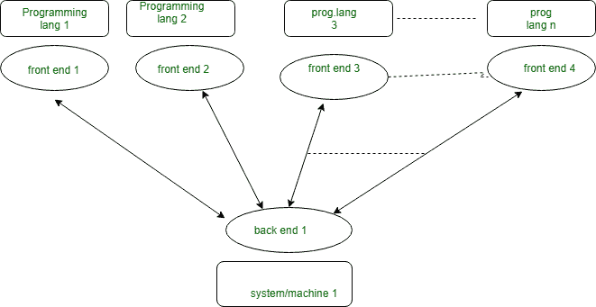
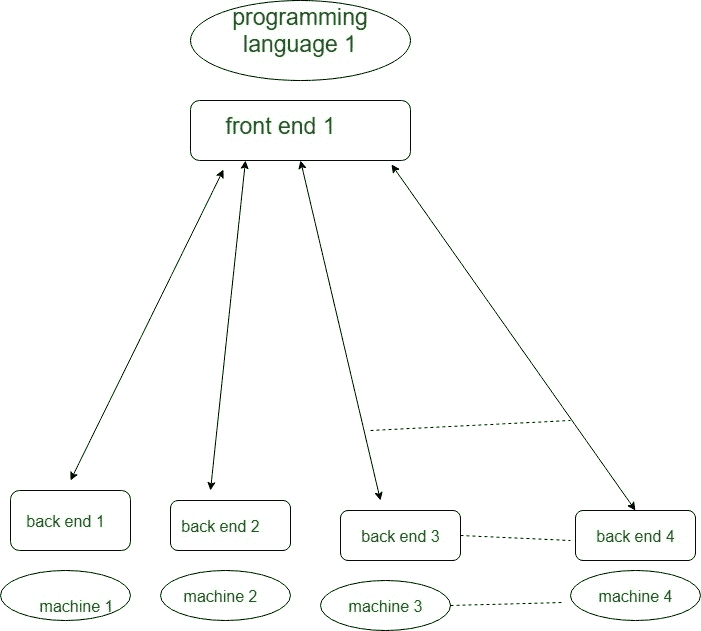

# 单程、两程和多程编译器

> 原文:[https://www . geeksforgeeks . org/单遍-两遍-多遍-编译器/](https://www.geeksforgeeks.org/single-pass-two-pass-and-multi-pass-compilers/)

我们已经知道了编译器设计的所有阶段，现在编译器通过了。一个**编译器传递**是指编译器遍历整个程序。编译器传递有两种类型:单程编译器和双程编译器*或*多程编译器。这些解释如下。

**1。单程编译器:**
如果我们将编译器设计的所有阶段组合或分组在一个**单个**模块中，称为单程编译器。

在上图中，所有 6 个阶段都被组合在一个模块中，单程编译器的一些要点如下:

1.  一次通过/单次通过编译器是一种只通过每个编译单元一次的编译器。
2.  单程编译器比多程编译器更快更小。
3.  单程编译器的缺点是与多程编译器相比效率较低。
4.  单程编译器是一个只处理一次输入*的编译器，所以直接从词法分析到代码生成器，然后返回进行下一次读取。*

***注:**单通编译器几乎没做过，早期 **Pascal 编译器**就做过这个作为介绍。*

***单程编译器问题:***

1.  *由于表达式的上下文受限，我们无法很好地进行优化。*
2.  *由于我们不能备份和处理它，所以语法应该被限制或简化。*
3.  *像 *bash/sh/tcsh* 这样的命令解释器可以认为是单通编译器，但是它们也是一处理完就执行入口。*

***2。两遍编译器*或*多遍编译器:**
两遍/多遍编译器是一种多次处理程序的*源代码*或抽象语法树的编译器。在多遍编译器中，我们将阶段分为两遍，如下所示:*

**

1.  ***First Pass:** is refers as

    *   **(一)。**前端
    *   **(b)。**分析部分
    *   **(c)。**平台无关

    在第一遍中，包含的阶段是词法分析器、语法分析器、语义分析器、中间代码生成器作为前端和分析部分工作，这意味着所有阶段都分析高级语言并将其转换为**三个地址码**，并且第一遍是平台无关的，因为第一遍的输出是对每个系统都有用的三个地址码，并且要求更改第二遍中的**代码优化和代码生成器阶段**。* 
2.  ***Second Pass:** is refers as

    *   **(一)。**后端
    *   **(b)。**合成部分
    *   **(c)。**平台相关

    在第二遍中，包含的阶段是代码优化，代码生成器是后端，合成部分是指将输入作为三个地址码，并将其转换为低级语言/汇编语言，第二遍是平台相关的，因为典型编译器的最后阶段将程序的中间表示转换为依赖于系统的可执行指令集。* 

***使用多遍编译器，我们可以解决这两个基本问题:***

1.  *If we want to design a compiler for different programming language for same machine. In this case for each programming language there is requirement of making Front end/first pass for each of them and only one Back end/second pass as:

    * 
2.  *If we want to design a compiler for same programming language for different machine/system. In this case we make different Back end for different Machine/system and make only one **Front end** for same programming language as:

    

    **单程和多程编译器的区别:**

    

    | 因素 | 单程 | 多次通过 |
    | 速度 | 快的 | 慢的 |
    | 记忆 | 更大的 | 较少的 |
    | 时间 | 较少的 | 更大的 |
    | 轻便 | 不 | 是 |

    
*