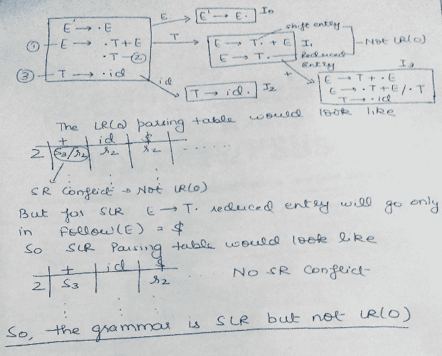
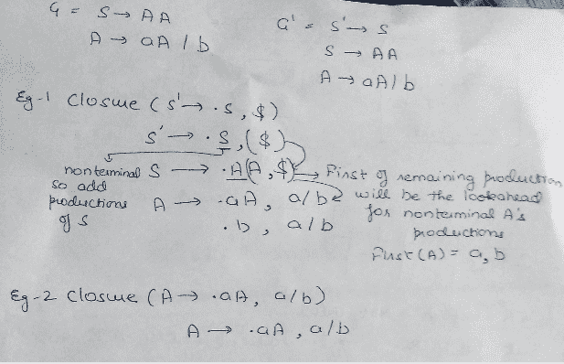
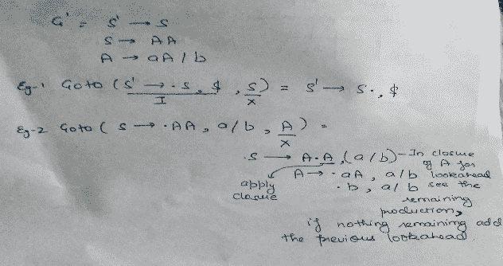
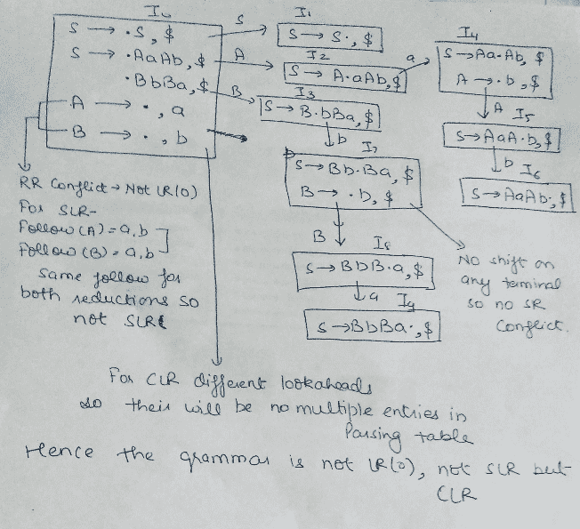
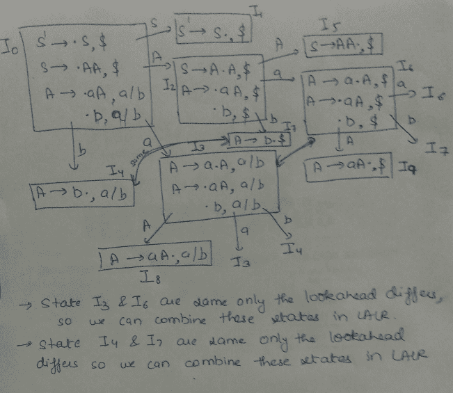
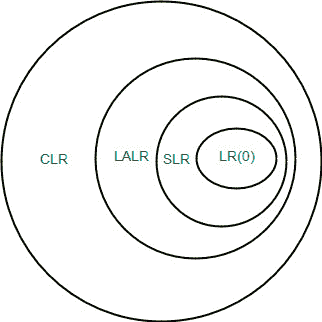

# 单反、CLR 和 LALR 解析器|第三套

> 原文:[https://www . geesforgeks . org/SLR-clr-and-lalr-parser s-set-3/](https://www.geeksforgeeks.org/slr-clr-and-lalr-parsers-set-3/)

在本文中，我们将讨论自底向上解析器中的单反解析器、CLR 解析器和 LALR 解析器。

**单反解析器**
单反解析器类似于 LR(0)解析器，只是条目减少了。减少的产量只写在产量减少的变量的 FOLLOW 中。

**单反解析表的构建–**

1.  构造 C = { I <sub>0</sub> ，I <sub>1</sub> ，……。I <sub>n</sub> }，为 G’的 LR(0)项集合。
2.  状态 I 由 Ii 构成。状态 I 的解析动作确定如下:
    *   如果[ A ->？。a？]在 I <sub>i</sub> 和 GOTO(I <sub>i</sub> ，a) = I <sub>j</sub> ，然后将 ACTION[i，a]设置为“shift j”。这里一定是终点站。
    *   如果[A ->？。]是在 I <sub>i</sub> 中，然后设置 ACTION【I，A】为“减 A - >？”对于跟随中的所有 A(A)；这里的 A 可能不是 S。
    *   Is [S -> S.] is in I <sub>i</sub> ，则设置动作[i，$]为“接受”。如果以上规则产生了任何冲突的动作，我们就说语法不是单反。
3.  使用以下规则为所有非终端 A 构建状态 I 的 goto 转换:
    如果 GOTO( I <sub>i</sub> ，A ) = I <sub>j</sub> ，则 GOTO [i，A] = j
4.  规则 2 和 3 未定义的所有条目都会出错。

例如:
如果在解析表中我们有多个条目，那么这被称为冲突。

```
Consider the grammar E -> T+E | T
                     T ->id
    Augmented grammar - E’ -> E
                E -> T+E | T
                T -> id

```

[](https://media.geeksforgeeks.org/wp-content/cdn-uploads/gq/2017/02/parser_16.png)

**注 1**–对于 GATE，我们不需要绘制表格，在 GOTO 图中只需寻找在一种状态下一起发生的减少和移位..在两个缩减的情况下，如果两个缩减的产品有一些共同之处，那么它将导致表中有多个条目，因此不是单反。在一个移位和一个缩减的情况下，如果它们是从终端上的状态的 GOTO 操作，这是缩减的生产的后续，那么它将导致多个条目，因此不是单反。
**注 2**——每一个单反语法都是明确的，但它们的语法中有很多明确的不是单反的语法。

**CLR PARSER**

在单反方法中，我们使用 LR(0))项。在 CLR 解析中，我们将使用 LR(1)项。LR(k)项被定义为使用长度为 k 的前瞻项。因此，LR(1)项由两部分组成:LR(0)项和与该项相关联的前瞻。
LR(1)解析器是更强大的解析器。
对于 LR(1)项，我们修改闭包和 GOTO 函数。

**关闭操作**

```
Closure(I)
repeat 
    for (each item [ A -> ?.B?, a ] in I )
        for (each production B -> ? in G’)
          for (each terminal b in FIRST(?a))
            add [ B -> .? , b ] to set I;
until no more items are added to I;
return I;

```

让我们用一个例子来理解–
[](https://media.geeksforgeeks.org/wp-content/cdn-uploads/gq/2017/02/parser_17.png)

**转到操作**

```
Goto(I, X)
Initialise J to be the empty set;
for ( each item A -> ?.X?, a ] in I )
    Add item A -> ?X.?, a ] to se J;   /* move the dot one step */
return Closure(J);    /* apply closure to the set */

```

eg-[](https://media.geeksforgeeks.org/wp-content/cdn-uploads/gq/2017/02/parser_18.png)
**【lr(1)**项

```
Void items(G’)
Initialise C to { closure ({[S’ -> .S, $]})};
Repeat
    For (each set of items I in C)
        For (each grammar symbol X)
            if( GOTO(I, X) is not empty and not in C)
                Add GOTO(I, X) to C;
Until no new set of items are added to C;

```

**GOTO 图的构建**

*   状态一<sub>0</sub>–扩大左后(1)项目关闭。
*   使用 I <sub>0</sub> 在 DFA 的帮助下找到 LR(1)项集合的所有集合
*   将 DFA 转换为 LR(1)解析表

**构建 CLR 解析表-**
输入-扩充语法 G’

1.  构造 C = { I <sub>0</sub> ，I <sub>1</sub> ，……。I <sub>n</sub> }，为 G’的 LR(0)项集合。
2.  状态 I 由 Ii 构成。状态 I 的解析动作确定如下:
    i)如果[ A - >？。a？，b ]在 I <sub>i</sub> 和 GOTO(I <sub>i</sub> ，a) = I <sub>j</sub> ，然后将 ACTION[i，a]设置为“shift j”。这里一定是终点站。
    ii)如果【A - >？。，a]是在 I <sub>i</sub> ，A ≠ S，然后将 ACTION[i，a]设置为“减 A - >？”。
    iii) Is [S - > S .，$ ] is in I <sub>i</sub> ，然后将动作[i，$ ]设置为“接受”。
    如果以上规则产生了任何冲突动作，我们说语法是
    不是 CLR。
3.  使用以下规则为所有非终端 A 构建状态 I 的 goto 转换:如果 GOTO( I <sub>i</sub> ，A ) = I <sub>j</sub> ，则 GOTO [i，A] = j。
4.  规则 2 和 3 未定义的所有条目都会出错。

例如:

```
Consider the following grammar 
    S -> AaAb | BbBa
    A -> ?
    B -> ?
    Augmented grammar - S’ -> S
                  S -> AaAb | BbBa
                  A -> ?
                  B -> ?
    GOTO graph for this grammar will be - 

```

[](https://media.geeksforgeeks.org/wp-content/cdn-uploads/gq/2017/02/parser_19.png) 
**注意**–如果一个状态有两个约简，并且两个都有相同的前瞻，那么它将在解析表中有多个条目，从而产生冲突。如果一个状态有一个约简，并且它们在终端上与约简的前瞻状态相同，那么它将导致解析表中的多个条目，从而导致冲突。

**LALR PARSER**
LALR PARSER 与 CLR parser 相同，只是有一点不同。在 CLR 解析器中，如果两个状态仅在前瞻方面不同，那么我们在 LALR 解析器中组合这些状态。最小化后，如果解析表没有冲突，则语法也是 LALR。
Eg:

```
consider the grammar S ->AA
                     A -> aA | b
    Augmented grammar - S’ -> S
                        S ->AA
                        A -> aA | b

```

[](https://media.geeksforgeeks.org/wp-content/cdn-uploads/gq/2017/02/parser_20.png)

**重要注意事项**
1。即使 CLR 解析器没有 RR 冲突，但是 LALR 可能包含 RR 冲突。
2。如果状态数 LR(0) = n1，
状态数 SLR = n2，
状态数 LALR = n3，
状态数 CLR = n4，那么，
n1 = N2 = n3<= n4

[](https://media.geeksforgeeks.org/wp-content/uploads/Parsing.jpg)

本文由**帕鲁尔·夏尔马**供稿