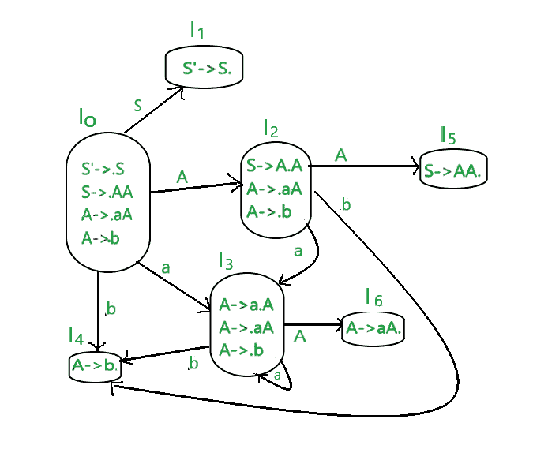
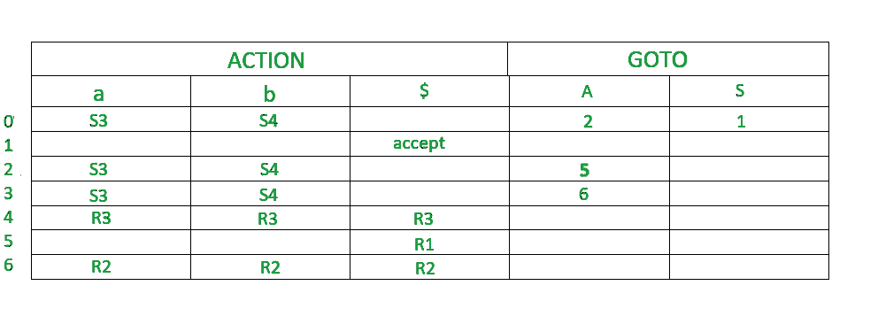

# 单反解析器(带示例)

> 原文:[https://www.geeksforgeeks.org/slr-parser-with-examples/](https://www.geeksforgeeks.org/slr-parser-with-examples/)

**先决条件:** [LR 解析器](https://www.geeksforgeeks.org/lr-parser/)

**LR 解析器:**
它是一种高效的自下而上的语法分析技术，可以用来解析一大类上下文无关的语法称为 LR(0)解析。
L 代表从左到右扫描
R 代表反向最右求导
0 代表前瞻
输入符号数

**LR 解析的优势:**

*   它识别了几乎所有可以编写 CFG 的编程语言结构
*   它能够检测语法错误
*   这是一种高效的非回溯移位约简解析方法。

**LR 解析方法类型:**

1.  自动装弹步枪
2.  清除（clear 的缩写）
3.  拉勒

**单反解析器:**
单反就是简单的 LR。它是最小的语法类别，只有很少的状态。单反非常容易构建，类似于 LR 解析。单反解析器和 LR(0)解析器的唯一区别是，在 LR(0)解析表中，有可能发生“移位减少”冲突，因为我们正在输入对应于所有终端状态的“减少”。我们可以通过输入“减少”来解决这个问题，该“减少”对应于终止状态下生产的 LHS 跟踪。这被称为单反(1)项目的集合

**构建单反解析表的步骤:**

1.  写作扩充语法
2.  待查找项目的 LR(0)集合
3.  找到 LHS 的生产跟踪
4.  定义 2 个函数:转到解析表中的[终端列表]和动作[非终端列表]

**示例–为给定的上下文无关语法构建 LR 解析表**

**S–>AA**T2**A–>AA | b**

**解决方案:**

**步骤 1–**查找扩充语法
给定语法的扩充语法是:-

s '–>。S [第 0 次生产]
S–>。AA【第一次生产】
A–>。aA【第二次生产】
A–>。b [第三次生产]

**step 2–**查找 LR(0)物品集合
下图为 LR(0)物品集合。我们会一件一件了解一切。

这个语法的结尾是{a，b}。
这个语法的非终结点是{S，A}

**规则–**
如果任何非终点有“.”在它之前，我们必须写下它所有的作品并加上“.”在每次生产之前。

**RULE–**
从一个州到下一个州，这个“.”向右移动一个位置。

*   在图中，I0 由扩充语法组成。
*   木卫一什么时候去 I1 第 0 次生产的产品被转移到 S(S'->S)的右侧。这个状态就是接受状态。编译器会看到 s。
*   当“.”时，Io 转到 I2 第一部作品的重心向右移。编译器会看到
*   当“.”时，I0 转到 I3 第二部作品的主题向右移了。编译器会看到。
*   当“.”时，I0 转到 I4 第三部作品的重心向右移(A->b)。编译器会看到 b。
*   当“.”时，I2 转到 I5 第一次生产的位置向右移动(S->AA。) .编译器会看到
*   当“.”时，I2 转到 I4 第三次生产向右移动(A->b)。编译器会看到 b。
*   当“.”时，I2 转到 I3 第二部作品的主题向右移了。编译器会看到。
*   当“.”时，I3 转到 I4 第三部作品的重心向右移(A->b)。编译器会看到 b。
*   当“.”时，I3 转到 I6 生产的第二部分向右移动(A->aA。) .编译器会看到
*   当“.”时，I3 转到 I3 第二部作品的主题向右移了。编译器会看到。

**第三步–**
找到生产的 LHS 的追随者

FOLLOW(S)=$
FOLLOW(A)=a，b，$

要查找非终端的 FOLLOW，请阅读语法分析中的 [follow set。](https://www.geeksforgeeks.org/follow-set-in-syntax-analysis/)

**STEP 4-**
定义 2 个函数:转到解析表中的【终端列表】和动作【非终端列表】。下面是单反解析表。

*   默认情况下，$是非终端，处于接受状态。
*   0，1，2，3，4，5，6 表示 I0，I1，I2，I3，I4，I5，I6
*   I0 在 I2 中给出 A，所以 2 加到 A 列和 0 行。
*   I0 在 I1 给出 S，所以在 S 列加 1，在 1 行加 1。
*   类似地，5 写在 A 列和 2 行，6 写在 A 列和 3 行。
*   I0 在 I3 中给出 a。所以 S3(移位 3)被添加到一列和 0 行。
*   I0 在 I4 中给出 b。所以 S4(移位 4)被添加到 b 列和 0 行。
*   类似地，S3(移位 3)被添加到 a 列和 2，3 行，S4(移位 4)被添加到 b 列和 2，3 行。
*   I4 被简化为“.”就在尽头。I4 是语法的第三个产物(A–>。b)。这个作品的 LHS 是 A. FOLLOW(A)=a，b，$。在 a、b、$和第 4 行的列中写入 r3(减少 3)
*   I5 被简化为“.”就在尽头。I5 是语法的第一个产物(S–>。AA)。这个产品的 LHS 是 S.
    FOLLOW(S)=$。在$列和第 5 行中写入 r1(减少 1)
*   I6 被简化为“.”就在尽头。I6 是语法的第二个产物(A–>。aA)。这个作品的 LHS 是 A.
    FOLLOW(A)=a，b，$。在 a、b、$和第 6 行的列中写入 r2(减少 2)