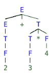
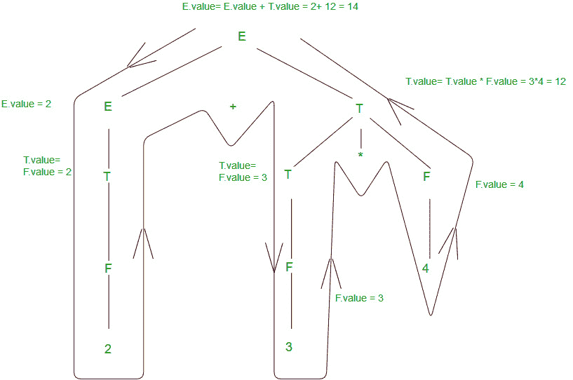

# 编译器设计中的语法定向翻译

> 原文:[https://www . geeksforgeeks . org/语法指导-编译中翻译-设计/](https://www.geeksforgeeks.org/syntax-directed-translation-in-compiler-design/)

**背景:**解析器使用一个 CFG(上下文无关语法)来验证输入字符串，并为编译器的下一阶段生成输出。输出可以是解析树或抽象语法树。现在，为了将语义分析与编译器的语法分析阶段交织在一起，我们使用了语法定向翻译。

**定义**
句法指导翻译增加了便于语义分析的语法规则。SDT 包括以附加到节点的属性的形式在解析树中自下而上和/或自上而下传递信息。语法导向的翻译规则使用 1)节点的词汇值，2)常数& 3)与其定义中的非终端相关联的属性。

语法导向翻译的一般方法是构造一个解析树或语法树，并通过以某种顺序访问树的节点来计算它们的属性值。在许多情况下，翻译可以在解析过程中完成，而无需构建显式树。
例

```
E -> E+T | T
T -> T*F | F
F -> INTLIT 
```

这是一种语法，用于在语法上验证包含加法和乘法的表达式。现在，为了进行语义分析，我们将对这个语法增加 SDT 规则，以便向解析树传递一些信息，并检查语义错误(如果有的话)。在这个例子中，我们将关注给定表达式的评估，因为在这个非常基本的例子中，我们没有任何语义断言要检查。

```
E -> E+T     { E.val = E.val + T.val }   PR#1
E -> T       { E.val = T.val }           PR#2
T -> T*F     { T.val = T.val * F.val }   PR#3
T -> F       { T.val = F.val }           PR#4
F -> INTLIT  { F.val = INTLIT.lexval }   PR#5
```

为了进一步理解翻译规则，我们将第一个标准翻译扩展到[ E -> E+T ]生产规则。考虑中的转换规则将 val 作为两个非终端设备的属性。转换规则的右侧对应于生产规则右侧节点的属性值，反之亦然。概括地说，SDT 是一个 CFG 的扩充规则，它使用属性、常量和词汇值将 1)一组属性与语法的每个节点相关联，将 2)一组翻译规则与每个生产规则相关联。

让我们拿一个字符串来看看语义分析是如何发生的——S = 2+3 * 4。对应于 S 的解析树将是



为了评估翻译规则，我们可以在解析树上使用深度优先搜索遍历。这是可能的，因为只有在具有所有合成属性的语法的父语法计算出孩子的属性之前，SDT 规则才不会对评估施加任何特定的顺序。否则，我们必须找出最适合遍历解析树的计划，并评估一个或多个遍历中的所有属性。为了更好地理解，我们将以从左到右的方式自下而上地计算示例的翻译规则。



上图显示了语义分析是如何发生的。如上所述，信息流是自下而上的，所有孩子的属性都是在父母之前计算的。右侧节点有时用下标 1 进行注释，以区分子节点和父节点。
附加信息
**合成属性**就是只依赖子节点属性值的属性。
因此[ E - > E+T { E.val = E.val + T.val } ]具有对应于节点 E 的合成属性 val。如果扩充语法中的所有语义属性都被合成，则任何顺序的一个深度优先搜索遍历对于语义分析阶段都是足够的。

**继承属性**是依赖于父和/或兄弟的属性的属性。
因此【Ep - > E+T { Ep.val = E.val + T.val，T.val = Ep.val }】，其中 E & Ep 是相同的生产符号，被注释以区分父节点和子节点，具有对应于节点 T 的继承属性 val

参考:
[http://www . personal . Kent . edu/~ rmuhamma/Compilers/mycopiler/syntaxdirecttrans . htm](http://www.personal.kent.edu/~rmuhamma/Compilers/MyCompiler/syntaxDirectTrans.htm)
[http://pages . cs . wisc . edu/~ fischer/cs 536 . s06/course . hold/html/NOtes/4。SYNTAX-DIRECTED-TRANSLATION.html](http://pages.cs.wisc.edu/~fischer/cs536.s06/course.hold/html/NOTES/4.SYNTAX-DIRECTED-TRANSLATION.html)

本文由 **Vineet Purswani** 供稿。如果你喜欢 GeeksforGeeks 并想投稿，你也可以使用[write.geeksforgeeks.org](https://write.geeksforgeeks.org)写一篇文章或者把你的文章邮寄到 review-team@geeksforgeeks.org。看到你的文章出现在极客博客主页上，帮助其他极客。

如果你发现任何不正确的地方，或者你想分享更多关于上面讨论的话题的信息，请写评论。