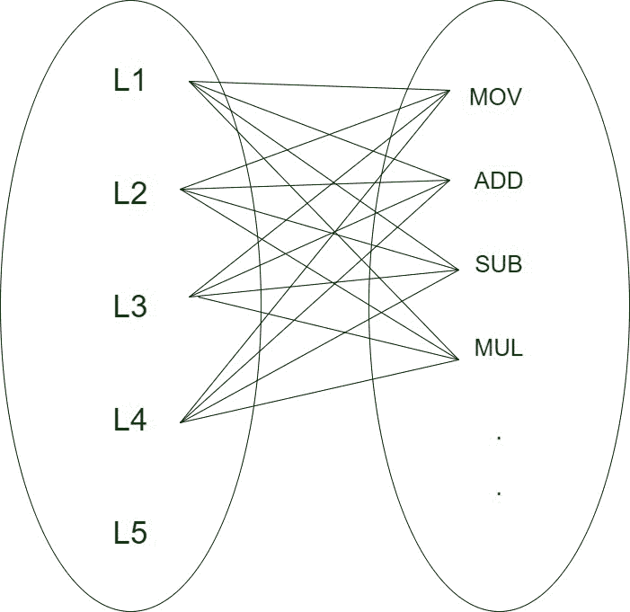

# 编译器设计中的目标代码生成

> 原文:[https://www . geesforgeks . org/target-code-generation-in-compiler-design/](https://www.geeksforgeeks.org/target-code-generation-in-compiler-design/)

**目标代码生成**是编译器的最后阶段。

1.  **输入:**优化中间表示。
2.  **输出:**目标代码。
3.  **已执行任务:**寄存器分配方法和优化，汇编级代码。
4.  **方法:**寄存器分配和优化的三种流行策略。
5.  **Implementation :** Algorithms.

    目标代码生成处理汇编语言，将优化的代码转换成机器可理解的格式。目标代码可以是机器可读代码或汇编代码。优化代码中的每一行都可以映射到机器(或)汇编代码中的一行或多行，因此有一个 1:N 的映射与之相关联。

    

    1 : N 映射

    通常假设计算是在高速存储单元上进行的，称为寄存器。对寄存器执行各种操作是有效的，因为寄存器比高速缓冲存储器快。编译器有效地利用了这一特性，但是寄存器数量不多，而且成本高。因此，我们应该尽量使用最少数量的寄存器，以降低总体成本。

    **优化代码:**

    ```
    Example 1 :
    L1: a = b + c * d

    optimization :
    t0 = c * d
    a  = b + t0
    Example 2 :
    L2: e = f - g / d

    optimization :
    t0 = g / d
    e  = f - t0

    ```

    **寄存器分配:**
    寄存器分配是将程序变量分配给寄存器并减少进出寄存器的交换次数的过程。变量在内存中的移动非常耗时，这也是使用寄存器的主要原因，因为寄存器在内存中是可用的，并且是最快可访问的存储位置。

    ```
    Example 1:
    R1**优势:**
    ```

    *   快速存取存储器
    *   允许对它们执行计算
    *   确定性的，因为它不会引起遗漏
    *   减少内存流量
    *   减少整体计算时间

    **缺点:**

    *   寄存器通常数量很少(最多几百 Kb)
    *   寄存器的大小是固定的，不同的处理器有所不同
    *   寄存器很复杂
    *   需要在上下文切换和过程调用期间保存和恢复更改--->