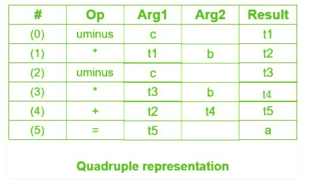

# 编译器中的三个地址码

> 原文:[https://www.geeksforgeeks.org/three-address-code-compiler/](https://www.geeksforgeeks.org/three-address-code-compiler/)

先决条件–[中间代码生成](https://www.geeksforgeeks.org/intermediate-code-generation-in-compiler-design/)

**三地址码**是一种容易生成，容易转换成机器码的中间码。它最多使用三个地址和一个运算符来表示一个表达式，并且在每个指令上计算的值存储在编译器生成的临时变量中。编译器决定三个地址码给出的操作顺序。

**一般表示–**

```
 a = b op c 
```

其中 a、b 或 c 代表操作数，如名称、常数或编译器生成的临时变量，op 代表运算符

**示例-1:** 将表达式 a*–(b+ c)转换为三个地址码。
T3】

**示例-2:** 为以下代码编写三个地址码

```
for(i = 1; i<=10; i++)
 {
  a[i] = x * 5;                                       
 } 
```


**三个地址码的实现–**
三个地址码有三种表示，即

1.  四倍
2.  增至三倍
3.  间接三元组

**1。四重–**
它是由 4 个字段组成的结构，即 op、arg1、arg2 和 result。op 表示运算符，arg1 和 arg2 表示两个操作数，result 用于存储表达式的结果。

**优势–**

*   易于重新排列代码进行全局优化。
*   可以使用符号表快速访问临时变量的值。

**劣势–**

*   包含许多临时成员。
*   临时变量的创建增加了时间和空间的复杂性。

**示例–**考虑表达式 a = b *–c+b *–c .
三个地址码为:

```
t1 = uminus c
t2 = b * t1
t3 = uminus c
t4 = b * t3 
t5 = t2 + t4
a = t5  
```



**2。三元组–**
这种表示方式不使用额外的临时变量来表示单个操作，而是当需要引用另一个三元组的值时，使用指向该三元组的指针。因此，它只包含三个字段，即 op、arg1 和 arg2。

**劣势–**

*   临时变量是隐式的，很难重新排列代码。
*   很难优化，因为优化涉及移动中间代码。当一个三元组被移动时，任何引用它的其他三元组也必须被更新。借助指针，人们可以直接访问符号表条目。

**示例–**考虑表达式 a = b *–c+b *–c


**3。间接三元组–**
这种表示方式利用了指向所有计算引用列表的指针，这些引用是单独进行并存储的。与四重表示相比，它的实用性相似，但需要的空间比它少。临时变量是隐式的，更容易重新排列代码。

**示例–**考虑表达式 a = b *–c+b *–c


**问题–**写出以下表达式的四元组、三元组和间接三元组:(x + y) * (y + z) + (x + y + z)

**说明–**三个地址码为:

```
t1 = x + y
t2 = y + z
t3 = t1 * t2
t4 = t1 + z
t5 = t3 + t4  
```


