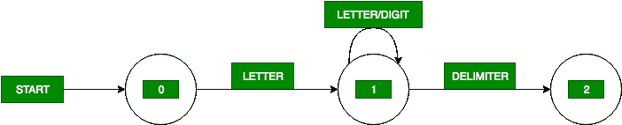

# 编译器设计中标识符的转换图

> 原文:[https://www . geesforgeks . org/transition-graph-for-identifier-in-compiler-design/](https://www.geeksforgeeks.org/transition-diagram-for-identifiers-in-compiler-design/)

**过渡图**是语言分析的一种特殊流程图。在转换图中，流程图的方框画成圆形，称为状态。状态由称为边的箭头连接。边缘上的标签或粗细表示在该状态之后可能出现的输入字符。

标识符的转换图如下所示:



该标识符转换图读取第一个字母，在该字母或数字之后，直到下一个输入字符是标识符的分隔符，意味着该字符既不是字母也不是数字。为了把转换图变成一个程序，我们为转换图的每个状态构造程序段代码。

每个状态的程序段代码如下:

**状态-0:**

```
C=GETCHAR();
if LETTER(C) then goto State 1
else FAIL() 
```

**状态-1:**

```
C=GETCHAR();
if LETTER(C) OR DIGIT(C) then goto State 1
else if DELIMITER(C) then goto State 2
else FAIL() 
```

**状态-2:**

```
RETRACT();
RETURN(ID, INSTALL())
```

其中，
下一个字符为输入缓冲区我们使用 **GETCHAR()** 返回下一个字符。
**字母(C)** 是当且仅当 C 是字母时返回**真值的过程。
**FAIL(C)** 是一个收回前瞻指针并启动下一个转换图的例程，否则调用错误例程。
**数字(C)** 是当且仅当 C 是数字时返回**真值的程序。
**DELIMITER(C)** 是返回**真值**的过程，当且仅当 C 是可以跟在标识符后面的字符，例如空白符号、算术、逻辑运算符、左括号、右括号、+、:、；等等。
由于分隔符不是标识符的一部分，因此我们必须将前瞻指针缩进一个字符。为此，我们使用 **RETRACT()** 过程。
因为标识符有值，所以要在符号表中安装标识符的值，我们使用 **INSTALL()** 程序。****