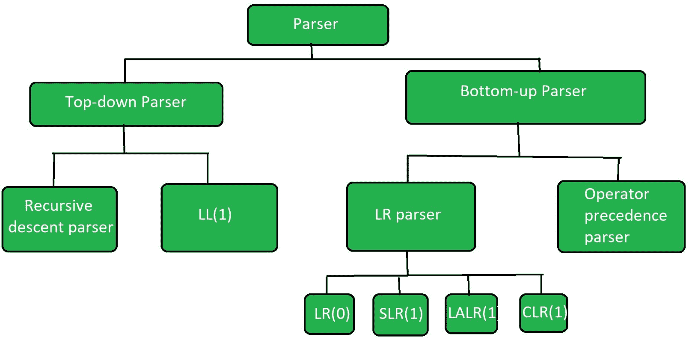

# 编译器设计中解析器的类型

> 原文:[https://www . geesforgeks . org/编译器设计中的解析器类型/](https://www.geeksforgeeks.org/types-of-parsers-in-compiler-design/)

**解析器**是编译器的一个阶段，它将一个标记字符串作为输入，并在现有语法的帮助下，将其转换为相应的中间表示。解析器也被称为*语法分析器。*



解析器的分类

### **解析器类型:**

解析器主要分为两类，即自顶向下解析器和自底向上解析器。这些解释如下:

#### 自顶向下解析器:

[自上而下解析器](https://www.geeksforgeeks.org/classification-of-top-down-parsers/)是**通过扩展非终端，即从开始符号开始，到终端结束，在语法产品的帮助下，为给定输入字符串**生成解析的解析器。它使用最左边的派生。
进一步将自顶向下解析器分为两种类型:递归下降解析器和非递归下降解析器。

1.  [**【递归下降解析器】**](https://www.geeksforgeeks.org/compiler-design-recursive-descent-parser/) 也被称为蛮力解析器或回溯解析器。它基本上通过使用蛮力和回溯来生成解析树。
2.  **非递归下降解析器**又称 LL(1)解析器或预测解析器或无回溯解析器或动态解析器。它使用解析表来生成解析树，而不是回溯。

#### **自下而上解析器:**

[自下而上解析器](https://www.geeksforgeeks.org/working-of-bottom-up-parser/)是一个解析器，它通过压缩非终结符为给定的输入字符串生成解析树，即它从非终结符开始，到开始符号结束。它使用与最右边的派生相反的方式。
进一步自底向上解析器分为两种类型:LR 解析器和运算符优先解析器。

*   **LR 解析器**是自下而上的解析器，通过使用明确的语法为给定的字符串生成解析树。它遵循最右边推导的相反方向。
    LR 解析器有四种类型:

```
(a)LR(0)
(b)SLR(1)
(c)LALR(1)
(d)CLR(1) 
```

*   [**运算符优先解析器**](https://www.geeksforgeeks.org/theory-computation-operator-grammar-precedence-parser/) 在给定语法和字符串的情况下生成解析树形式，但唯一的条件是两个连续的非终端，并且ε永远不会出现在任何产品的右侧。