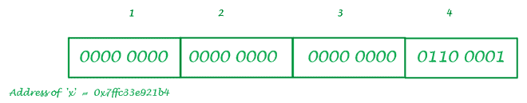
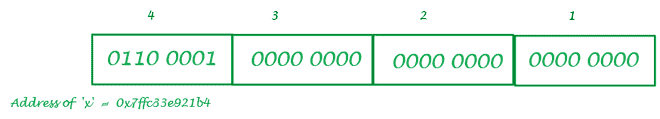

# 作为编译器理解类型转换

> 原文:[https://www . geesforgeks . org/understanding-type casting-as-a-compiler/](https://www.geeksforgeeks.org/understanding-typecasting-as-a-compiler/)

让我们以几行[C](https://www.geeksforgeeks.org/c-programming-language/)–

## C

```
#include <stdio.h>

int main() {

    int x = 97;
    char ch = x;
    printf("The value of %d in character form is '%c'",x, ch);
    return 0;
}
```

**输出:**

```
The value of 97 in character form is 'a'
```

让我们理解编译器将如何编译这个程序中的每一条指令。

**编译器:**

1.  进入主程序
2.  分配 4 字节内存(整数一般取 4 字节)，命名为 **x** ，取值 97
3.  分配 1 字节内存(一个字符占用 1 字节空间)，命名为 **ch** ，并将 **x** 对应的值存储在其中
4.  打印 **ch** 的值
5.  退出主程序

我们将彻底理解 2 & 3 点，因为其他的都是显而易见的。

**第二点描述:**

当存储器以[二进制形式](https://www.geeksforgeeks.org/binary-representation-of-a-given-number/)存储数据时，编译器将把 **97** (十进制)转换成相应的[二进制形式](https://www.geeksforgeeks.org/binary-representation-of-a-given-number/)。**000000000000000000000000011000001**是 **97** 在 4 字节(或 32 位)二进制表示中的二进制表示。所以变量 **x** 的内容看起来就像给定的图像–



大端系统

这种在内存中以二进制形式表示数据的系统被称为[大端](https://www.geeksforgeeks.org/little-and-big-endian-mystery/)但是在大多数计算机系统中，除了这个系统之外，[T3](https://www.geeksforgeeks.org/little-and-big-endian-mystery/)[小端](https://www.geeksforgeeks.org/little-and-big-endian-mystery/)系统紧随其后。所以在[小端系统](https://www.geeksforgeeks.org/little-and-big-endian-mystery/)中 x 的含量如下–



小端系统

所以在大多数计算机中，内存中的每一个数据都只能以小端格式存储。

**第二点描述:**

如前所述，字符在内存中占用 1 个字节或 8 位空间，因此编译器会分配这些空间，但在给变量 **ch** 赋值时，它会到达 **x** 所在的位置，并在读取字符时只开始读取第一个字节的内容。所以第一个字节有二进制形式的 **0110 0001** ，对应的十进制形式是 **97。**每个字符都有一些与之相关的 ASCII 码，字符 **a** 的 ASCII 码是 97。所以这就是为什么 **ch** 的内容会变成 **a** 之后，编译器会简单的打印 **ch 的内容。**

**更多更好理解的例子:**

## C

```
#include <stdio.h>

int main() {
    int x = 321;  //can be written as 256+65
    char ch = x;
    printf("The character form of %d is '%c'",x,ch);
    return 0;
}
```

**输出:**

```
The character form of 321 is 'A'
```

**说明:**

321 的二进制表示为**0000000000000000000000000000000000000000000000000000000000000000000000000000000000000000000000000000000000000000000000000000000000000000000000000000000000000000 现在编译器只看第一个字节 **0100001** ，对应的十进制形式为 65，是字符**‘a’**的 ASCII 码。**

## C

```
#include <stdio.h>

int main() {

    int x = 57; 
    char ch = x;
    printf("The character form of %d is '%c'",x,ch);
    return 0;
}
```

**输出:**

```
The character form of 57 is '9'
```

**说明:**

57 的二进制表示是**000000000000000000000000111001**小端系统中 <u>x</u> 的内容是**00111001 0000000000000000000000000000000000000000000000000000000000000000000000000000000000000000000000000000000000000**

**很高兴拥有:**

1.  a-z 的 ASCII 码是 65-90，A-Z 是 97-122，从 0 到 9 的数字也有它们对应的 ASCII 码 48 到 57。
2.  要找到相应的字符形式，只需找到该数字与 256 的模，然后查找 ASCII 表并找到对应于余数的字符。那将是你的答案。

谢谢^_^