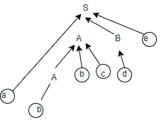

# 自下而上解析器的工作

> 原文:[https://www.geeksforgeeks.org/working-of-bottom-up-parser/](https://www.geeksforgeeks.org/working-of-bottom-up-parser/)

在本文中，我们将介绍自底向上解析器的工作，并了解如何获取输入并解析它，还将介绍自底向上解析器的一些基础知识。

先决条件–[解析](https://www.geeksforgeeks.org/introduction-of-parsing-ambiguity-and-parsers-set-1/)

自下而上**解析器:**

*   它将从字符串开始，并继续开始。
*   在自底向上解析器中，识别正确的句柄(子串)总是很困难。
*   它将按照相反的顺序遵循最右边的推导。

**注意:**
在自下而上的解析器中，没有变量，这就是为什么没有从底部进行任何推导，而是按照相反的顺序，看起来像是自上而下，当你有最右边的推导时。

**自底向上解析器的工作:**
让我们考虑一个例子，其中给出了语法，您需要使用自底向上解析器技术来构建解析树。

**示例–**

```
S -> aABe
A -> Abc | b
B -> d
```

现在，让我们考虑要读取的输入，并使用自下而上的方法构建解析树。

**输入–**

```
abbcde$
```

现在，您将看到自下而上的方法是如何工作的。在这里，您将看到如何从语法中为自下而上的方法生成输入字符串。

*   首先可以从 A -> b 开始。
*   现在，展开 A -> Abc。
*   之后展开 B-> d
*   最后，只需展开 S -> aABe
*   最后一串，你会得到 **abbcde** 。

下面给出了构建自底向上解析树的图解说明。您可以在图中清楚地看到如何使用自底向上的语法生成输入字符串。



从上面的解释和图表中，你可以清楚地看到并可以说它遵循了最右边推导的相反方向。