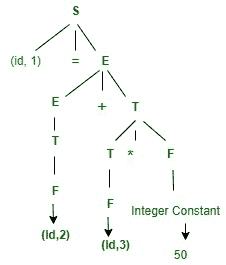
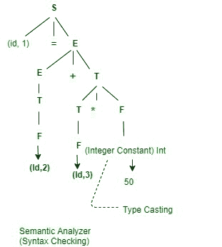

# 编译器阶段的工作示例

> 原文:[https://www . geeksforgeeks . org/working-of-compiler-phases-with-example/](https://www.geeksforgeeks.org/working-of-compiler-phases-with-example/)

在本文中，我们将通过一个例子来概述我们如何让每个**编译器阶段**独立工作。我们一个一个来讨论。

先决条件–[编译器阶段介绍](https://www.geeksforgeeks.org/phases-of-a-compiler/)

您将看到编译器阶段，如词法分析器、语法分析器、语义分析器、中间代码生成器、代码优化器和目标代码生成。让我们考虑一个例子。

```
x = a+b*50
```

下面给出了上述示例的符号表。在符号表中明确提到了变量名和变量类型。

<center>

| 没有。 | 变量名 | 变量类型 |
| one | x | 漂浮物 |
| Two | a | 漂浮物 |
| three | b | 漂浮物 |

</center>

现在，在这里您将看到如何在每个级别执行编译器阶段，以及它是如何工作的。

1.  **[Lexical Analyzer](https://www.geeksforgeeks.org/introduction-of-lexical-analysis/) :**

    在这个阶段，您将看到如何标记表达式。

    ```
    x  ->  Identifier-  (id, 1)
    =  ->  Operator  -  Assignment
    a  ->  Identifier-  (id, 2)
    +  ->  Operator  -  Binary Addition
    b  ->  Identifier-  (id, 3)
    *  ->  Operator  -  Multiplication
    50 ->  Constant  -  Integer
    ```

    下面给出了最终的标记化表达式。

    ```
    (id, 1) = (id, 2) + (Id, 3)*50
    ```

2.  **[Syntax Analyzer](https://www.geeksforgeeks.org/introduction-to-syntax-analysis-in-compiler-design/) :**

    在这个阶段，您将看到如何在标记化表达式后检查语法。

    ```
    S -> Id = E
    E -> E+T | T
    T -> T*F | F
    F -> Id | Integer constant
    ```

    下面给出了上述表达式的标准偏差。

    

3.  **Semantic Analyzer :**
    In this phase, you will see how you can check the type and semantic action for the syntax tree. Given below is the diagram of the semantic analyzer.

    

4.  **[Intermediate Code Generator](https://www.geeksforgeeks.org/intermediate-code-generation-in-compiler-design/) :**
    In this phase as an input, you will give a modified parse tree and as output after converting into Intermediate code will generate 3 -Address Code. Given below is an expression of the above-modified parse tree.

    **3 地址代码–**

    ```
    t1 = b * 50.0
    t2 = a+t1
    x = t2
    ```

5.  **[代码优化器](https://www.geeksforgeeks.org/code-optimization-in-compiler-design/) :**
    在这个阶段，你会看到作为输入会给出 3 个地址码，作为输出，你会看到优化代码。让我们看看它将如何转换。

    ```
    t1 = b* 50.0
    x = a+ t1
    ```

6.  **目标代码生成器:**
    这是最后一个阶段，在这个阶段，您将看到如何将最终表达式转换为汇编代码。这样，对于处理器来说就很容易理解了。

    ```
    Mul
    Add
    Store
    ```