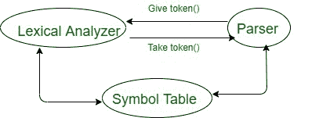
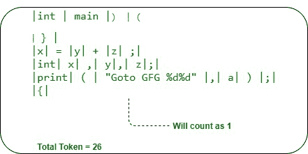

# 编译器中词法分析器的工作

> 原文:[https://www . geesforgeks . org/working-of-词法分析器 in-compiler/](https://www.geeksforgeeks.org/working-of-lexical-analyzer-in-compiler/)

在本文中，我们将介绍词法分析器是如何工作的，也将介绍词法分析器的基本架构。我们一个一个来讨论。

**先决条件**–[词汇分析器简介](https://www.geeksforgeeks.org/introduction-of-lexical-analysis/)

**词法分析器:**

*   它是编译器的第一阶段，被称为**扫描仪**(它扫描程序)。
*   词法分析器将程序分成一些有意义的字符串，这些字符串被称为标记。



**令牌类型如下–**

1.  标识符
2.  关键字
3.  操作员
4.  常数
5.  特殊符号(@、$、#)

以上是在词法分析器中工作的关键组件——标记的术语。现在，借助示例，您将看到它是如何工作的。

让我们考虑下面给出的 C 程序来理解工作。

```
int main)(
}
x = y+z;
int x, y, z;
print("Goto GFG %d%d", a);
{ 
```

在第一阶段，编译器不检查语法。所以，这里这个程序作为词法分析器的输入，并将其转换成标记。因此，标记化是词法分析器的重要功能之一。

这个程序的令牌总数是 26。下面给出的是如何计算令牌的图表。



在上图中，您可以检查和计数标记的数量，并可以理解标记化在词法分析器阶段是如何工作的。

这是你如何清楚地理解编译器中的每个阶段，并了解编译器内部是如何工作的，编译器的每个阶段都是关键的一步。