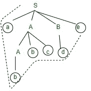

# 自顶向下解析器的工作

> 原文:[https://www.geeksforgeeks.org/working-of-top-down-parser/](https://www.geeksforgeeks.org/working-of-top-down-parser/)

在本文中，我们将介绍自顶向下解析器的工作，并了解如何获取输入并解析它，还将介绍自顶向下的一些基础知识。

先决条件–[解析](https://www.geeksforgeeks.org/introduction-of-parsing-ambiguity-and-parsers-set-1/)

**自顶向下解析器:**

*   在自上而下技术中，从顶部解析树结构，输入将从左向右读取。在自上而下，自上而下解析器中，它将从前进到字符串开始符号。

*   它遵循最左边的推导。

*   在自顶向下解析器中，自顶向下解析器的困难在于，如果变量包含一种以上的可能性，选择 1 是困难的。

**自顶向下解析器的工作:**
让我们考虑一个例子，其中给出了语法，您需要使用自顶向下解析器技术来构建解析树。

**示例–**

```
S -> aABe
A -> Abc | b
B -> d
```

现在，让我们考虑要读取的输入，并使用自顶向下的方法构建一个解析树。

**输入–**

```
abbcde$
```

现在，您将看到自上而下的方法是如何工作的。在这里，您将看到如何从语法中生成自顶向下的输入字符串。

*   首先，您可以从 S -> a A B e 开始，然后您将在开头看到输入字符串 A，在结尾看到 e。

*   现在，你需要生成~~一个~~ bbcd ~~e~~ 。

*   展开 A-> Abc，展开 B-> d

*   现在，你有一个类似 aAbcde 的字符串，你的输入字符串是 abbcde。

*   展开 A-> b

*   最后一串，你会得到 **abbcde** 。

下面给出了构建自顶向下解析树的图解说明。您可以在图中清楚地看到如何使用自顶向下的语法生成输入字符串。

