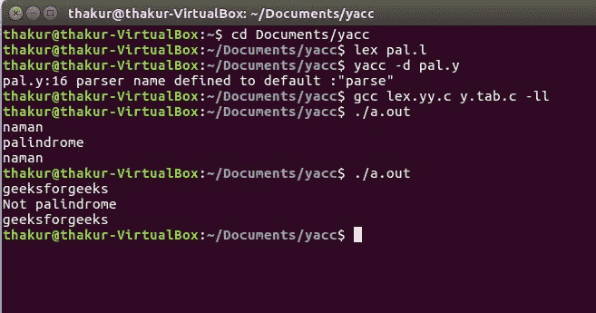

# YACC 程序检查给定字符串是否是回文

> 原文:[https://www . geesforgeks . org/yaac-program-to-check-给定字符串是否是回文/](https://www.geeksforgeeks.org/yaac-program-to-check-whether-given-string-is-palindrome-or-not/)

**问题:**写一个 YACC 程序，检查给定的字符串是否是回文。

**解释:**
[Yacc(为“又一个编译器编译器。”)](https://www.geeksforgeeks.org/introduction-to-yacc/)是 Unix 操作系统的标准解析器生成器。yacc 是一个开源程序，用 C 编程语言为解析器生成代码。首字母缩略词通常以小写形式呈现，但偶尔会被视为 YACC 或 Yacc。

**示例:**

```
Input: naman
Output: palindrome

Input: geeksforgeeks
Output: not palindrome 
```

**词法分析器源代码:**

```
%{
    /* Definition section */
    #include <stdio.h>
    #include <stdlib.h>
    #include "y.tab.h"
%}

/* %option noyywrap */

/* Rule Section */
%%

[a-zA-Z]+   {yylval.f = yytext; return STR;}
[-+()*/]    {return yytext[0];}
[ \t\n]      {;}

%%

 int yywrap()
 { 
  return -1; 
 }  
```

**解析器源代码:**

```
%{
    /* Definition section */
    #include <stdio.h>
    #include <string.h>   
    #include <stdlib.h>
    extern int yylex();

    void yyerror(char *msg);
    int flag;

    int i;
    int k =0;       
%}

%union {
    char* f;
 }

%token <f> STR
%type <f> E

/* Rule Section */
%%

S : E    {
         flag = 0;
         k = strlen($1) - 1;
         if(k%2==0){   

         for (i = 0; i <= k/2; i++) {
           if ($1[i] == $1[k-i]) {
            } else {
               flag = 1;
              }
          }
         if (flag == 1) printf("Not palindrome\n");
         else printf("palindrome\n");
         printf("%s\n", $1);

        }else{

        for (i = 0; i < k/2; i++) {
          if ($1[i] == $1[k-i]) {
          } else {
              flag = 1;
             }
            }
        if (flag == 1) printf("Not palindrome\n");
        else printf("palindrome\n");
        printf("%s\n", $1);           

          }
       }
  ;

E :  STR    {$ = $1;}
  ;

%%

void yyerror(char *msg)
 {
    fprintf(stderr, "%s\n", msg);
    exit(1);
 }

//driver code 
int main()
 {
    yyparse();
    return 0;
 }
```

**输出:**

