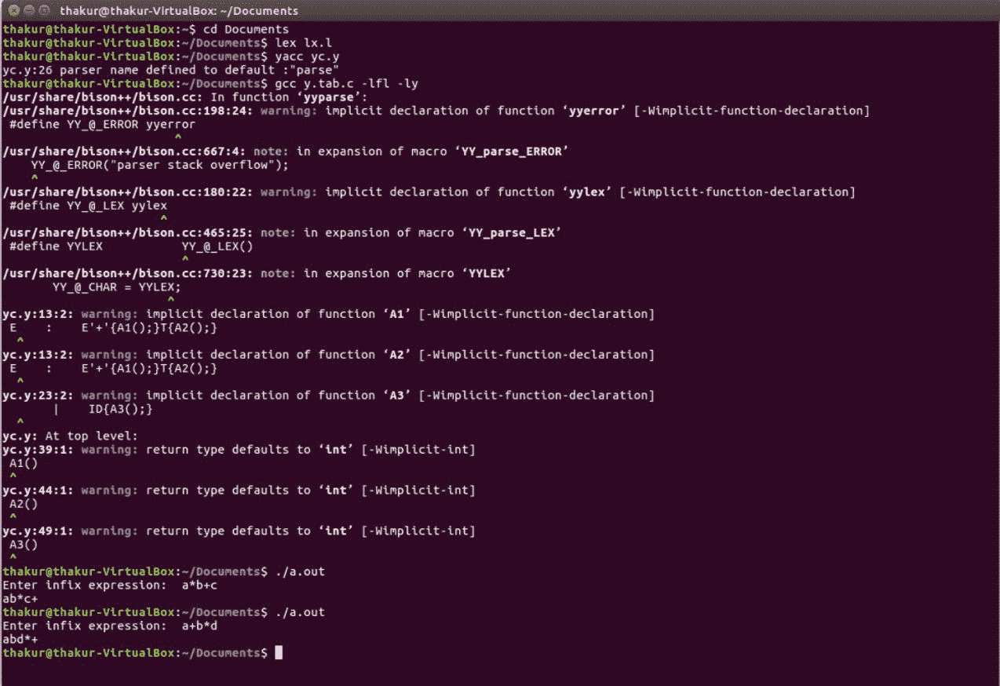

# 中缀到后缀表达式转换的 YACC 程序

> 原文:[https://www . geesforgeks . org/yacc-用于中缀到后缀表达式转换的程序/](https://www.geeksforgeeks.org/yacc-program-for-conversion-of-infix-to-postfix-expression/)

**问题:**写一个 YACC 程序，用于中缀到后缀表达式的转换。

**解释:**
[YACC(又一个编译器——编译器)](https://practice.geeksforgeeks.org/problems/what-is-yacc)是 Unix 操作系统的标准解析器生成器。yacc 是一个开源程序，用 C 编程语言为解析器生成代码。首字母缩略词通常以小写形式呈现，但偶尔会被视为 YACC 或 Yacc。

**示例:**

```
Input: a*b+c 
Output: ab*c+

Input: a+b*d
Output: abd*+ 
```

**词法分析器源代码:**

```
%{
  /* Definition section */
%}
ALPHA [A-Z a-z]
DIGIT [0-9]

/* Rule Section */
%%
{ALPHA}({ALPHA}|{DIGIT})*  return ID;
{DIGIT}+                   {yylval=atoi(yytext); return ID;}
[\n \t]                    yyterminate();
.                          return yytext[0];
%%
```

**解析器源代码:**

```
%{
   /* Definition section */
   #include <stdio.h>
   #include <stdlib.h>
%}

%token    ID
%left    '+' '-'
%left    '*' '/'
%left    UMINUS

/* Rule Section */
%%

S  :  E
E  :  E'+'{A1();}T{A2();}
   |  E'-'{A1();}T{A2();}
   |  T
   ;
T  :  T'*'{A1();}F{A2();}
   |  T'/'{A1();}F{A2();}
   |  F
   ;
F  :  '('E{A2();}')'
   |  '-'{A1();}F{A2();}
   |  ID{A3();}
   ;

%%

#include"lex.yy.c"
char st[100];
int top=0;

//driver code
int main()
{
    printf("Enter infix expression:  "); 
    yyparse();
    printf("\n");
    return 0;
}
A1()
{
    st[top++]=yytext[0];
}

A2()
{
    printf("%c", st[--top]);
}

A3()
{
    printf("%c", yytext[0]);
}
```

**输出:**

