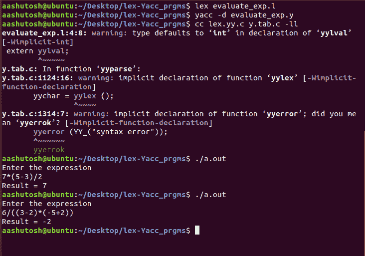

# Yacc 程序计算给定的算术表达式

> 原文:[https://www . geeksforgeeks . org/yacc-程序评估给定算术表达式/](https://www.geeksforgeeks.org/yacc-program-to-evaluate-a-given-arithmetic-expression/)

先决条件–[YACC 简介](https://www.geeksforgeeks.org/introduction-to-yacc/)
**问题:**编写一个 YACC 程序来计算一个给定的算术表达式，该表达式由包含括号的“+”、“-”、“*”、“/”组成。
**例:**

```
Input: 7*(5-3)/2
Output: 7

Input: 6/((3-2)*(-5+2))
Output: -2 
```

**词法分析器源代码:**

## C

```
%{
    /* Definition section*/
    #include "y.tab.h"
    extern yylval;
}%

%%
[0-9]+    {
              yylval = atoi(yytext);
              return NUMBER;
            }

[a-zA-Z]+    { return ID; }
[ \t]+         ;  /*For skipping whitespaces*/

\n            { return 0; }
.            { return yytext[0]; }

%%
```

**解析器源代码:**

## C

```
%{
    /* Definition section */
  #include <stdio.h>
%}

%token NUMBER ID
// setting the precedence
// and associativity of operators
%left '+' '-'
%left '*' '/'

/* Rule Section */
%%
E : T        {
                printf("Result = %d\n", $);
                return 0;
            }

T :
    T '+' T { $ = $1 + $3; }
    | T '-' T { $ = $1 - $3; }
    | T '*' T { $ = $1 * $3; }
    | T '/' T { $ = $1 / $3; }
    | '-' NUMBER { $ = -$2; }
    | '-' ID { $ = -$2; }
    | '(' T ')' { $ = $2; }
    | NUMBER { $ = $1; }
    | ID { $ = $1; };
% %

int main() {
    printf("Enter the expression\n");
    yyparse();
}

/* For printing error messages */
int yyerror(char* s) {
    printf("\nExpression is invalid\n");
}
```

**输出:**



**注意:**
Yacc 程序一般是 2 个文件写的，一个为 lex 一个为 with。l 扩展(用于令牌化并将令牌发送给 yacc ),另一个用于带有。y 扩展(用于语法评估和结果评估)。
**执行 Yacc 程序的步骤:**

```
yacc -d sample_yacc_program.y
lex sample_lex_program.l
cc lex.yy.c y.tab.c -ll
./a.out
```