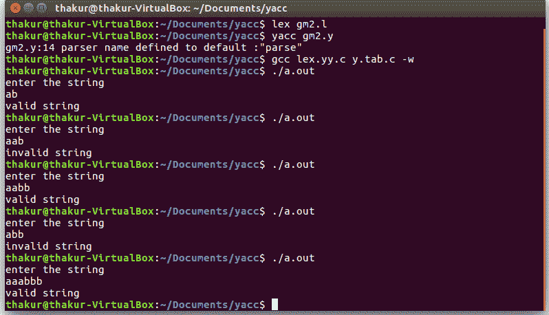

# YACC 程序识别语法为{ anbn | n≥0 }的字符串

> 原文:[https://www . geeksforgeeks . org/yacc-带语法的程序识别字符串-anbn-n0/](https://www.geeksforgeeks.org/yacc-program-to-recognize-string-with-grammar-anbn-n0/)

**问题:**编写 YACC 程序识别带语法的字符串{ a <sup>n</sup> b <sup>n</sup> | n≥0 }。

**解释:**
[Yacc(为“又一个编译器编译器。”)](https://www.geeksforgeeks.org/introduction-to-yacc/)是 Unix 操作系统的标准解析器生成器。yacc 是一个开源程序，用 C 编程语言为解析器生成代码。首字母缩略词通常以小写形式呈现，但偶尔会被视为 YACC 或 Yacc。

**示例:**

```
Input: ab
Output: valid string

Input: aab
Output: invalid string

Input: aabb
Output: valid string

Input: abb
Output: invalid string

Input: aaabbb
Output: valid string 
```

**词法分析器源代码:**

```
%{
   /* Definition section */
  #include "y.tab.h"
 %}

/* Rule Section */
 %%
[aA] {return A;}
[bB] {return B;}
\n {return NL;}
.  {return yytext[0];}
%%

int yywrap() 
 { 
  return 1; 
 } 
```

**解析器源代码:**

```
%{
   /* Definition section */
   #include<stdio.h>
   #include<stdlib.h>
%}

%token A B NL

/* Rule Section */
%%
stmt: S NL  { printf("valid string\n");
              exit(0); }
;
S: A S B |
;
%%

int yyerror(char *msg)
 {
  printf("invalid string\n");
  exit(0);
 }

//driver code 
main()
 {
  printf("enter the string\n");
  yyparse();
 }
```

**输出:**

