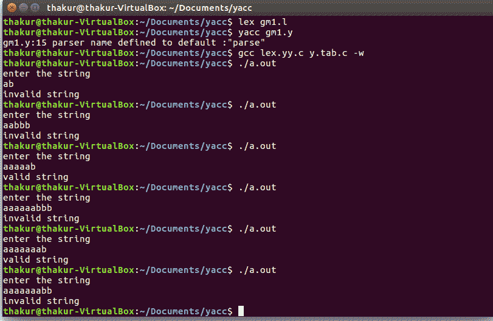

# 识别{ anb | n≥5 }字符串的 YACC 程序

> 原文:[https://www . geesforgeks . org/yacc-程序识别字符串-anb-n5/](https://www.geeksforgeeks.org/yacc-program-to-recognize-strings-of-anb-n5/)

**问题:**编写 YACC 程序识别{ a <sup>n</sup> b | n≥5 }的字符串

**解释:**
Yacc(为“又一个编译器编译器。”)是 Unix 操作系统的标准解析器生成器。yacc 是一个开源程序，用 C 编程语言为解析器生成代码。首字母缩略词通常以小写形式呈现，但偶尔会被视为 YACC 或 Yacc。

**示例:**

```
Input: ab
Output: invalid string

Input: aaaaab
Output: valid string

Input: aabb
Output: invalid string

Input: aaaaaaab
Output: valid string

Input: aaaaaabb
Output: invalid string 
```

**词法分析器源代码:**

```
%{
   /* Definition section */
  #include "y.tab.h"
 %}

/* Rule Section */
 %%
[aA] {return A;}
[bB] {return B;}
\n {return NL;}
.   {return yytext[0];}
 %%

int yywrap() 
 { 
   return 1; 
 } 
```

**解析器源代码:**

```
%{
   /* Definition section */
  #include<stdio.h>
  #include<stdlib.h>
 %}

%token A B NL

/* Rule Section */
%%
stmt: A A A A A S B NL {printf("valid string\n");
             exit(0);}
;
S: S A
|
;
%%

int yyerror(char *msg)
 {
  printf("invalid string\n");
  exit(0);
 }

//driver code 
main()
 {
  printf("enter the string\n");
  yyparse();
 }
```

**输出:**

