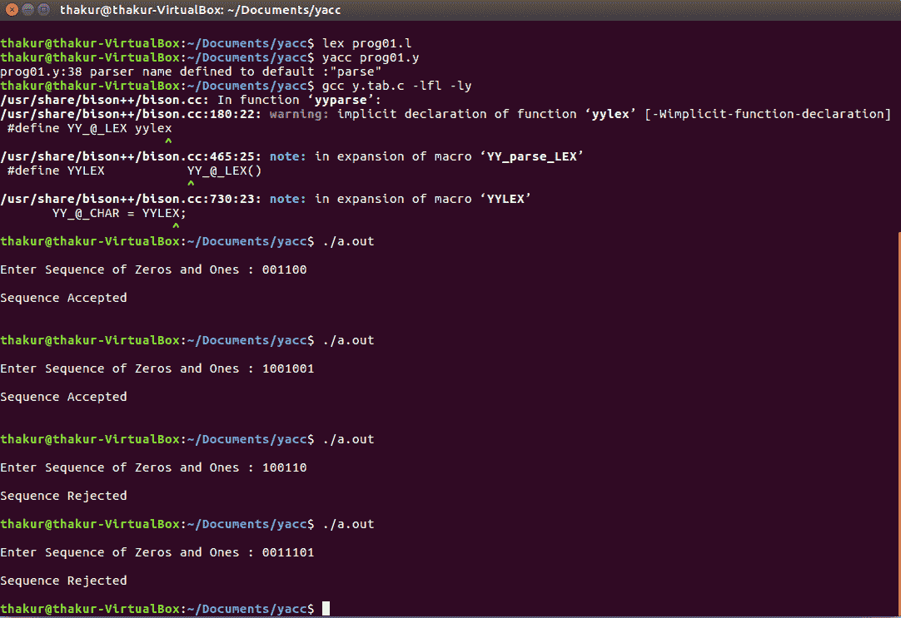

# 接受以 0 或 1 开始和结束的字符串的 YACC 程序

> 原文:[https://www . geesforgeks . org/yacc-program-哪些接受字符串-以-0 或-1 开头和结尾/](https://www.geeksforgeeks.org/yacc-program-which-accept-strings-that-starts-and-ends-with-0-or-1/)

**问题:**编写一个 YACC 程序，接受以 0 或 1 开头和结尾的字符串

**解释:**
[YACC(又一个编译器——编译器)](https://practice.geeksforgeeks.org/problems/what-is-yacc)是 Unix 操作系统的标准解析器生成器。yacc 是一个开源程序，用 C 编程语言为解析器生成代码。首字母缩略词通常以小写形式呈现，但偶尔会被视为 YACC 或 Yacc。

**示例:**

```
Input: 001100
Output: Sequence Accepted

Input: 1001001
Output: Sequence Accepted

Input: 0011101
Output: Sequence Rejected

Input: 100110
Output: Sequence Rejected 
```

**词法分析器源代码:**

```
%{
  /* Definition section */
  extern int yylval;
%}

/* Rule Section */
%%

0 {yylval = 0; return ZERO;}

1 {yylval = 1; return ONE;}

.|\n {yylval = 2; return 0;}

%%
```

**解析器源代码:**

```
%{
  /* Definition section */
  #include<stdio.h>
  #include <stdlib.h>
  void yyerror(const char *str) 
  {
   printf("\nSequence Rejected\n");        
  }

%}

%token ZERO ONE

/* Rule Section */
%%

r : s {printf("\nSequence Accepted\n\n");}
;

s : n
| ZERO a
| ONE b
;

a : n a
| ZERO
;

b : n b
| ONE
;

n : ZERO
| ONE
;

%%

#include"lex.yy.c"
//driver code
int main() 
 {
    printf("\nEnter Sequence of Zeros and Ones : ");
    yyparse();
    printf("\n");
    return 0;
 }
```

**输出:**

