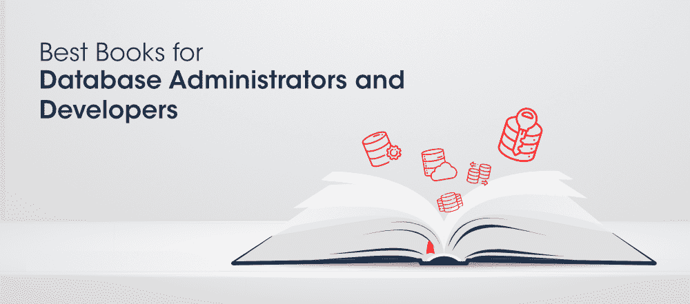

# 数据库管理员和开发人员的 7 本最佳书籍

> 原文:[https://www . geesforgeks . org/7-数据库管理员和开发人员最佳书籍/](https://www.geeksforgeeks.org/7-best-books-for-database-administrators-and-developers/)

**数据库管理员**根据公司的需求创建数据库，并确保它们有效且高效地运行。这是一条不断增长的美容职业道路，增长率接近 10%，失业率仅在 1.7%左右。在当今快节奏和媒体驱动的生活中，信息是如此容易获得。数据库管理员是信息宝藏的守护者，他们实施安全措施来确保敏感信息的安全。开发人员的角色包括应用程序的完整端到端开发，包括报表数据库、数据建模解决方案、迁移等。这也是一条真正有前途的职业道路，为有才华的人提供了无尽的职业机会。有了正确的知识和技能，你就可以在这些领域中占据优势。

在这个博客中，我们将讨论 7 本适合数据库管理员和开发人员的最佳书籍，它们将帮助你建立一个成功的职业生涯。让我们开始吧。

### 1.MySQL 解释:数据库设计的分步指南

这是一本由软件顾问兼程序员安德鲁·科莫写的令人惊叹的书。它就像一个教程，为每个人谁想提高他们的知识数据库软件。这本书是专门为非 IT 专业人士定制的，提供关于数据库理论和原理的背景信息。这本书从数据库的定义到安装以及 MySQL 提供的各种安全工具，以一种非常容易理解的方式进行。这本书有助于揭开数据库技术的神秘面纱，并深入其中。

### 2.SQL Server 性能监控和调整:成为一名聪明的数据库管理员

这是一本了不起的书，简化了数据库管理员的生活。它从常见的监控参数开始，深入到自动化技术。这本书包括自动化整个数据库监控过程的技术。这本书讨论了 SQL Server 查询优化器的核心概念，以增强开发人员的概念。本书涵盖的一些令人惊叹的概念是:

*   *参数嗅探*
*   *更新统计数据及其重要性*
*   *自动化数据库性能*
*   *索引碎片*
*   *提高查询性能*

### **3。放松数据库管理员**

这本书是四位敬业的技术人员 Gokulkumar Radhakrishnan、Sundaravel Ramasubbu、Arun Kumar Kubendiran 和 Mahendran Manickam 的合作经验。它们提供了惊人的提示和技巧来帮助读者从他们的经历中学习。这本书包括数据库管理各个领域的专门章节。这本书涵盖了执行复杂任务的最佳实践和注意事项。语言真的很简单，可以帮助读者快速掌握概念。

### 4.穆拉希的甲骨文和面向开发人员的 PL/SQL

这本书有助于在开发应用程序时节省时间和精力。本书涵盖的概念有:

*   *创建 SQL 查询*
*   *设计并实现数据库*
*   *解决安全问题*
*   *数据库微调*

还有更多。它教您以极其快速有效的方式编写 SQL 查询。这本书是乔尔·穆拉希写的，他有近 10 年的写作和编辑书籍的经验。他写了很多关于技术的书，比如。NET、Java、网络和数据库技术。

### 5.为 Oracle 数据库 18c 开始 Oracle SQL

这本书将涵盖开发 Oracle 数据库所需的所有知识。最棒的是你不需要任何数据库的先验知识来开始这本书。它分为几个小章节，可以在短时间内快速掌握和理解。它包含了一些重要的主题，例如:

*   *设置简单模式并读取数据*
*   *创建和更新数据库中的数据*
*   *使用内置特性和功能修改数据*
*   *查看数据库中存储的数据*

如果您计划使用 Oracle 作为后端数据存储来开发软件，这本书是最好的。

### 6.甲骨文数据库管理员导师:成功成为甲骨文数据库管理员

这本书是布莱恩·皮斯兰德写的，他在甲骨文数据库方面有 20 多年的经验。它有助于开发解决公司数据库问题的能力。这本书从创建第一个数据库到构建一个运行良好的数据库系统的过程相当缓慢。内容以逐步技术块的形式呈现，为您提供了数据库实践和过程的强大基础。

阅读本书后，您将深入了解:

*   Oracle 安装
*   *备份和恢复*
*   *数据安全实践*
*   *解决技术问题*
*   *升级 Oracle 数据库*

### 7.程序设计

本书由甲骨文 PL/SQL 语言的主要专家之一史蒂文·弗厄斯坦(Steven Feuerstein)撰写，他已经写了近十本书。这本书被认为是最好的甲骨文编程指南。在过去的二十年里，许多开发人员从这本书中受益匪浅。这本书涵盖了语言基础、高级编码技术以及解决现实问题的最佳方法。在这本书里你会得到:

*   *跟踪、测试、管理和执行代码的明确指令*
*   *大量代码样本*
*   *优化 PL/SQL 性能*
*   *构建易于维护的 PL/SQL 应用程序*
*   *有效使用程序、触发器和功能*

除了这些，你还可以参考一些其他的书:

*   *Pro 甲骨文 SQL 开发*
*   *Oracle 高可用性、灾难恢复和云服务*
*   *专业甲骨文数据库 18c 管理*
*   *甲骨文 PL/SQL 最佳实践*
*   *动态 Oracle 性能分析:使用标准化指标提高数据库速度*
*   *业务流程驱动的数据库设计:用 Oracle PL/SQL*

如果你愿意在这个领域建立你的职业生涯，那么你必须查阅上述书籍。此外，您还可以访问[极客博客](https://www.geeksforgeeks.org/)。它嵌入了令人惊叹的课程和内容，帮助你在专家的指导下王牌你的职业生涯！