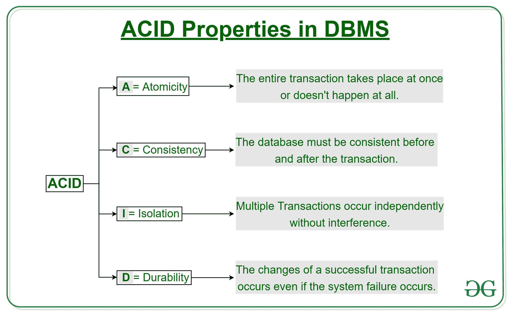
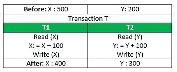
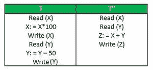

# 数据库管理系统中的酸性属性

> 原文:[https://www.geeksforgeeks.org/acid-properties-in-dbms/](https://www.geeksforgeeks.org/acid-properties-in-dbms/)

事务 是单个逻辑工作单元，它访问并可能修改数据库的内容。事务使用读写操作访问数据。
为了保持数据库的一致性，在交易前后，遵循某些属性。这些被称为**酸性**属性。

**原子性**
这里，我们的意思是要么整个事务立刻发生，要么根本不发生。没有中途，即交易不会部分发生。每个事务都被视为一个单元，要么运行到完成，要么根本不执行。它涉及以下两个操作。
— **中止**:如果事务中止，对数据库的更改将不可见。
— **提交**:如果事务提交，所做的更改是可见的。
原子性也被称为“全有或全无规则”。

考虑以下交易 **T** 由 **T1** 和 **T2** 组成:从账户 **X** 向账户 **Y** 转账 100。

如果交易在 **T1** 完成后但在 **T2** 完成前失败。(比如，**写(X)** 后**写(Y)** 前)，则金额已从 **X** 中扣除，但未加到 **Y** 中。这将导致数据库状态不一致。因此，事务必须整体执行，以确保数据库状态的正确性。

**一致性**
这意味着必须维护完整性约束，以便数据库在事务前后保持一致。它指的是数据库的正确性。参考上面的例子，
必须维护交易前后的总金额。
T 发生前总计**=**500+200 = 700**。
T 发生后总计**=**400+300 = 700**。
所以数据库是**一致的**。当 **T1** 完成而 **T2** 失败时，出现不一致。结果是 T 不完整。****

 ****【隔离】**
该属性确保多个事务可以并发发生，不会导致数据库状态不一致。交易独立发生，不受干扰。在特定事务中发生的更改对任何其他事务都不可见，直到该事务中的特定更改被写入内存或被提交。此属性确保并发执行事务将导致一个状态，该状态相当于以某种顺序连续执行事务所达到的状态。
让 **X** = 500， **Y** = 500。
考虑两笔交易 **T** 和 **T。****

****

**假设 **T** 一直执行到**读(Y)** 然后 **T''** 开始。结果，由于 **T''** 读取的是 **X** 的正确值，而 **Y** 的不正确值和
**T ' '计算的和(X+Y = 50，000+500=50，500)**
因此与事务结束时的和不一致:
**T: (X+Y = 50，000 + 450 = 50
这导致数据库不一致，因为丢失了 50 个单元。因此，事务必须独立进行，并且只有在对主内存进行了更改之后，更改才应该可见。****

 ****【持久性:**
该属性确保一旦事务完成执行，对数据库的更新和修改将被存储并写入磁盘，即使发生系统故障，它们也将持续存在。这些更新现在变成永久的，并存储在非易失性存储器中。因此，交易的效果永远不会丧失。**

**总的来说， **ACID** 属性提供了一种机制来确保数据库的正确性和一致性，使得每个事务都是一组操作，作为一个单元，产生一致的结果，与其他操作隔离，并且它所做的更新被持久存储。**

**本文由 **Avneet Kaur** 供稿。如果你喜欢 GeeksforGeeks 并想投稿，你也可以使用[contribute.geeksforgeeks.org](http://www.contribute.geeksforgeeks.org)写一篇文章或者把你的文章邮寄到 contribute@geeksforgeeks.org。看到你的文章出现在极客博客主页上，帮助其他极客。**

**如果你发现任何不正确的地方，或者你想分享更多关于上面讨论的话题的信息，请写评论。**