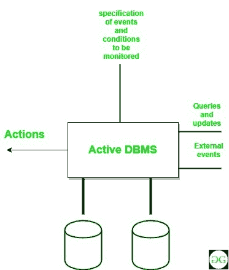

# 活动数据库

> 原文:[https://www.geeksforgeeks.org/active-databases/](https://www.geeksforgeeks.org/active-databases/)

活动数据库是由一组触发器组成的数据库。这些数据库很难维护，因为在理解这些触发因素的影响时会出现复杂性。在这样的数据库中，在执行语句之前，数据库管理系统首先验证在修改数据库的语句中指定的特定触发器是否被激活。

如果触发器处于活动状态，则数据库管理系统执行条件部分，然后仅当指定条件被评估为真时才执行操作部分。在一条语句中可以激活多个触发器。

在这种情况下，数据库管理系统随机处理每个触发器。触发器的动作部分的执行可以激活其他触发器，也可以激活初始化该动作的同一个触发器。这种自身激活的触发器称为“递归触发器”。数据库管理系统以某种预定义的方式执行这样的触发链，但是它影响了理解的概念。

**活动数据库的特征:**

1.  它拥有传统数据库的所有概念，即数据建模工具、查询语言等。
2.  它支持传统数据库的所有功能，如数据定义、数据操作、存储管理等。
3.  它支持非洲经委会规则的定义和管理。
4.  它检测事件的发生。
5.  它必须能够评估条件并执行操作。
6.  这意味着它必须实现规则执行。

**优势:**

1.  借助强大的规则处理功能增强传统数据库功能。
2.  实现与信息系统相关的业务规则的统一和集中描述。
3.  避免检查和修复操作的冗余。
4.  适合构建大型高效知识库和专家系统的平台。