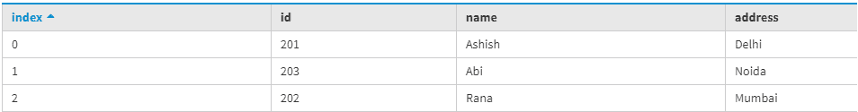
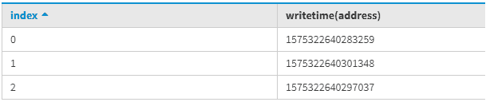
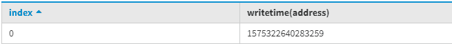

# CQL 附加功能(卡珊德拉查询语言)

> 原文:[https://www . geesforgeks . org/additional-functions-in-cql-Cassandra-query-language/](https://www.geeksforgeeks.org/additional-functions-in-cql-cassandra-query-language/)

在本文中，我们将讨论 CQL 在 [Cassandra](https://www.geeksforgeeks.org/introduction-to-apache-cassandra/) 中支持的几个函数，这些函数可以帮助直接使用函数将一个值类型转换为另一个新值。
在《卡珊德拉》中，有几个函数得到了 CQL 的支持，这在很多方面都有帮助，比如有一个场景，我们希望借助 TTL 函数找到一列的 TTL 值，我们可以很容易地做到这一点。

1.  [聚合功能](https://www.geeksforgeeks.org/aggregate-functions-in-cassandra/)
2.  [UUID 和定时器功能](https://www.geeksforgeeks.org/uuid-and-timeuuid-functions-in-cassandra/)
3.  [TOKEN 功能](https://www.geeksforgeeks.org/partitioners-with-the-token-function-in-cassandra/)
4.  WRITETIME 函数
5.  [TTL 功能](https://www.geeksforgeeks.org/time-to-live-ttl-for-a-column-in-cassandra/)

我们来讨论 WRITETIME 函数。

**WRITETIME:**
WRITETIME 函数在 Cassandra 查询语言中非常有用，当发生写操作时，我们可以检索对列的写操作的日期/时间。
我们可以在 select 语句中使用 WRITETIME 函数，后面跟着括号中的非分区列。在 Cassandra 查询语言中，一个表包含时间戳来表示对列进行写操作的日期和时间。返回查询后，它以微秒为单位给出 WRITETIME 函数值，然后我们可以将其转换为日期/时间格式。

让我们用一个例子来理解。

```
CREATE TABLE function_test
(
Id int,
Name text,
Address text,
PRIMARY KEY(Id)
);
```

使用以下 CQL 查询将数据插入表中。

```
INSERT INTO function_test (Id, Name, Address) 
       VALUES (201, 'Ashish', 'Delhi');
INSERT INTO function_test (Id, Name, Address) 
       VALUES (202, 'Rana', 'Mumbai');
INSERT INTO function_test (Id, Name, Address) 
       VALUES (203, 'Abi', 'Noida'); 
```

要读取数据，请使用以下 CQL 查询。

```
SELECT * 
FROM function_test; 
```

**输出:**



为了确定写时间函数值，使用了以下 CQL 查询。

```
SELECT WRITETIME (Address) 
FROM function_test; 
```

**输出:**



为了使用 WHERE 子句确定 WRITETIME 函数，使用了以下 CQL 查询。

```
SELECT WRITETIME (Address) 
FROM function_test where Id=201; 
```

**输出:**

