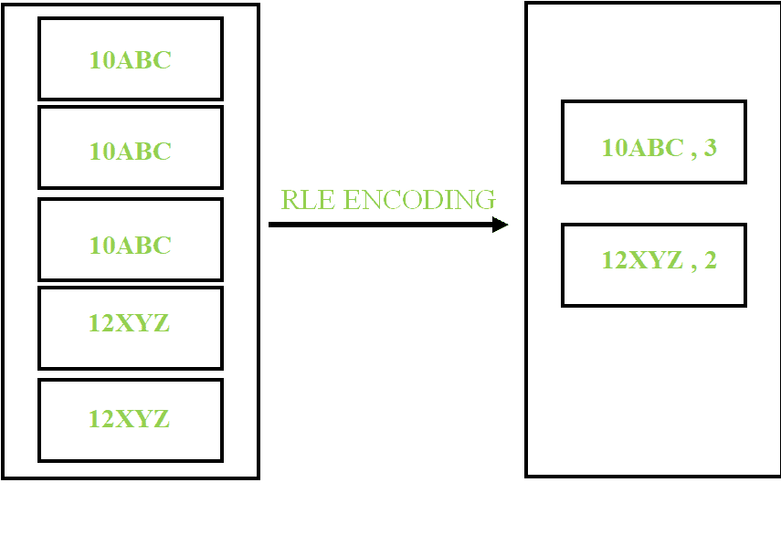
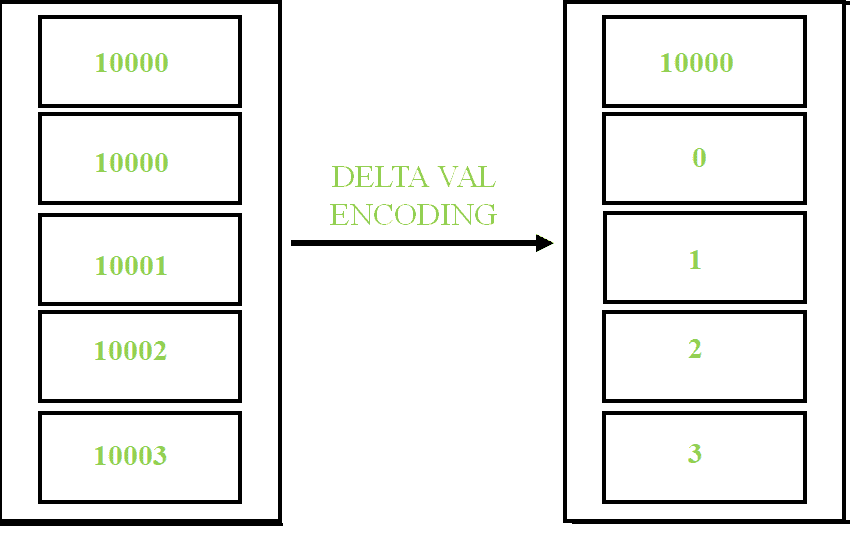
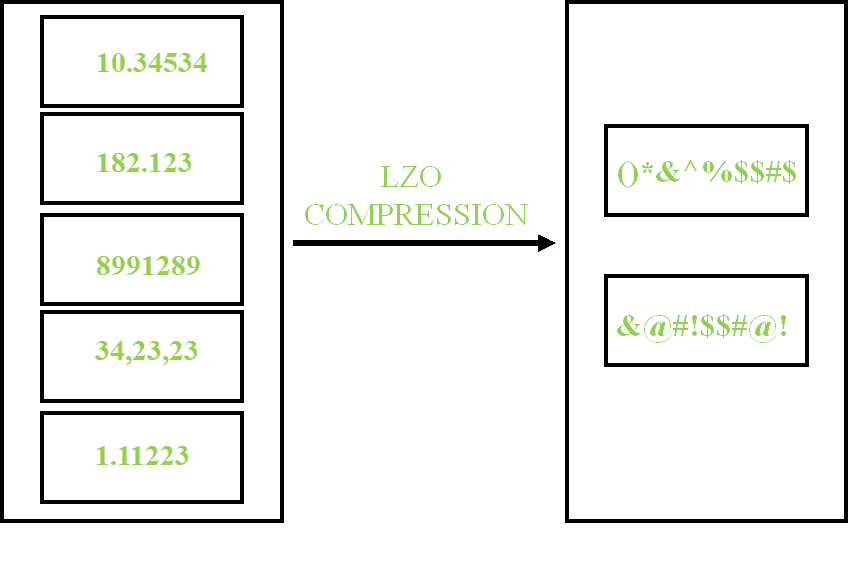

# 惠普 Vertica 中的高级压缩和编码技术

> 原文:[https://www . geesforgeks . org/advanced-压缩和编码技术-in-hp-vertica/](https://www.geeksforgeeks.org/advanced-compression-and-encoding-techniques-in-hp-vertica/)

我们在计算机系统中存储数据的主要目的是减少数据将占用的存储空间。惠普 vertica 使用**编码和压缩**技术来优化数据存储，并提高查询性能。

**<u>编码:</u>**
编码是将数据转换成某种标准格式的过程，这种编码数据可以由 vertica 直接处理。
vertica 中最常用的编码技术有:

*   **游程编码(RLE)**
*   **δval 编码。**

**<u>压缩:</u>**
压缩是压缩数据的方法，vertica 无法直接理解。首先，数据必须被解压缩，只有这个解压缩的数据才能被 vertica 理解。最常用的压缩技术是:

*   **LZO(基于莱姆佩尔-齐夫-奥伯胡默)压缩**

**<u>【游程编码(RLE):</u>**
RLE 用于压缩列中几乎没有不同值的排序数据。

**<u>【Deltaval 编码:</u>**
在 Deltaval 编码中，数据可以是已排序的，也可以是未排序的，并且值不是很明显。以其中一个数据为基础，找出数据之间的差异。

**<u>LZO 压缩:</u>**
LZO 压缩是在数据未排序时使用的数据非常鲜明。LZO 压缩删除了字符之间的空格，并对它们进行编码，就像在我们发送电子邮件之前压缩文档一样。

