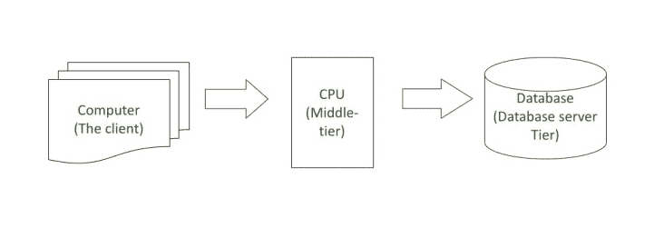
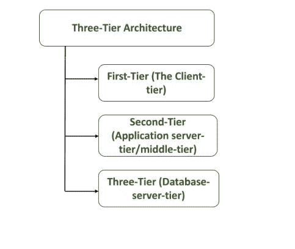

# DBMS 中三层架构的优缺点

> 原文:[https://www . geeksforgeeks . org/三层架构在 dbms 中的优缺点/](https://www.geeksforgeeks.org/advantages-and-disadvantages-of-three-tier-architecture-in-dbms/)

**三层架构:**
三层架构，中间服务器处理客户端请求，与下级服务器协调客户端请求的执行。它添加了中间件(中间层)，为一个数据库管理系统的客户端提供了从另一个数据库管理系统访问数据的方式。

通常，两层客户服务器模型用于从一个数据库管理系统服务器访问数据，这是一个集中式系统。另一种分发方法是在不同的地方存储几个等价的数据库，这被称为分布式数据库系统。

例如，不同的客户列表可以存储在由具有多个分支机构的组织所组织的几个州的每个分支机构中。这些表是分布式的，但相互连接，因此数据库管理系统能够在任何时间、任何地点找到任何客户的信息。

从上图(a)中，我们可以说客户端为第一层，服务器(cpu)为应用服务器层或中间层或第二层，数据库为第三层或数据库服务器层。

**三层架构基本上是三层–**

*   第一层(客户端层)
*   第二层(应用服务器层/中间层)
*   第三层(数据库服务器层)

**三层架构优势:**

1.  主要的三层好处是提高了可扩展性，因为应用服务器可以部署在许多机器上。此外，数据库不会与每个客户端建立更长的连接，它只需要从较少数量的应用服务器连接。
2.  它提高了数据的完整性。在这里，所有更新的信息都经过第二层。第二层可以确保只允许更新数据库中的重要信息，并消除不可靠的客户端应用程序破坏信息的风险。
3.  由于客户端不能直接访问数据库，安全性得到了提高；客户端更难获得未经授权的数据。业务逻辑更安全，因为它存储在安全的中央服务器上。
4.  通过将核心业务从数据库服务器中分离出来，负载平衡变得更加容易。
5.  高性能、轻量级、持久对象。
6.  最好重复使用。
7.  可扩展性:每个项目都可以水平扩展。
8.  性能:因为表示层可以缓存请求，所以网络利用率最小化，负载降低。
9.  易于维护和修改。
10.  提高数据完整性。
11.  提高安全性
12.  客户端是“瘦”的。这就是使用不太贵的硬件背后的原因。
13.  变更管理更容易、更快地执行，因为程序逻辑/业务逻辑是在集中式服务器上实现的。
14.  增加的模块化使修改或替换一层变得更加容易，而不会影响另一层。

**三层架构的缺点:**

1.  它比 2 层客户机-服务器计算模型更复杂，因为与 2 层应用程序相比，构建 3 层应用程序更困难。交流点增加了一倍。
2.  客户端不维护持久的数据库连接。
3.  可能需要单独的代理服务器。
4.  如果使用单独的代理服务器，网络流量将会增加。
5.  包含业务逻辑功能的应用服务器和包含数据库的数据库服务器的物理分离可能会影响性能。
6.  提高复杂性或努力程度。