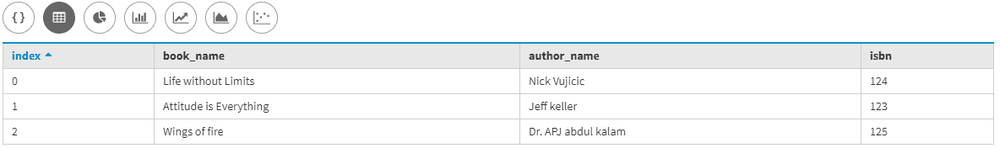
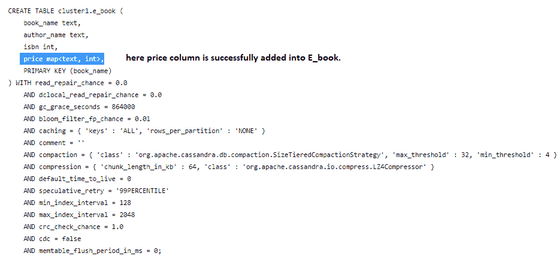
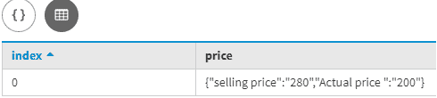

# 在卡珊德拉中更改表格以添加收集数据类型

> 原文:[https://www . geesforgeks . org/altering-a-table-to-add-a-collection-data-type-in-Cassandra/](https://www.geeksforgeeks.org/altering-a-table-to-add-a-collection-data-type-in-cassandra/)

在本文中，我们将讨论如何更改表以添加 MAP 集合数据类型，以及如何在 UPDATE 命令的帮助下更改表后插入数据。我们一个一个来讨论。
首先我们要创建一个表，让我们考虑 E_book 是一个表名，Bookk_name、Author_name、Selling _ price 是 E_book 表中的字段。让我们看看。

```
Create table E_book
(
Book_name text,
Author_name text,
ISBN int,
Primary key(Book_name)
); 
```

现在，我们将使用下面给出的 CQL 查询插入一些数据。

```
Insert into E_book(Book_name, Author_name, ISBN) 
Values ('Attitude is Everything', 'Jeff keller', 123 );

Insert into E_book(Book_name, Author_name, ISBN) 
Values ('Life without Limits', 'Nick Vujicic', 124 );

Insert into E_book(Book_name, Author_name, ISBN) 
Values ('Wings of fire', 'Dr. APJ abdul kalam', 125 ); 
```

让我们看看结果，

```
select * 
from E_book; 
```

**输出:**



现在，这里我们将使用 ALTER TABLE 命令添加一个新的集合数据类型列。让我们看看。

```
ALTER TABLE E_book 
ADD price map<text, int>; 
```

现在，验证使用了下面的 cqlsh 查询。

```
describe table E_book; 
```

**输出:**



在上面的[卡珊德拉查询语言(CQL)](https://www.geeksforgeeks.org/additional-functions-in-cql-cassandra-query-language/) 查询中，我们使用的是 MAP 集合，其中我们插入了密钥对值。现在，在成功地更改表之后，我们将使用 UPDATE 命令来插入数据。

让我们看看。

```
UPDATE E_book 
SET price = price + {'selling price' : 280, 'Actual price ' : 200} 
WHERE Book_name = 'Attitude is Everything'; 
```

现在，为了验证结果，我们将使用下面给出的 CQL 查询。

```
SELECT price FROM E_book 
WHERE Book_name = 'Attitude is Everything';
```

**输出:**

