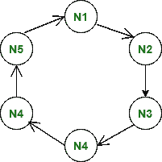
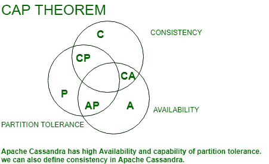

# Apache Cassandra (NOSQL 数据库)

> 原文:[https://www . geesforgeks . org/Apache-Cassandra-no SQL-database/](https://www.geeksforgeeks.org/apache-cassandra-nosql-database/)

在本文中，我们将学习 Apache Cassandra 的基础知识和 CQL (Cassandra 查询语言)操作的基础知识，如创建、插入、删除、选择等。

**[Apache Cassandra](https://www.geeksforgeeks.org/introduction-to-apache-cassandra/):**
Apache Cassandra 是一个用于处理大数据的开源无 SQL 数据库。Apache Cassandra 具有处理结构化、半结构化、非结构化数据的能力。Apache Cassandra 最初是在脸书开发的，之后于 2008 年开源，之后于 2010 年成为顶级 Apache 项目之一。


**图-1:** 卡珊德拉大师少环架构
T5】

Apache Cassandra 是一个高度可扩展的分布式数据库，它严格遵循一致性可用性和分区容差定理。


**图-2:** CAP 定理

在 Apache Cassandra 中，没有主客户端架构。它有一个对等的架构。在 Apache Cassandra 中，我们可以在创建密钥空间时创建数据的多个副本。我们可以简单定义复制策略和 RF (Replication Factor)来创建数据的多个副本。

**示例:**

```
CREATE KEYSPACE Example
WITH replication = {'class': 'NetworkTopologyStrategy', 
                             'replication_factor': '3'}; 
```

在本例中，我们将射频(复制因子)定义为 3，这仅仅意味着我们在顺时针方向跨多个节点创建 3 个数据副本。

**图-3:** 射频= 3

**cqlsh: CQL shell**
cqlsh 是通过 CQL (Cassandra Query Language)与 Cassandra 交互的命令行 shell。

**CQL 查询基本操作:**
**步骤 1:** 创建键空间使用了以下 CQL 查询。

```
CREATE KEYSPACE Emp
WITH replication = {'class': 'SimpleStrategy', 
                             'replication_factor': '1'}; 
```

**步骤 2:** 使用键空间的 CQL 查询

```
Syntax: 
USE keyspace-name 
USE Emp;
```

**步骤 3:** 创建表时使用了以下 CQL 查询。

```
Example:
CREATE TABLE Emp_table (
    name text PRIMARY KEY,
    Emp_id int,
    Emp_city text,
    Emp_email text,
    );
```

**第 4 步:**要插入 Emp_table，使用了以下 CQL 查询。

```
Insert into Emp_table(name, Emp_id, Emp_city, Emp_email) 
  VALUES ('ashish', 1001, 'Delhi', 'ashish05.rana05@gmail.com');
Insert into Emp_table(name, Emp_id, Emp_city, Emp_email) 
  VALUES ('Ashish Gupta', 1001, 'Bangalore', 'ashish@gmail.com');
Insert into Emp_table(name, Emp_id, Emp_city, Emp_email) 
  VALUES ('amit ', 1002, 'noida', 'abc@gmail.com');
Insert into Emp_table(name, Emp_id, Emp_city, Emp_email) 
  VALUES ('dhruv', 1003, 'pune', 'xyz@gmail.com');
Insert into Emp_table(name, Emp_id, Emp_city, Emp_email) 
  VALUES ('shivang', 1004, 'mumbai', 'test@gmail.com');
Insert into Emp_table(name, Emp_id, Emp_city, Emp_email) 
  VALUES ('aayush', 1005, 'gurugram', 'cass_write@gmail.com');
Insert into Emp_table(name, Emp_id, Emp_city, Emp_email) 
  VALUES ('bhagyesh', 1006, 'chandigar', 'welcome@gmail.com'); 
```

**步骤-5:** 要读取数据，请使用以下 CQl 查询。

```
SELECT * FROM Emp_table;
```