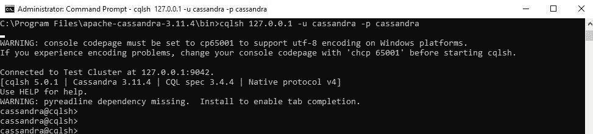
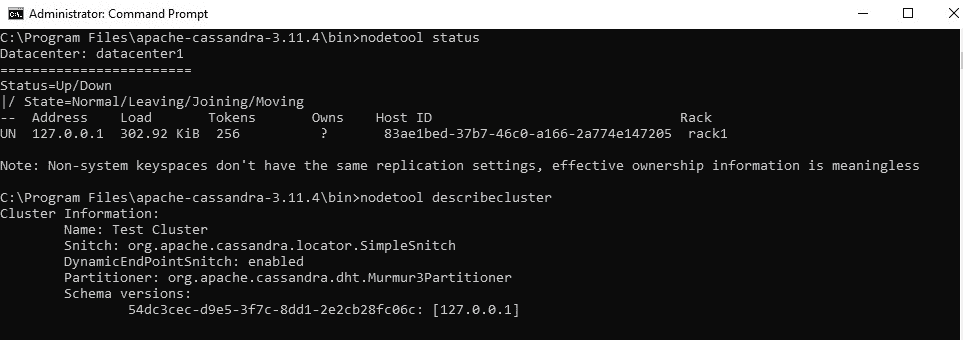
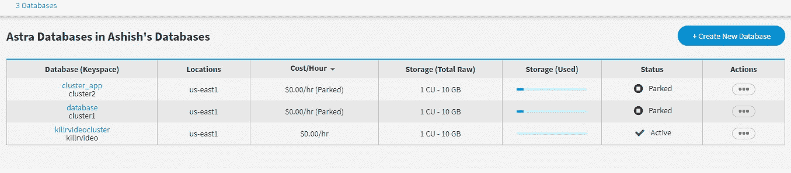

# 阿帕奇卡珊德拉工具

> 原文:[https://www.geeksforgeeks.org/apache-cassandra-tools/](https://www.geeksforgeeks.org/apache-cassandra-tools/)

**先决条件–**

*   [阿帕奇卡珊德拉介绍](https://www.geeksforgeeks.org/introduction-to-apache-cassandra/)
*   [Apache Cassandra (NOSQL 数据库)](https://www.geeksforgeeks.org/apache-cassandra-nosql-database/)
*   [阿帕奇卡珊德拉的架构](https://www.geeksforgeeks.org/architecture-of-apache-cassandra/)

在本文中，我们将讨论 Apache Cassandra 的工具，这些工具有助于执行任务的各个方面，例如节点的状态、环的状态、备份和恢复数据等。

1.  **The CQL shell (cqlsh) –**
    This is a tool for [Cassandra Query Language](https://www.geeksforgeeks.org/useful-cql-query-in-cassandra/) which supports Cassandra. cqlsh is a command-line shell for interacting with Cassandra through CQL (the Cassandra Query Language). with the help of the cql command, we can read and write data with the help of the cql query.

    默认情况下，CQL 安装在 Cassandra 可执行文件旁边的 bin/目录中。在 Cassandra 中，cqlsh 利用 [Python](https://www.geeksforgeeks.org/python-programming-language/) 本地协议驱动程序，并连接到命令行中指定的单个节点。
    下面是 cqlsh 连接 cqlsh 外壳的截图。

    

    <center>**Figure –** Connect with cqlsh shell</center>

2.  **[Nodetool](https://www.geeksforgeeks.org/node-in-apache-cassandra/) –**
    Nodetool is a very useful tool in Apache Cassandra. In Cassandra, nodetool is the utility for cqlsh, and with the help of nodetool, we can perform many actions such that **nodetool describecluster** this command will Print the name, snitch, partitioner and schema version of a cluster. Below given is the screenshot of the nodetool tool in which will see that how we can connect with the nodetool tool. It is also by default installed in the bin/ directory.
    Example – nodetool status, nodetool describecluster, etc. are the commands of nodetool.

    

    <center>**Figure –** Nodetool describecluster</center>

3.  **[SSTable](https://www.geeksforgeeks.org/sstable-in-apache-cassandra/) Tools –**
    In Cassandra, SSTable Tools utility has many tools like sstabledump, sstableloader, sstableutil, etc. If the user wants to dump the contents of a given SSTable to standard output in JSON format then we will use the sstabledump command. You must supply exactly one sstable. In the case of SSTable Tools, Cassandra’s service must be stopped while executing this tool is executed, or unexpected results will occur.

    **注意:**
    表工具脚本没有验证卡珊德拉被停止。
    示例–如果用户想要以 JSON 格式转储内容，那么我们可以使用这个命令。

    用法:

    ```
    sstabledump <options> <sstable file path>
    ```

4.  **Cassandra Stress –**
    In Apache Cassandra, Cassandra-stress is a tool for benchmarking and load testing a Cassandra cluster. In Apache Cassandra, to benchmark their data model, Cassandra-stress supports testing arbitrary CQL tables and queries and allows users to benchmark their data model.

    **语法:**

    ```
    cassandra-stress <command> [options]
    ```

5.  **Cassandra as a Service (DataStax Astra) –**
    It is one of the best tools for Cassandra, DataStax providing Cassandra as a service and gives 10 GB free on cloud and you can deploy your cluster databases on AWS and GCP.

    它们是专门部署在云上的服务，例如 AWS、GCP 等。这是一个基于图形用户界面的工具，您可以创建自己的笔记本来进行自我解释，也可以直接在 shell 或笔记本中执行 cqlsh 查询。通过驱动程序，如 Java 驱动程序、python 驱动程序、Java Script 驱动程序等，可以轻松实现与 Cassandra 的应用程序连接。

    

    <center>**Figure –** DataStax Astra Databases</center>