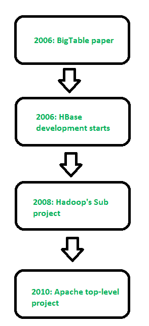

# Apache hbase

> 哎哎哎:# t0]https://www . geeksforgeeks . org/Apache-hbase/

先决条件–[Hadoop 简介](https://www.geeksforgeeks.org/hadoop-an-introduction/)
**HbSe**是一个类似于谷歌大表的数据模型。它是由用 Java 编写的 *Apache* 软件基金会开发的开源分布式数据库。HBase 是我们 Hadoop 生态系统的重要组成部分。HBase 运行在 HDFS (Hadoop 分布式文件系统)之上。它可以存储从万亿字节到千兆字节的海量数据。它面向列，可水平扩展。

**图–**糖化血红蛋白酶的历史

**糖化血红蛋白酶的特性–**

1.  它可以跨多个节点线性扩展，也可以模块化扩展，因为它可以跨多个节点划分。

2.  HBase 提供一致的读取和写入。

3.  它在一个读或写过程中提供原子读和写手段，阻止所有其他过程执行任何读或写操作。

4.  它为客户端访问提供了易于使用的 Java API。

5.  它支持非 Java 前端的节俭和 REST API，支持 XML、Protobuf 和二进制数据编码选项。

6.  它支持实时查询和大容量查询优化的块缓存和布隆过滤器。

7.  HBase 在区域服务器之间提供自动故障支持。

8.  它支持使用 Hadoop 度量子系统将度量导出到文件。

9.  它不会在您的数据中强制执行关系。

10.  它是一个随机存取存储和检索数据的平台。

**Facebook Messenger 平台**使用的是 Apache Cassandra，但在 2010 年 11 月从 Apache Cassandra 转移到了 HBase。脸书试图构建一个可扩展的、健壮的基础设施，将消息、电子邮件、聊天和短信等一系列服务处理成实时对话，这就是为什么 HBase 最适合这样做的原因。

**关系数据库管理系统 Vs 糖化血红蛋白酶–**

1.  关系数据库管理系统主要是面向行的，而高级数据库管理系统是面向列的。

2.  RDBMS 有固定的模式，但是在 HBase 中，我们也可以在运行时扩展或添加列。

3.  关系数据库管理系统适用于结构化数据，而 HBase 适用于半结构化数据。

4.  RDBMS 针对联接进行了优化，但 HBase 没有针对联接进行优化。