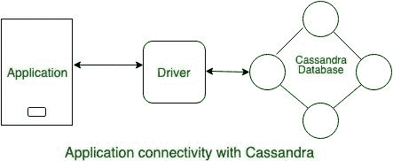

# 与卡珊德拉的应用程序连接

> 原文:[https://www . geesforgeks . org/application-connectivity-with-Cassandra/](https://www.geeksforgeeks.org/application-connectivity-with-cassandra/)

在本文中，我们将学习使用代码对 [Cassandra](https://www.geeksforgeeks.org/introduction-to-apache-cassandra/) 的基本访问，例如如何设置开发环境以及如何使用代码来执行 CQL 语句。

在高可用性和可扩展性的情况下，卡珊德拉总是将您的应用程序与卡珊德拉数据库连接起来的最佳选择。
我们来看看。



<center>**Figure –** Application connectivity with Cassandra</center>

要连接到 cassandra，有许多驱动程序可用。下面列出的很少。

*   [Java](https://docs.datastax.com/en/developer/java-driver-dse/2.3/)
*   [蟒蛇](https://docs.datastax.com/en/developer/python-dse-driver/2.11/)
*   [Node.js](https://docs.datastax.com/en/developer/nodejs-driver-dse/2.3/)
*   [C#](https://docs.datastax.com/en/developer/csharp-driver-dse/2.9/)

在连接应用程序和数据库的编程语言中，有一种编程模式。
下面是三个简单的步骤:

1.  创建连接(称为会话)
2.  使用会话执行查询。
3.  请务必关闭连接/会话。

让我们用例子一个一个来理解。

在 Java 编程语言中使用 Cloud 将应用程序与 Cassandra 数据库连接使用了以下步骤:

*   **步骤-1:**
    创建会话使用了以下 Java 代码。

    ```
    try (DseSession session = DseSession.builder()
                .withCloudSecureConnectBundle
                  ("/path/to/secure-connect-database_name.zip")
                 // Database Credentials
                .withAuthCredentials("DBUserName", "DBPassword") 
                .build()) { 
    ```

*   **第 2 步:**
    要执行 CQL 使用了以下 Java 代码。

    ```
    session.execute(
        SimpleStatement.builder("SELECT password 
                                 FROM keyspace-name.Table-name 
                                 WHERE email = ?")
            .addPossitionalValues("name@datastax.com")
            .build()); 
    ```

*   **步骤 3:**
    要关闭会话，请使用以下 Java 代码。

    ```
    // Close happens automatically here 
    // - otherwise use session.close()
    session.close() 
    ```

在 Python 编程语言中，使用 Cloud 将应用程序与 Cassandra 数据库连接使用了以下步骤:

*   **步骤 1:**
    创建会话使用了以下 Python 代码。

    ```
    cluster = Cluster(
              cloud = {'secure_connection_bundle' 
                          : '/path / to / secure-connect-database_name.zip'},
              auth_provider = PlainTextAuthProvider('DBUsername', 'DBPassword'))        
               # Database Credentials
             session = cluster.connect() 
    ```

*   **步骤-2:**
    要执行 CQL 使用了以下 Pyhton 代码。

    ```
    session.execute(("SELECT password 
                      FROM keyspace-name.Table-name 
                      WHERE email = % s, ('name@datastax.com')) 
    ```

*   **步骤 3:**
    要关闭会话，请使用以下 Python 代码。

    ```
    session.shutdown() 
    ```