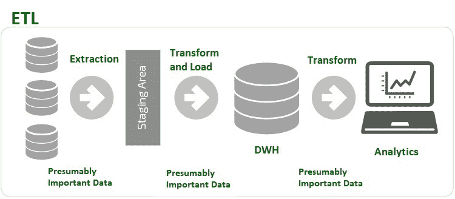
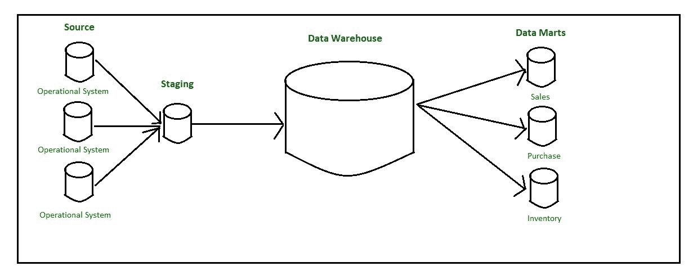

# ETL 过程中的方法

> 原文:[https://www.geeksforgeeks.org/approaches-in-etl-process/](https://www.geeksforgeeks.org/approaches-in-etl-process/)

**先决条件–**[ETL(提取、转换和加载)流程](https://www.geeksforgeeks.org/etl-process-in-data-warehouse/)

**ETL 代表提取、转换和加载。**

这是三个数据库功能，它们被合并到一个工具中，用于从一个数据库中提取数据，并将数据放入另一个数据库。

大数据包含大量的结构化或非结构化数据。 [RDBMS](https://www.geeksforgeeks.org/rdbms-architecture/) 发现处理海量数据具有挑战性。此外，关系数据库管理系统是为稳定的数据保留而不是快速增长而设计的。这就是数据仓库的作用。

数据仓库支持所有类型的数据，也可以处理快速增长的数据。因此，对于数据分析，数据需要从数据库转移到数据仓库。借助下图可以很好地解释 ETL 过程的工作。

ETL 过程

**ETL 过程的应用是:**

*   将数据移入和移出数据仓库。数据库不适合大数据分析，因此，数据需要从数据库移动到数据仓库，这是通过 ETL 过程完成的。
*   数据策略比以往任何时候都更加复杂。ETL 有助于将大量数据转化为可操作的商业智能。

**ETL 中有两种方法:**

1.  **Top Down Approach :**
    The data flow in the top-down OLAP environment begins with data extraction from the operational data sources. This data is loaded into the staging area and validated and consolidated for ensuring a level of correctness and then moved to the Operational Data Store (ODS).

    如果 ODS 阶段是运行数据库的另一个副本，它有时会被跳过。数据被并行加载到数据仓库中，以避免从正式文件系统中提取数据。数据通常从正式文件系统中提取出来，暂时存放在中转区进行汇总、汇总，然后提取并加载到数据仓库中。

    是否需要正式文件系统取决于业务要求。如果需要数据仓库中的详细数据，则必须创建正式文件系统。数据仓库聚合和汇总过程完成后，数据集市会将数据从数据仓库提取到暂存区，并对其执行一组新的转换。这将有助于按照数据集市的要求以特定的结构组织数据。

    之后，数据集市可以装载数据，用户可以使用 OLAP 环境。数据仓库中的数据是历史数据。英蒙提出了一种自上而下的模型方法，使用传统的数据库建模技术(ER 模型)创建一个集中式企业数据仓库，数据存储在 3NF 中。数据仓库现在充当新数据集市的数据源。

    

    自上而下的方法

2.  **Kimball Methodology (Bottom-Up Approach) :**
    The bottom‐up approach reverses the positions of the Datawarehouse and the Data marts. Data marts are directly loaded with the data through the staging area. The existence of ODS depends on business requirements. The data flow in the bottom-up approach starts with the extraction of data from operational databases into the staging area where it is processed and consolidated and then loaded into the ODS.

    ODS 中的数据要么被附加到正在加载的新数据上，要么被新数据替换。一旦 ODS 被刷新，当前数据再次被提取到暂存区并被处理。数据集市中的数据被拉至暂存区进行聚合、汇总等，并加载到数据仓库中，供最终用户进行分析。

    

    自下而上的方法

**ETL 工具:**
一些最常用的 ETL 工具是 MarkLogic、Oracle、Sybase、Hevo 和 Xplenty。

**ETL 工具的优势:**

*   易于使用。
*   同时从不同的目标加载数据。
*   根据需要执行数据转换。
*   更适合复杂的规则和转换。
*   内置错误处理功能。
*   基于图形用户界面，提供可视化流程。
*   节约成本，增加收入。

**ETL 工具的缺点:**

*   不适合接近实时的数据访问。
*   更倾向于批量数据处理
*   难以跟上不断变化的要求。