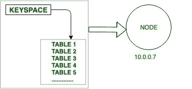
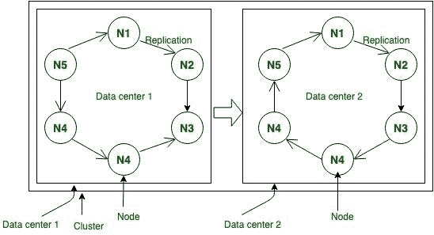
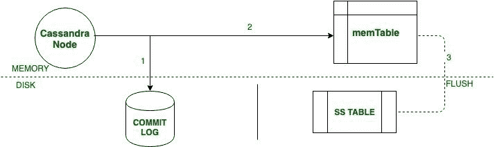
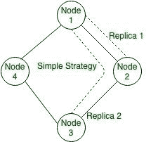
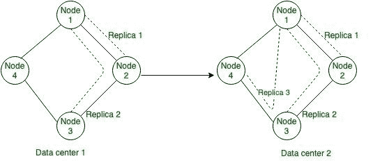
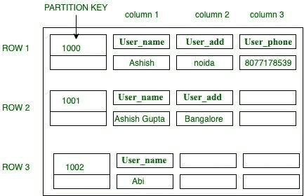

# 阿帕奇卡珊德拉的架构

> 原文:[https://www . geesforgeks . org/architecture-of-Apache-Cassandra/](https://www.geeksforgeeks.org/architecture-of-apache-cassandra/)

阿维纳什·拉克什曼和普拉尚特·马利克最初在脸书开发了卡珊德拉，为脸书收件箱搜索功能提供动力。脸书在 2008 年 7 月发布了作为谷歌代码开源项目的 Cassandra。它于 2009 年 3 月成为阿帕奇孵化器项目。2010 年 2 月 17 日成为顶级项目之一。在互联网革命、移动设备和电子商务的推动下，现代应用已经超越了关系数据库。出于需要，新一代数据库已经出现，以解决大规模、全球分布的数据管理挑战。

卡珊德拉为世界上一些最知名的品牌提供在线服务和移动后端，包括苹果、网飞和脸书。

**建筑的** [**阿帕奇卡珊德拉**](https://www.geeksforgeeks.org/introduction-to-apache-cassandra/) **:**
在本节中我们将描述阿帕奇卡珊德拉的以下组件。

**基本术语:**

```
Node
Data center
Cluster
```

**操作:**

```
Read Operation
Write Operation
```

**存储引擎:**

```
CommitLog
Memtables
SSTables
```

```
Data Replication Strategies
```

让我们一个一个来讨论。

**基本术语:**

**1。节点:**
节点是 Apache Cassandra 中的基本组件。它是实际存储数据的地方。例如:如图所示，IP 地址为 10.0.0.7 的节点包含数据(键空间包含一个或多个表)。



**图–**节点

**2。数据中心:**
数据中心是节点的集合。
例如:

```
DC – N1 + N2 + N3 …. 
DC: Data Center
N1: Node 1
N2: Node 2
N3: Node 3 
```

**3。集群:**
是很多数据中心的集合。
例如:

```
C = DC1 + DC2 + DC3….
C: Cluster
DC1: Data Center 1
DC2: Data Center 2
DC3: Data Center 3 
```



**图–**节点、数据中心、集群

**操作:**

**1。读取操作:**
在读取操作中，**协调器**可以向副本发送三种类型的读取请求。接受写请求的节点称为该特定操作的协调器。

*   **步骤-1:直接请求:**
    在此操作中，协调器节点将读取请求发送到其中一个副本。
*   **步骤-2:摘要请求:**
    在此操作中，协调器将联系到一致性级别指定的副本。例如:一致性二；这仅仅意味着数据中心的任何两个节点都会确认。
*   **步骤-3:读取修复请求:**
    如果存在跨节点数据不一致的情况，则启动后台读取修复请求，以确保跨节点的最新数据可用。

**2。写操作:**

*   **步骤-1:**
    在写操作中，一旦我们收到请求，它首先被转储到提交日志中，以确保数据被保存。
*   **步骤 2:**
    将数据插入表中，该表也写入 MemTable 中，MemTable 保存数据直到数据变满。
*   **步骤 3:**
    如果记忆表达到其阈值，则数据被刷新到记忆表。



**图–**卡珊德拉中的写操作

**存储引擎:**

1.  **提交日志:**
    提交日志是写入磁盘或 memTable 时的第一个入口点。apache Cassandra 中提交日志的目的是在数据节点关闭时解决服务器同步问题。
2.  **Mem-table:**
    在提交日志中写入数据之后，再将该数据写入 Mem-table。数据暂时写入 Mem-table。
3.  **表:**
    一旦内存表达到某个阈值，数据将被刷新到表磁盘文件。

**数据复制策略:**
基本用于备份，确保无单点故障。在这个策略中，Cassandra 使用复制来实现高可用性和持久性。每个数据项在 N 个主机上复制，其中 N 是每个实例配置的复制因子”。

复制策略有两种类型:简单策略和网络拓扑策略。这些解释如下。

**1。简单策略:**
在该策略中，它允许定义单个整数射频(复制因子)。它确定应该包含每行副本的节点数。例如，如果 replication_factor 为 2，则两个不同的节点应该存储每行的副本。它对所有节点一视同仁，忽略任何已配置的数据中心或机架。

CQL(卡珊德拉查询语言)简单策略查询。密钥空间是使用 CREATE KEYSPACE 语句创建的:

```
create_keyspace_statement ::=  
      CREATE KEYSPACE [ IF NOT EXISTS ] keyspace_name 
       WITH options 
```

例如:

```
CREATE KEYSPACE User_data
    WITH replication = {'class': 'SimpleStrategy', 
                        'replication_factor' : 2}; 
```

为了检查键空间，Schema 使用了下面的 CQl 查询。

```
DESCRIBE KEYSPACE User_data
```

简单策略的图形表示。



**图–**简单策略

**2。网络拓扑策略:**
在该策略中，它允许为集群中的每个数据中心指定复制因子。即使您的集群只使用一个数据中心。此策略应优先于简单策略，以便于以后向群集添加新的物理或虚拟数据中心。

CQL(卡珊德拉查询语言)网络拓扑策略查询。

```
CREATE KEYSPACE User_data
    WITH replication = {'class': 'NetworkTopologyStrategy', 'DC1' : 2, 'DC2' : 3}
    AND durable_writes = false; 
```

为了检查键空间，Schema 使用了下面的 CQl 查询。

```
DESCRIBE KEYSPACE User_data
```

网络拓扑策略的图形表示。



**图–**网络拓扑策略

**卡珊德拉中的表格结构:**

```
USE User_data;

CREATE TABLE User_table (
     User_id int,
     User_name text,
     User_add text,
     User_phone text,
     PRIMARY KEY (User_id)
);

Insert into User_data (User_id, User_name, User_add, User_phone ) 
                    VALUES(1000, ‘Ashish’, ‘Noida’, ‘8077178539’);
Insert into User_data (User_id, User_name, User_add, User_phone ) 
                        VALUES(1001, ‘Ashish Gupta’, ‘Bangalore’);
Insert into User_data (User_id, User_name, User_add, User_phone ) 
                                              VALUES(1002, ‘Abi’); 
```

**输出:**



**图–**表格结构

**Apache Cassandra 的应用:**
Cassandra 擅长的一些应用用例包括:

*   实时大数据工作负载
*   时间序列数据管理
*   高速设备数据消耗和分析
*   媒体流管理(例如，音乐、电影)
*   社交媒体(即非结构化数据)输入和分析
*   在线网络零售(例如，购物车、用户交易)
*   实时数据分析
*   在线游戏(例如，实时消息)
*   利用网络服务的软件即服务(SaaS)应用程序
*   在线门户(例如，医疗保健提供商/患者互动)
*   大多数写密集型系统