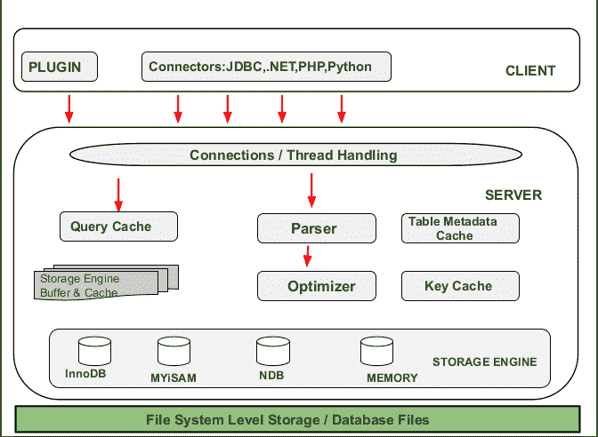

# MySQL 的架构

> 原文:[https://www.geeksforgeeks.org/architecture-of-mysql/](https://www.geeksforgeeks.org/architecture-of-mysql/)

**MySQL** 是 GNU 许可下免费开源软件的关系数据库管理系统。甲骨文公司也支持它。它是一个快速、可扩展、易于使用的数据库管理系统。MYSQL 支持很多操作系统，如 Windows、Linux、MacOS 等。

MySQL 是结构化查询语言，用于在各种查询的帮助下操作、管理和检索数据。

MySQL 是由一家瑞典公司 MySQL AB 开发和支持的，用 C 和 C++编程语言编写。它是由迈克尔·威得纽斯和大卫·休斯开发的。人们常说，MYSQL 是以联合创始人 MIchael Widenius 的女儿的名字命名的，她的名字是“My”。

**MySQL 的架构:**

MYSQL 体系结构描述了 MYSQL 系统不同组件之间的关系。MYSQL 遵循客户机-服务器体系结构。它旨在使作为客户端的最终用户可以使用各种网络服务从作为服务器的计算机访问资源。MYSQL 的体系结构包含以下主要层:

*   客户
*   计算机网络服务器
*   存储层

**客户端层:**
该层为上图最顶层。客户在客户层的帮助下向服务提供请求指示。客户端通过命令提示符或图形用户界面屏幕使用有效的 MYSQL 命令和表达式发出请求。如果表达式和命令有效，则在屏幕上获得输出。客户端层的一些重要服务有:

*   连接处理。
*   认证。
*   保安。

**连接处理:**
当客户端向服务器发送请求时，服务器将接受该请求，客户端已连接..当客户机连接到服务器时，客户机获得自己的连接线程。在这个线程的帮助下，客户端的所有查询都会被执行。

**认证:**
客户端连接到 MYSQL 服务器时，在服务器端进行认证。身份验证是在用户名和密码的帮助下完成的。

**安全:**
身份验证后，当客户端成功连接到 MySQL 服务器时，服务器将检查特定客户端是否有权限对 MySQL 服务器发出某些查询。

**服务器层:**
MYSQL 架构的第二层负责 MYSQL 关系数据库管理系统的所有逻辑功能。这一层的 MYSQL 系统也被称为***【MYSQL 架构大脑】*** 。当客户机向服务器发出请求指令，并且一旦指令匹配，服务器就给出输出。MYSQL 服务器的各个子组件是:

*   **线程处理–**
    当客户端向服务器发送请求时，服务器将接受该请求，并且客户端已连接..当客户机连接到服务器时，客户机获得自己的连接线程。该线程由服务器层的线程处理提供。线程执行的客户端查询也由线程处理模块处理。
*   **解析器–**
    解析器是一种软件组件，它为给定的输入构建数据结构(解析树)。在解析之前，完成词法分析，即输入被分成多个标记。数据在较小的元素中可用后，解析器执行语法分析，然后生成解析树作为输出。
*   **优化器–**
    解析一完成，优化器块就会应用各种类型的优化技术。这些技术可能包括重写查询、扫描表的顺序以及选择要使用的正确索引等。
*   **查询缓存–**
    查询缓存存储输入查询语句的完整结果集。解析前一天晚上，MYSQL 服务器查询缓存。当客户端写查询时，如果客户端写的查询在缓存中是相同的，那么服务器就简单地跳过解析、优化甚至执行，它只是简单地显示缓存的输出。
*   **缓冲区和缓存–**
    缓存并将缓冲区存储用户之前的查询或问题。当用户写入查询时，它首先进入查询缓存，然后查询缓存将检查缓存中是否有相同的查询或问题。如果相同的查询可用，那么它将提供输出而不干扰解析器、优化器。
*   **表元数据缓存–**
    元数据缓存是用于跟踪数据库、索引或对象信息的保留内存区域。打开的数据库、索引或对象的数量越多，元数据缓存的大小就越大。
*   **密钥缓存–**
    密钥缓存是唯一标识缓存中对象的索引条目。默认情况下，边缘服务器根据整个资源路径和查询字符串缓存内容。

**存储层:**
这个 MYSQL 架构的存储引擎层让它独一无二，最适合开发者。由于这个层，MYSQL 层被认为是最常用的关系数据库管理系统，并被广泛使用。在 MYSQL 服务器中，针对不同的情况和需求，使用了不同类型的存储引擎，如 InnoDB、MYiSAM、NDB、Memory 等。这些存储引擎用作可插拔存储引擎，用户创建的表与它们相连。

**MYSQL 的特点:**

1.  与 C、C++、Java 等其他编程语言相比，MYSQL 语言易于使用。通过学习一些基本的命令，我们可以工作，创建和与数据库交互。
2.  MYSQL 由数据安全层组成，保护数据不受侵犯。此外，密码在 MYSQL 中是加密的。
3.  MYSQL 遵循客户机-服务器架构，其中客户机请求命令和指令，一旦指令匹配，服务器就会产生输出。
4.  MYSQL 在社区版下可以免费使用。所以我们可以从 MYSQL 网站下载并免费使用。
5.  MYSQL 使用多线程，这使得它具有可伸缩性。它可以处理任意数量的数据。默认文件大小限制为 4 GB，但我们可以根据需要增加。
6.  MYSQL 被认为是速度最快的数据库之一。其牢度是在大量基准测试的基础上确定的。
7.  MYSQL 非常灵活，因为它支持大量的嵌入式系统。
8.  MYSQL 兼容运行在各种操作系统上，如 Windows、MacOS、Linux 等。
9.  MYSQL 允许事务回滚、提交和现金回收。
10.  它具有较低的内存泄漏问题，这增加了它的内存效率。
11.  MYSQL 版本提供双密码支持，一个是当前密码，另一个是二级密码。在这个帮助下，我们可以创建新的密码。
12.  MYSQL 提供了分区特性，这提高了大型数据库的性能。