# DBMS 中函数依赖的阿姆斯特朗公理

> 原文:[https://www . geesforgeks . org/Armstrong GS-公理-函数中的公理-依赖于数据库管理系统/](https://www.geeksforgeeks.org/armstrongs-axioms-in-functional-dependency-in-dbms/)

**先决条件–**[功能依赖关系](https://www.geeksforgeeks.org/database-normalization-introduction/)

阿姆斯特朗公理一词是指由威廉·w·阿姆斯特朗引入的一套完整的推理规则或公理，用于测试**函数依赖**的逻辑蕴涵。如果 F 是一组函数依赖，那么 F 的闭包，表示为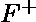，是由 F .阿姆斯壮的公理在逻辑上隐含的所有函数依赖的集合，是一组规则，当重复应用时，生成函数依赖的闭包。

### 公理–

1.  **反身性公理–**
    如果是一组属性，是的子集，那么成立。如果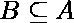那么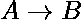这个属性就是微不足道的属性。
2.  **扩增公理–**
    如果成立，为属性集，那么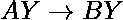也成立。即在依赖项中添加属性，不会改变基本的依赖项。如果，则为任意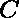。
3.  **及物性公理–**
    同代数中的及物性规则，如果成立，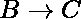成立，那么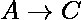也成立。在功能上被称为，决定。如果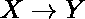和，那么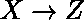

### 次要规则–

这些规则可以从上述公理中推导出来。

1.  **联合–**
    如果成立成立，那么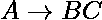成立。如果和然后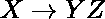
2.  **成分–**
    如果成立，那么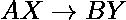成立。
3.  **分解–**
    如果成立，那么和成立。如果然后和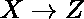
4.  **伪及物性–**
    如果成立，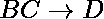成立，那么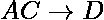成立。如果和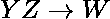然后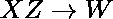。

**为什么阿姆斯特朗公理指的是声音和完整？**
通过声音，我们意味着给定一组在关系模式 R 上指定的函数依赖 F，我们可以通过使用阿姆斯特朗公理的主要规则从 F 中推断出的任何依赖在满足 F 中的依赖的 R 的每个关系状态 R 中都成立。
通过完成，我们意味着重复使用阿姆斯特朗公理的主要规则来推断依赖，直到不能推断出更多的依赖，导致可以从 F 中推断出的所有可能依赖的完整集合

**参考文献–**

*   书籍–[数据库系统基础](https://amzn.to/3j834dt)
*   [http://tinman.cs.gsu.edu](http://tinman.cs.gsu.edu/~raj/4710/sp08/fd-theory.pdf)

本文由 **Samit Mandal** 供稿。如果你喜欢 GeeksforGeeks 并想投稿，你也可以使用[contribute.geeksforgeeks.org](http://www.contribute.geeksforgeeks.org)写一篇文章或者把你的文章邮寄到 contribute@geeksforgeeks.org。看到你的文章出现在极客博客主页上，帮助其他极客。

如果你发现任何不正确的地方，或者你想分享更多关于上面讨论的话题的信息，请写评论。