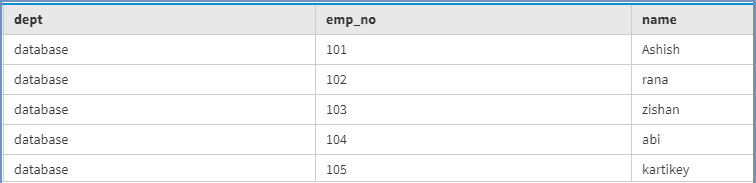

# 在卡珊德拉中按降序排列聚类列

> 原文:[https://www . geesforgeks . org/arrangeing-clustering-column-in-降序-in-cassandra/](https://www.geeksforgeeks.org/arranging-clustering-column-in-descending-order-in-cassandra/)

额外–[卡珊德拉](https://www.geeksforgeeks.org/introduction-to-apache-cassandra/)
在本文中，我们将讨论如何排列表格数据，以及如何在表格中按降序排列聚类列。

为了先按降序排列聚类列，我们将创建一个带有聚类列的表。

首先，我们将在不使用 order by 子句的情况下看到结果。
我们来看看。

```
CREATE TABLE Emp_track (
  emp_no int,
  dept text,
  name text,
  PRIMARY KEY (dept, emp_no)
); 
```

现在，我们将向表中插入一些数据。
我们来看看。

```
insert into Emp_track(emp_no, dept, name) values (101, 'database', 'Ashish'); 
insert into Emp_track(emp_no, dept, name) values (102, 'database', 'rana'); 
insert into Emp_track(emp_no, dept, name) values (103, 'database', 'zishan'); 
insert into Emp_track(emp_no, dept, name) values (104, 'database', 'abi'); 
insert into Emp_track(emp_no, dept, name) values (105, 'database', 'kartikey');  
```

现在，要查看结果，请使用下面给出的 CQL 查询。

```
select * 
from Emp_track; 
```

**输出:**



现在，我们将使用 order by 子句。
我们来看看。

```
CREATE TABLE Emp_track (
  emp_no int,
  dept text,
  name text,
  PRIMARY KEY (dept, emp_no)
)
WITH CLUSTERING ORDER BY (emp_no desc); 
```

在这里，我们将看到 emp_no 是一个聚类列，为了按降序排列，我们将在创建表时使用 order by 子句。

现在，我们将向表中插入一些数据。
我们来看看。

```
insert into Emp_track(emp_no, dept, name) values (101, 'database', 'Ashish'); 
insert into Emp_track(emp_no, dept, name) values (102, 'database', 'rana'); 
insert into Emp_track(emp_no, dept, name) values (103, 'database', 'zishan'); 
insert into Emp_track(emp_no, dept, name) values (104, 'database', 'abi'); 
insert into Emp_track(emp_no, dept, name) values (105, 'database', 'kartikey'); 

```

现在，要查看结果，请使用下面给出的 CQL 查询。

```
select * 
from Emp_track; 
```

**输出:**

