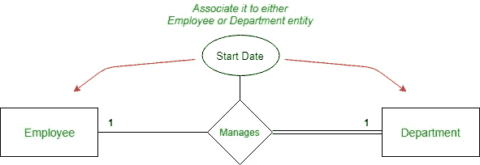
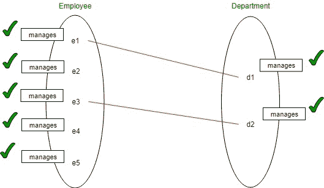
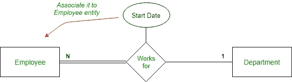
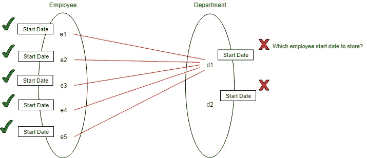

# ER 模型中关系的属性

> 原文:[https://www . geesforgeks . org/attributes-to-relations-in-er-model/](https://www.geeksforgeeks.org/attributes-to-relationships-in-er-model/)

在 ER 模型中，实体具有多种类型的属性，如单值、多值、复合、简单、存储、派生和复杂。但是关系也可以有与之相关的属性。如果不需要，通常不建议给关系赋予属性，因为在将 ER 模型转换为 Relational 模型时，事情可能会变得复杂，我们可能需要创建一个单独的表来表示关系。让我们看看各种情况，当我们需要借助示例来赋予关系属性时:

**1。一对一的关系:**
在一个组织中，一名员工管理一个部门，而每个部门都由一名员工管理。因此，em >部门实体完全参与，给定实体之间存在*一对一*关系。现在，如果我们想存储员工开始管理部门的*开始 _ 日期*，那么我们可能认为我们可以将*开始 _ 日期*属性赋予关系*管理*。但是，在这种情况下，我们可以通过将*开始 _ 日期*属性关联到*员工*或*部门*实体来避免它。

**2。一对多关系:**
在一个组织中，许多员工可以为一个部门工作，但每个员工只能为一个部门工作。所以，实体之间存在着*一对多*的关系。现在，如果我们想存储员工开始为部门工作时的*开始 _ 日期*，那么我们应该将其分配给*员工*实体，而不是将其分配给关系。将它分配给*员工*实体是有意义的，因为每个员工只能为一个部门工作，但另一方面，一个部门可以有许多员工在它下面工作，因此，如果我们将 Start_Date 属性分配给 department，这是没有意义的。

**3。多对多关系:**
在一个组织中，一名员工可以同时从事多个项目，每个项目可以有多名员工从事。因此，这是一种多对多的关系。所以这里给员工分配*工作小时数*不会起作用，因为问题是它会存储哪个项目的工作时间，因为单个员工可以在多个项目上工作。类似于*项目*实体的情况。因此，我们被迫将*工作小时数*属性分配给关系。

**结论:**只有在**多对多**关系的情况下，才赋予关系属性。